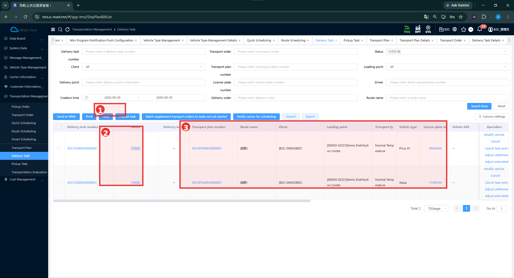
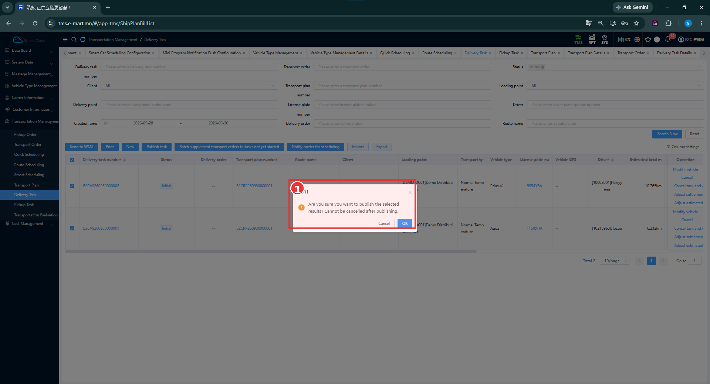
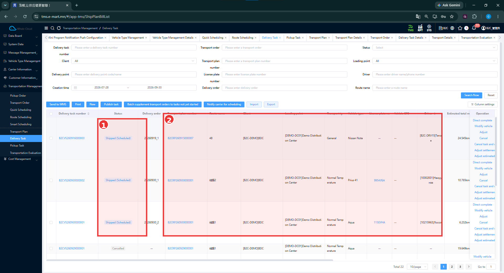
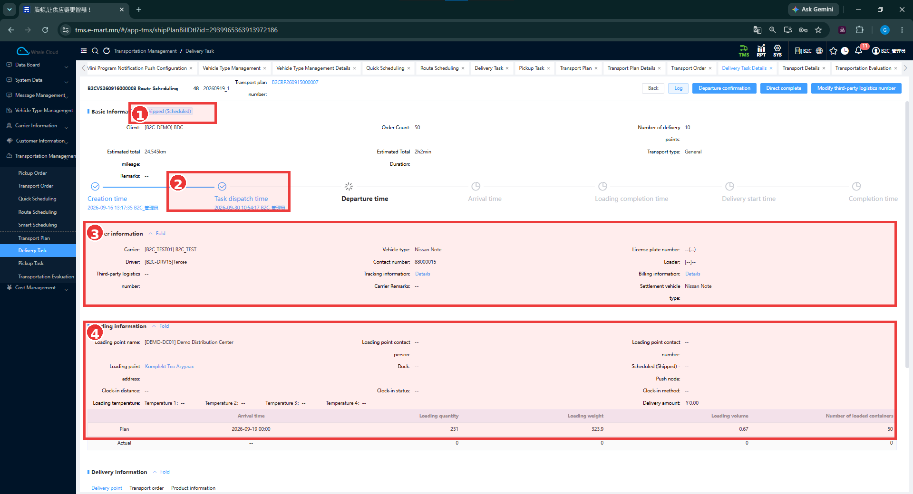
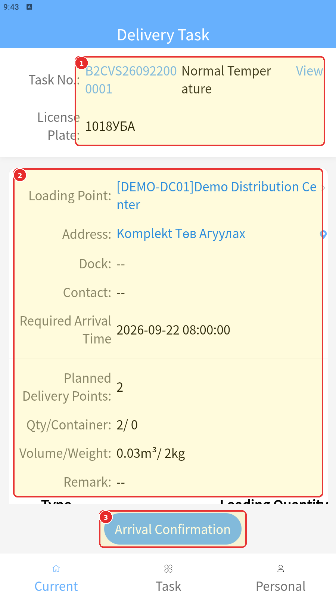

# Delivery Task — Хүргэлтийн даалгавар

[Transportation Management-ийн тойм](../tms/transportation-management.md)

## Delivery Task гэж юу вэ?

Delivery Task нь Transport Plan-ийн маршрутыг бодитоор гүйцэтгэх даалгавар. Түүнд тээврийн захиалга, ачилтын болон хүргэлтийн цэгүүд, машин, жолоочийн мэдээлэл холбогдоно. Даалгаврыг нийтэлсний дараа жолооч гүйцэтгэлийн алхмуудаа үргэлжлүүлнэ.

## Хэзээ ашиглах вэ?

Даалгавар бэлэн эсэхийг шалгах, нийтлэх, явцыг харах, ачилтын төлөвлөсөн ба бодит хэмжээг харьцуулахад ашиглана.

## Эхлэхийн өмнө

[Transport Plan](../planning/overview.md) болон холбоотой даалгавраа олно. [Машин](assign-vehicle.md), [жолооч](assign-driver.md)-ийн оноолт зөв эсэхийг шалгана.

**Цэсний зам:** TMS → Transportation Management → Delivery Task.

## Initial list — Нийтлээгүй даалгаврууд



| № | Хэсэг | Тайлбар |
|---|---|---|
| ① | Дээд үйлдлийн мөрийн орчим | Хүрээ New товчны дээр байрласан. Publish task нь New-ийн баруун талд байна. |
| ② | Status | Хоёр даалгавар Initial төлөвтэй. |
| ③ | Холбоотой мэдээлэл | Transport plan number, Route name, Client, Loading point, Transport type, Vehicle type, License plate number. |

### Хайх, нягтлах

1. **Delivery task number** эсвэл **Transport plan number** оруулна.
2. Шаардлагатай бол **Status = Initial**, Client, Loading point, Driver, Creation time нөхцөлүүдээр шүүнэ.
3. **Search Now** дарж зөв даалгавраа олно.
4. Дугаар, маршрут, машин, жолоочийг тулгана. Жолоочийн багана эхний зурагт харагдахгүй хэсэгт байгаа бөгөөд баталгаажуулалтын арын хүснэгт болон нийтэлсний дараах жагсаалтад харагдана.

### Жагсаалтын талбарууд

| Талбар | Тайлбар |
|---|---|
| Delivery task number | Даалгаврын дугаар; дэлгэрэнгүй рүү орно. |
| Status | Initial бол нийтлээгүй даалгавар. |
| Transport plan number | Холбоотой төлөвлөгөөний дугаар. |
| Route name | Гүйцэтгэх маршрут. |
| Client / Loading point | Харилцагч болон ачилтын цэг. |
| Transport type | Тээврийн төрөл. |
| Vehicle type / License plate number | Машины төрөл болон улсын дугаар. |
| Driver | Оноосон жолооч. |
| Estimated total mileage | Төлөвлөсөн нийт зай; бодит явсан зай биш. |

Эдгээр нь харах баганууд; заавал бөглөх маягт биш.

## Publish Task — Нийтлэх

1. Нийтлэх даалгаврын мөрийн сонгох нүдийг тэмдэглэнэ.
2. Сонгосон дугаарууд, машин, жолооч зөв эсэхийг дахин нягтална.
3. **Publish task** дарна.
4. Баталгаажуулах цонхны анхааруулгыг уншина.
5. Нийтлэх бол **OK**, буцах бол **Cancel** дарна.



| № | Хэсэг | Тайлбар |
|---|---|---|
| ① | Hint | Сонгосон даалгавруудыг нийтлэх эсэхийг асууж, Cancel / OK харуулна. |

!!! warning "Нийтлэхийн өмнө"
    Энэ Publish task цонхонд **“Cannot be cancelled after publishing.”** гэж анхааруулдаг. Сонгосон даалгавар болон оноолтоо нягталж байж OK дарна. Энэ бичвэрийг бүх төлөв, бүх төрлийн цуцлалтад үйлчлэх ерөнхий дүрэм гэж өргөжүүлэхгүй.

## Publish-ийн дараах төлөв



| № | Хэсэг | Тайлбар |
|---|---|---|
| ① | Status | Нийтлэгдсэн даалгавруудад Shipped (Scheduled) харагдана. Доор өөр Cancelled мөр бас бий. |
| ② | Холбоотой мэдээлэл | Төлөвлөгөө, маршрут, харилцагч, ачилтын цэг, машин, жолооч. |

Тестэд **B2CVS260930000002**, **B2CVS260930000001** дугаарууд нийтлэхээс өмнө Initial, нийтэлсний дараа Shipped (Scheduled) байна.

```text
Initial
   │
   └── Publish task → баталгаажуулалтын OK
                              │
                              ↓
                    Shipped (Scheduled)
```

Нийтэлсний дараа зөвхөн Initial-аар шүүсэн хэвээр бол даалгавар харагдахгүй байж болно. Төлөвийн нөхцөлийг өөрчилж, ижил дугаараар хайж шалгана. **Shipped (Scheduled)** нь энэ тестийн нийтэлсний дараах төлөв; хүргэлт дууссан гэсэн үг биш.

## Delivery Task Detail



| № | Хэсэг | Тайлбар |
|---|---|---|
| ① | Basic Information дахь төлөв | Shipped (Scheduled). |
| ② | Timeline дахь Task dispatch time | Даалгавар хуваарилсан цаг. Бусад үе шат нь хажуугаар үргэлжилнэ. |
| ③ | Carrier information | Тээвэрлэгч, жолооч, утас, машины төрөл, улсын дугаар болон холбогдох мэдээлэл. |
| ④ | Loading information | Ачилтын цэг, хаяг, Plan мөрийн ирэх цаг, тоо, жин, эзлэхүүн, сав; Actual мөр нь хүрээний доор. |

**Энэ бол өөр даалгаврын жишээ:** **B2CVS260916000003**, төрөл нь **Route Scheduling**, төлөвлөгөө нь **B2CRP260915000007**. Дээр нийтэлсэн хоёр даалгаврын нэг биш. Transport Plan жагсаалтын **Smart Scheduling** жишээнээс үүссэн гэж холбохгүй.

### Дэлгэрэнгүй талбарууд

| Талбар | Утгыг хэрхэн унших вэ? |
|---|---|
| Client | Даалгаврын харилцагч. |
| Order Count | Хамрагдсан захиалгын тоо; жишээнд 50. |
| Number of delivery points | Хүргэлтийн цэгийн тоо; жишээнд 10. |
| Estimated total mileage | Тооцоолсон зай; 24.545 km. |
| Estimated Total Duration | Тооцоолсон хугацаа; 2 h 2 min. |
| Timeline | Creation time, Task dispatch time, Departure time, Arrival time, Loading completion time, Delivery start time, Completion time. |
| Carrier | Гүйцэтгэх тээвэрлэгч; жишээнд B2C_TEST01. |
| Driver / Contact number | Жолооч болон утас. |
| Vehicle type / License plate number | Машины төрөл, улсын дугаар; жишээнд Nissan Note, дугаарын оронд зураас. |
| Loading point name / address | Ачилтын цэгийн нэр, хаяг. |
| Arrival time — Plan | Төлөвлөсөн ирэх цаг; 2026-09-19 00:00. |
| Loading quantity / weight / volume — Plan | Төлөвлөсөн ачилт; зурагт 231 / 323.9 / 0.67. |
| Number of loaded containers — Plan | Төлөвлөсөн сав; 50. |
| Actual мөр | Бодит бүртгэл; зурагт ирэх цаг зураастай, хэмжээнүүд 0. |

Хугацааны мөрөнд нэр харагдсан нь тэр үе гүйцэтгэсэн гэсэн үг биш. Цаг бөглөгдсөн эсэхийг шалгана. Plan ба Actual хэмжээг тусад нь уншина.

## Дараагийн execution — Жолоочийн гүйцэтгэл

Дэлгэрэнгүйд **Departure confirmation**, **Direct complete** гэсэн дараагийн боломжит ажиллагаа харагдана. Энэ зургийн цуглуулга эдгээрийг бүрэн туршсан үр дүнг харуулахгүй.

Өмнөх **TC-B2C-E2E-001** тестэд **B2CVS260922000001** даалгаврыг нийтэлсний дараа **B2C-DRV05** жолоочийн Driver App → **Current** хэсэгт харагдсан.



Зургийн **1** — даалгаврын дугаар, улсын дугаар; **2** — ачилтын цэг, нийт хэмжээ; **3** — Arrival Confirmation. Энэ нь шинэ Web зургийн хоёр даалгавраас өөр тестийн жишээ.

Дараагийн ачилт, хүргэлтийг [Driver Mini App](../execution/index.md)-ийн заавраар гүйцэтгэнэ.

## Нэмэлт ажиллагаа

Жагсаалтын Operation баганад **Modify vehicle**, **Cancel**, **Cancel task and order** (нэрийн төгсгөл зурагт тасарсан), **Adjust settlement**, **Adjust estimated…**, **Direct complete** харагдана. Нэмэлт тохируулгын үр дүн, зөвшөөрөх төлөв, цуцлалтад захиалга хэрхэн өөрчлөгдөх нь одоогийн тестээр баталгаажаагүй.

## Үйлдэл хийсний дараа

Даалгаврын ижил дугаарыг хайж **Shipped (Scheduled)** болсон эсэх, төлөвлөгөө, машин, жолооч зөв хэвээр эсэхийг шалгана. Жолооч өөрийн аппын **Current** хэсгийг шалгана.

## Анхаарах зүйл

Нийтлэх нь хүргэлт дуусгах үйлдэл биш. Даалгаврын Cancelled мөр байгаа нь ямар төлөвөөс цуцалсныг батлахгүй. Шинэ Web зураг ба өмнөх Mini App тестийн дугааруудыг хольж болохгүй.

## Дараагийн алхам

[Driver Mini App: ачилт, хүргэлт](../execution/index.md) → [Store App: хүлээн авалт, үнэлгээ](../execution/store-app.md) → [Transportation Evaluation](../tms/transportation-management/transportation-evaluation.md).

Даалгавартай холбоотой зардлыг [Carrier Fee Bill](../reference/cost-settlement.md)-ээс Task number-оор хайж, дүн болон гэрээний дугаарыг шалгана.
