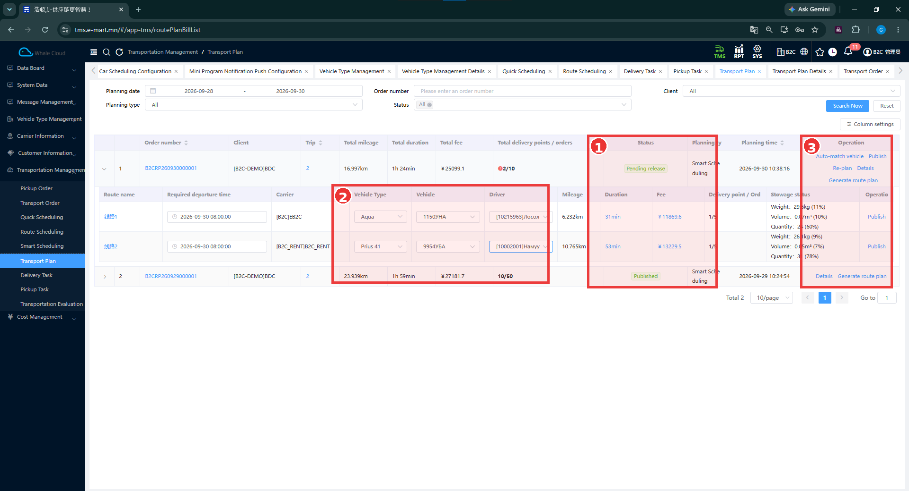
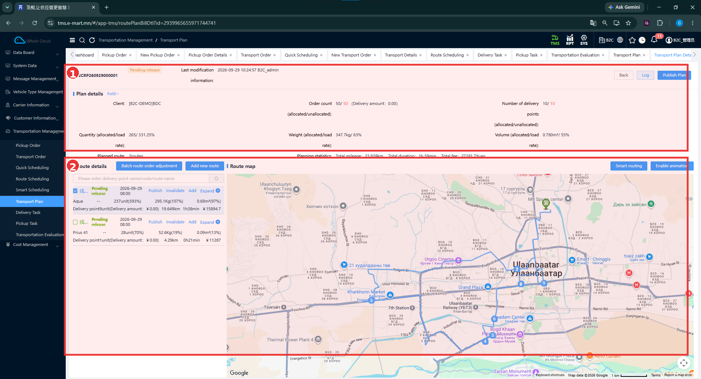

# Transport Plan — Тээврийн төлөвлөгөө

[Transportation Management-ийн тойм](../tms/transportation-management.md)

## Transport Plan гэж юу вэ?

Transport Plan нь Scheduling-ийн үр дүнд үүссэн тээвэрлэлтийн төлөвлөгөө. Нэг төлөвлөгөө дотроо маршруттай; маршрут бүр хүргэлтийн цэг, захиалга, тээврийн нөөцийн мэдээлэлтэй. Маршрутыг гүйцэтгэх ажил нь [Delivery Task](../dispatch/publish.md)-д харагдана.

## Хэзээ ашиглах вэ?

Төлөвлөлтийн үр дүн, маршрутын ачаа, машин, жолооч, төлөвийг шалгах үед ашиглана. [Quick / Route / Smart Scheduling-ийн ялгаа](../tms/transportation-management.md#scheduling)-г тоймоос харна.

## Эхлэхийн өмнө

Төлөвлөгөөний дугаар эсвэл төлөвлөсөн огноо, харилцагчаа мэдэж байна. Машин, жолоочийн бүртгэлийг [Carrier Information](../tms/carrier-information.md)-оос бэлтгэнэ.

**Цэсний зам:** TMS → Transportation Management → Transport Plan.

## Plan list — Жагсаалтын дэлгэц

| № | Хэсэг | Тайлбар |
|---|---|---|
| ① | Status / Planning type | Pending release, Published төлөвүүд болон Smart Scheduling төрөл. |
| ② | Маршрутын нөөц | Vehicle Type, Vehicle, Driver гэсэн сонголтууд маршрут бүрийн мөрөнд байна. |
| ③ | Operation | Төлөвлөгөөний болон маршрутын боломжит үйлдлүүд. |

### Алхам алхмаар

1. **Planning date**, **Client**, хэрэгтэй бол **Order number**, **Planning type**, **Status**-аар шүүнэ.
2. **Search Now** дарна. Нөхцөл цэвэрлэхдээ **Reset** ашиглана.
3. Төлөвлөгөөний дугаар, Planning type, Status болон нийлбэр үзүүлэлтүүдийг шалгана.
4. Мөрийн зүүн талын сумыг дэлгэж маршрутуудыг харна.
5. Маршрут бүрийн тээвэрлэгч, машины төрөл, улсын дугаар, жолоочийг нягтална.
6. **Details** эсвэл төлөвлөгөөний дугаарын холбоосоор дэлгэрэнгүйг нээнэ.

### Төлөвлөгөөний талбарууд

Эдгээр нь жагсаалтын харах үзүүлэлтүүд; заавал бөглөх маягт биш.

| Талбар | Тайлбар |
|---|---|
| Order number | Энэ дэлгэц дэх төлөвлөгөөний дугаар. Transport Order-ийн дугаартай андуурахгүй. |
| Client | Төлөвлөгөөний харилцагч. |
| Trip | Төлөвлөгөөний рейсийн тоо. |
| Total mileage | Төлөвлөсөн нийт зай, км. |
| Total duration | Төлөвлөсөн нийт хугацаа. |
| Total fee | Төлөвлөлтөд харагдах нийт дүн. Эцсийн төлбөр тооцоо гэсэн баталгаа биш. |
| Total delivery points / orders | Нийт хүргэлтийн цэг / захиалгын тоо. |
| Status | Төлөвлөгөөний нийтлэгдсэн эсэх төлөв. |
| Planning type | Ямар аргаар төлөвлөснийг харуулна. Зурагт Smart Scheduling. |
| Planning time | Төлөвлөсөн огноо, цаг. |

### Маршрутын талбарууд

| Талбар | Тайлбар |
|---|---|
| Route name | Төлөвлөгөөнд харьяалах маршрут. |
| Required departure time | Төлөвлөсөн гарах цаг. |
| Carrier | Тухайн маршрутын тээвэрлэгч. |
| Vehicle Type / Vehicle / Driver | Машины төрөл / бодит машин / жолооч. |
| Mileage / Duration / Fee | Маршрутын зай, хугацаа, дүн. |
| Delivery point / Order | Маршрутын хүргэлтийн цэг, захиалгын тоо. |
| Stowage status | Ачааны жин, эзлэхүүн, тоо болон ачааллын хувь. |

## Pending release ба Published

| Төлөв | Хэрэглэгчид ямар утгатай вэ? |
|---|---|
| Pending release | Төлөвлөгөө бэлтгэгдсэн боловч нийтлэгдээгүй. Нөөц, маршрутаа нягтлах үе. |
| Published | Төлөвлөгөө нийтлэгдсэн. Холбоотой Delivery Task-ийг тусад нь шалгана. |

Зурагт **B2CRP260930000001** Pending release, **B2CRP260929000001** Published байна. Эдгээр нь хоёр өөр бүртгэл. Нэг төлөвлөгөө Publish дарахад хэрхэн шилжсэний дараалсан зураг гэж үзэхгүй.

## Vehicle / Driver assignment — Машин, жолоочийн холбоо

Машин, жолооч нь төлөвлөгөөний **маршрутын мөрөнд** холбогдож байна. Зурагт нэг маршрут Aqua төрлийн **1150УНА**, нөгөө нь Prius 41 төрлийн **9954УБА** машинтай. Driver сонголт тус бүрдээ байна.

1. Төлөвлөгөөний зөв маршрутыг дэлгэнэ.
2. **Carrier**, **Vehicle Type**, **Vehicle**, **Driver**-ыг хамтад нь нягтална.
3. Машины улсын дугаар ба жолоочийн код/нэрийг бодит ажилтайгаа тулгана.
4. Нийтлэхийн өмнө дутуу эсвэл буруу оноолт байгаа эсэхийг шалгана.

Сонголтын талбар харагдсан боловч өөрчилсөн утгыг хадгалах үйл явцын зураг байхгүй. **Auto-match vehicle** ямар дүрмээр машин, жолооч сонгодгийг таамаглахгүй.

## Боломжит үйлдлүүд

| Үйлдэл | Харагдсан хүрээ |
|---|---|
| Auto-match vehicle | Машин автоматаар тааруулах боломж; сонгох алгоритм, үр дүн баталгаажаагүй. |
| Publish | Төлөвлөгөөний түвшинд болон маршрутын мөрөнд байна. |
| Re-plan | Дахин төлөвлөх боломж; өмнөх даалгаварт үзүүлэх нөлөө баталгаажаагүй. |
| Details | Төлөвлөгөөний дэлгэрэнгүйг харах. |
| Generate route plan | Маршрутын төлөвлөгөө үүсгэх боломж; гарах баримт, дараагийн алхам баталгаажаагүй. |

**Publish Plan** нь дэлгэрэнгүй дэлгэцийн баруун дээд талд мөн харагдана. Plan-ийн Publish ба Delivery Task-ийн **Publish task** нь тусдаа үйлдэл. Энэ багцад plan нийтлэхээс task анх үүсэх хүртэлх бүх дэлгэц байхгүй; яг хэдийд, ямар товчоор task үүссэнийг зохиож нэмээгүй. Өмнөх B2C тестэд төлөвлөгөөнөөс task үүссэн, шинэ task жагсаалтад Transport plan number холбоос байгаагаар холбоо нь батлагдана.

## Transport Plan Detail — Маршрут ба газрын зураг

| № | Хэсэг | Тайлбар |
|---|---|---|
| ① | Plan details | Дугаар, төлөв, харилцагч, хуваарилсан/хуваарилаагүй захиалга, цэг, ачааны нийлбэр. |
| ② | Route details / Route map | Зүүн талд маршрутууд, баруун талд тэдгээрийн хүргэлтийн цэг ба замын шугам. |

Холбоо нь **Plan → Route → Delivery Point**. Маршрут бүрийн тоо, хэмжээ, хугацааг төлөвлөгөөний нийт үзүүлэлттэй хамт уншина.

Дэлгэрэнгүй зурагт **B2CRP260929000001** төлөвлөгөө **Pending release**, хоёр маршруттай байна. Ижил дугаар жагсаалтын зурагт **Published** гэж харагддаг боловч хоёр зураг нийтлэх бүх алхмыг харуулахгүй. Зураг бүрийн үеийн төлөвийг тусад нь уншина.

**Order count (allocated/unallocated)**, **Number of delivery points (allocated/unallocated)** нь хуваарилсан/хуваарилаагүй утгыг ялган харуулдаг. Зурагт 50/50, 10/10 гэж байна. Үүнийг бүгд хуваарилагдсан гэсэн тэмдэглэгээ гэж уншихгүй.

## Үйлдэл хийсний дараа

Төлөвлөгөөний дугаар, төлөв, төрөл, маршрут, цэгийн тоо, машин/жолоочийн мэдээллийг шалгасан байна. [Delivery Task](../dispatch/publish.md)-д **Transport plan number**-аар холбоотой даалгаврыг тулгана.

## Анхаарах зүйл

Газрын зургийн шугам нь төлөвлөсөн маршрут; бодит GPS зам гэдгийг энэ зургаар батлахгүй. **Batch route order adjustment**, **Add new route**, **Smart routing**, **Enable animation**, **Invalidate** зэрэг нэмэлт боломж харагдсан боловч үйлчлэлийг бүрэн туршаагүй. Хэмжээ, хувь, дүнгийн томьёог зургаас таамаглахгүй.

## Дараагийн алхам

[Delivery Task: жагсаалт, нийтлэх, дэлгэрэнгүй](../dispatch/publish.md) → [Driver Mini App](../execution/index.md).
