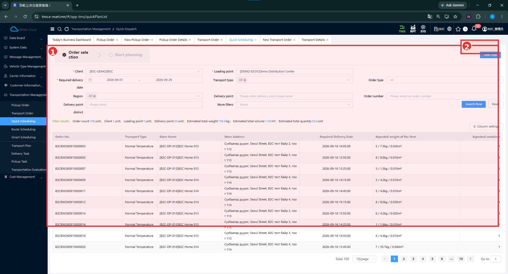
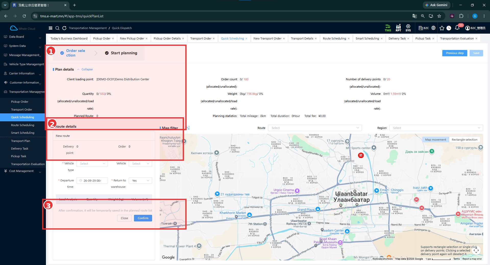

# Quick Scheduling — Хурдан төлөвлөлт

[Transportation Management-ийн тойм](../tms/transportation-management.md)

## Энэ хэсэг юу хийдэг вэ?

Тээврийн захиалгуудаа шүүж, маршрут гараар бэлтгэх төлөвлөлтийн дэлгэц рүү орно. **New route**, машины төрөл, машин, гарах цагийн сонголт харагдана. Энэ тестэд маршрут үүсээгүй тул хадгалалтын дараах үр дүн баталгаажаагүй.

## Хэзээ ашиглах вэ?

Захиалгын сонголт болон гараар маршрут бэлтгэх дэлгэцтэй ажиллах үед ашиглана. Бусад аргын ялгааг [Scheduling-ийн харьцуулалтаас](../tms/transportation-management.md#scheduling) харна.

## Эхлэхийн өмнө

[Transport Order](../transportation-order/overview.md), харилцагч, ачилтын цэг, хүргэх огноо болон [тээврийн нөөц](../tms/carrier-information.md)-өө бэлтгэнэ.

**Цэсний зам:** TMS → Transportation Management → Quick Scheduling. Зургийн дээд замд **Quick Dispatch** гэж харагдана.

## Order selection — Захиалга сонгох

| № | Хэсэг | Тайлбар |
|---|---|---|
| ① | Order selection | Үе шат, шүүлтүүр, хайлтын нийлбэр, захиалгын хүснэгт. |
| ② | Дараагийн алхмын орчим | Next step товч жижиг хүрээний доод захад байрлана. |

1. **Client**, **Loading point**, **Required delivery date**-ыг сонгоно.
2. Хэрэгтэй бол Transport type, Order type, Region, Delivery point, Order number, Delivery point district, More filters-ээр нарийсгана.
3. **Search Now** дарж захиалгын жагсаалт болон **Filter results** нийлбэрийг шалгана.
4. **Next step** дарж **Start planning** дэлгэц рүү орно.

Зурагт 100 захиалга, 20 хүргэлтийн цэг, нийт 532 нэгж, 736.9 kg, 1.59 m³ байна. Эдгээр нь шүүлтүүрийн үр дүн; маршрут үүссэн тоо биш.

## Planning result — Төлөвлөх дэлгэц

| № | Хэсэг | Тайлбар |
|---|---|---|
| ① | Plan details-ийн зүүн хэсэг | Start planning үе, ачилтын цэг, тоо хэмжээ, Planned Route = 0. |
| ② | Route details | New route хэсэгт Delivery point = 0, Order = 0. |
| ③ | Маршрутын доод үйлдэл | Түр хадгалах тухай тайлбар, Close / Confirm. Энэ нь дэлгэцийн дээд Save-ээс тусдаа. |

### Талбаруудын тайлбар

| Талбар | Тайлбар | Заавал эсэх |
|---|---|---|
| Client / Loading point / Required delivery date | Захиалга шүүх үндсэн нөхцөлүүд. | Тийм — эхний зурагт * тэмдэгтэй |
| Vehicle type | Маршрутын машины төрөл. | Тийм — хоёр дахь зурагт * тэмдэгтэй |
| Vehicle | Бодит машин сонгох талбар; зурагт сонгоогүй. | Зурагт * тэмдэггүй |
| Departure time | Гарах цаг. | Тийм — * тэмдэгтэй |
| Return to warehouse | Агуулахад буцах эсэх; зурагт Yes. | Тийм — * тэмдэгтэй |
| Planned Route | Төлөвлөсөн маршрутын тоо; 0 байна. | Харах үзүүлэлт |
| Delivery point / Order | New route-д орсон цэг, захиалгын тоо; хоёулаа 0. | Харах үзүүлэлт |
| Order count / Number of delivery points | Хуваарилсан/хуваарилаагүй захиалга, цэг; 0/100 ба 0/20. | Харах үзүүлэлт |
| Quantity / Weight / Volume | Хуваарилсан хэмжээ, хуваарилаагүй хэмжээ, ачааллын хувь. | Харах үзүүлэлт |

**Save** нь баруун дээд талд бүдэг, идэвхгүй байна. **Previous step** нь захиалга сонгох алхам руу буцах боломж. Газрын зурагт Map movement, Rectangle selection харагдах боловч цэг сонгож, маршрут баталсан үр дүн энэ багцад байхгүй.

## Үйлдэл хийсний дараа

Тестэд захиалга сонгох алхмыг давж төлөвлөх дэлгэц нээгдсэн. **Planned Route = 0**, маршрут үүсээгүй, **Save** идэвхжээгүй.

### Баталгаажаагүй хэсэг

!!! note "Хадгалалтын үр дүн баталгаажаагүй"
    Одоогийн тестийн сонгосон өгөгдлөөр маршрут үүсээгүй тул Save товч идэвхжээгүй. Quick Scheduling-ийн хадгалалтын дараах үр дүн энэ тестээр баталгаажаагүй. Confirm дарж маршрут үүссэн, Transport Plan хадгалагдсан гэж үзэхгүй.

## Анхаарах зүйл

Route Scheduling-ийн машин/жолоочийн зураг, эхлүүлэх баталгаажуулалтыг Quick Scheduling амжилттай дууссаны нотолгоо болгож ашиглахгүй. Маршрут үүсээгүй шалтгаан энэ тестээр тогтоогдоогүй.

## Дараагийн алхам

[Route Scheduling](route-scheduling.md), [Smart Scheduling](smart-plan.md)-ийн тусдаа зааврыг харьцуулж уншина. Өмнөх [гараар төлөвлөх тестийн хүрээ](manual-plan.md)-г мөн хадгалсан.
