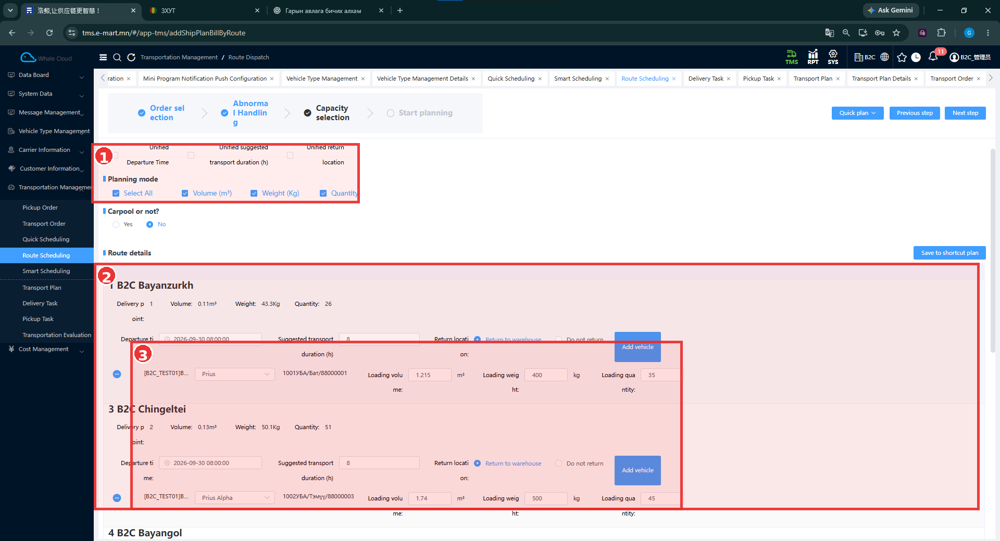
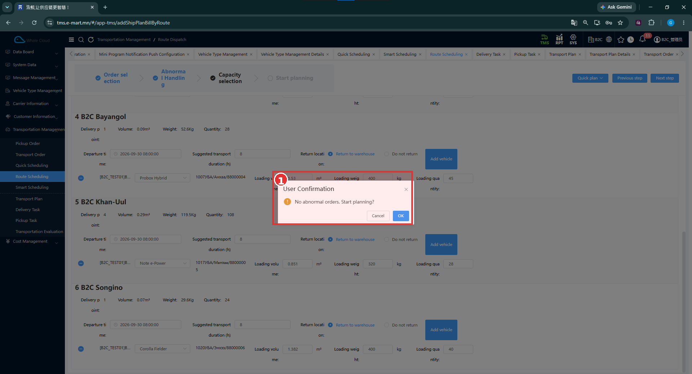

# Route Scheduling — Маршрутаар төлөвлөх

[Transportation Management-ийн тойм](../tms/transportation-management.md)

## Энэ хэсэг юу хийдэг вэ?

Маршрут, тогтмол маршрутад тулгуурлан захиалгын ачаа болон тээврийн нөөцийг төлөвлөнө. Маршрут бүрийн цэг, ачааны хэмжээг машины багтаамжтай харьцуулж, гарах цаг, машин, жолоочийн мэдээллийг шалгана.

## Хэзээ ашиглах вэ?

Маршрутаар бүлэглэсэн хүргэлтэд ямар нөөц ашиглахыг бэлтгэх үед хэрэглэнэ. Энэ нь [Quick Scheduling](quick-scheduling.md)-ээс тусдаа цэс.

## Эхлэхийн өмнө

[Transport Order](../transportation-order/overview.md), [Fixed Route](../tms/customer-information/fixed-route.md), [Vehicle](../tms/carrier-information/vehicle-management.md), [Driver / Employee](../tms/carrier-information/employee-management.md)-ийн мэдээллээ нягтална. Тогтмол маршрутаас захиалгыг автоматаар сонгох нарийн дүрэм баталгаажаагүй.

**Цэсний зам:** TMS → Transportation Management → Route Scheduling. Зургийн дээд замд **Route Dispatch** гэж байна.

## Capacity selection — Тээврийн нөөц сонгох

Дээд мөрөнд **Order selection → Abnormal Handling → Capacity selection → Start planning** гэсэн үе шатууд байна. Эхний хоёр үеийн тусдаа дэлгэц энэ багцад байхгүй.

| № | Хэсэг | Тайлбар |
|---|---|---|
| ① | Нийтлэг тохиргоо | Unified Departure Time, Unified suggested transport duration, Unified return location; Planning mode-ийн Volume, Weight, Quantity. |
| ② | Route details | B2C Bayanzurkh, B2C Chingeltei зэрэг нэртэй маршрут бүрийн цэг, ачаа, цаг, нөөц. |
| ③ | Машины мэдээллийн мөрүүд | Төрөл, улсын дугаар/жолооч/утас болон багтаамжийн Loading volume, Loading weight, Loading quantity. |

### Талбаруудын тайлбар

Энэ зураг дахь доорх талбаруудад улаан **\*** тэмдэг харагдахгүй. Иймээс бүх талбарыг заавал гэж тэмдэглээгүй.

| Талбар | Энгийн тайлбар | Заавал эсэх |
|---|---|---|
| Route name | Маршрутын нэр; нэр нь дүүрэгтэй төстэй байж болно. | Харах мэдээлэл |
| Delivery point | Тухайн маршрутын хүргэлтийн цэгийн тоо. | Харах мэдээлэл |
| Volume / Weight / Quantity | Маршрутын ачааны эзлэхүүн, жин, тоо. | Харах мэдээлэл |
| Departure Time | Маршрутын гарах цаг. | Зурагт * тэмдэггүй |
| Suggested transport duration (h) | Тээвэрт санал болгосон хугацаа, цагаар. | Зурагт * тэмдэггүй |
| Return location | Return to warehouse эсвэл Do not return сонголт. | Зурагт * тэмдэггүй |
| Vehicle Type | Prius, Prius Alpha зэрэг машины төрөл. | Зурагт * тэмдэггүй |
| Vehicle / Driver | Нэг мөрөнд харагдах улсын дугаар, жолооч, утас. | Харах мэдээлэл |
| Loading volume / Loading weight / Loading quantity | Сонгосон автомашины багтаамжийн мэдээлэл: м³, кг, тоо. | Зурагт * тэмдэггүй |
| Planning mode | Төлөвлөлтөд ашиглах Volume, Weight, Quantity хэмжүүрүүд. | Зурагт * тэмдэггүй |
| Carpool or not? | Yes / No сонголт; ачаа нэгтгэх нарийн дүрэм баталгаажаагүй. | Зурагт * тэмдэггүй |

Жишээ **B2C Bayanzurkh** маршрут 1 цэг, 0.11 m³, 43.3 kg, 26 нэгж ачаатай. Сонгосон Prius-ийн мөрөнд 1.215 m³, 400 kg, 35 гэсэн багтаамж харагдана. Маршрутын ачааны хэмжээ ба машины багтаамжийг тусад нь уншина.

## Алхам алхмаар

1. **Capacity selection** дээр маршрут бүрийн нэр, цэгийн тоо, ачааны хэмжээг шалгана.
2. **Departure Time**, **Suggested transport duration**, **Return location**-ыг бодит ажилтайгаа тулгана.
3. Машины төрөл, улсын дугаар, жолоочийн мэдээлэл болон багтаамжийг шалгана. **Add vehicle** боломж харагдана; нэмэх цонх энэ багцад байхгүй.
4. Нөөцийн мэдээллээ нягталсны дараа **Next step** дарна.
5. Нээгдсэн баталгаажуулалтын бичвэрийг уншина. Эхлүүлэх бол **OK**, буцах бол **Cancel** дарна.

## Start planning — Эхлүүлэх баталгаажуулалт

| № | Хэсэг | Тайлбар |
|---|---|---|
| ① | User Confirmation | “No abnormal orders. Start planning?” болон Cancel / OK. |

**Систем төлөвлөлт эхлүүлэхийн өмнө баталгаажуулалт асууж байна.** Энэ бичвэр нь тухайн шалгалтаар асуудалтай захиалга илрээгүйг хэлнэ. Төлөвлөгөө амжилттай хадгалагдсаны мэдэгдэл биш.

## Үйлдэл хийсний дараа

Энэ багцаар маршрутын мэдээлэл, машин/жолооч болон эхлүүлэх баталгаажуулалт харагдсаныг баталсан. OK-ийн дараах шууд төлөвлөлтийн үр дүнгийн зураг байхгүй. [Delivery Task Detail](../dispatch/publish.md#delivery-task-detail)-д Route Scheduling гэж тэмдэглэсэн өөр даалгаврын жишээ бий; дээрх оролдлогын үр дүн гэж холбохгүй.

## Анхаарах зүйл

**Quick plan**, **Save to shortcut plan**, нийтлэг цагийн тохиргоо харагдана. Эдгээрийн хадгалалт, дахин ашиглалт болон машин/жолооч автоматаар сонгох дүрэм одоогийн тестээр баталгаажаагүй.

## Дараагийн алхам

[Transport Plan](overview.md)-аас үүссэн төлөвлөгөөний дугаар, төлөвлөлтийн төрөл, маршрут, нөөцөө шалгана.
