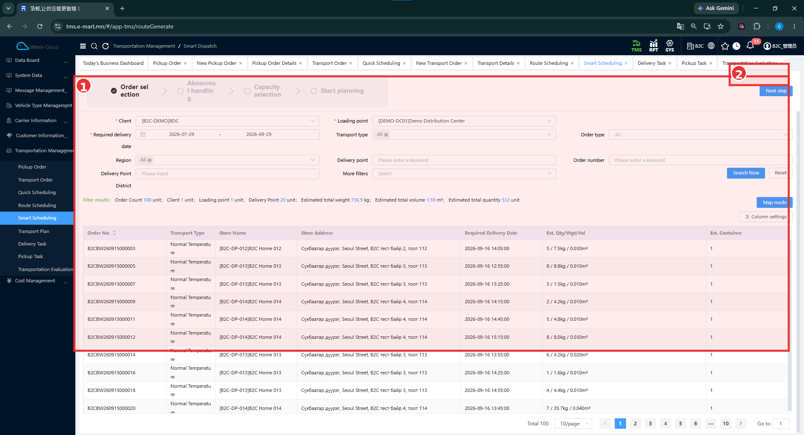
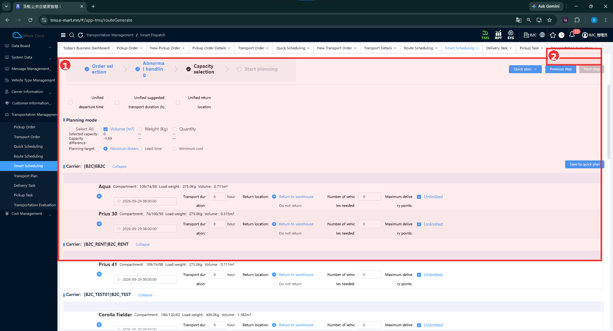
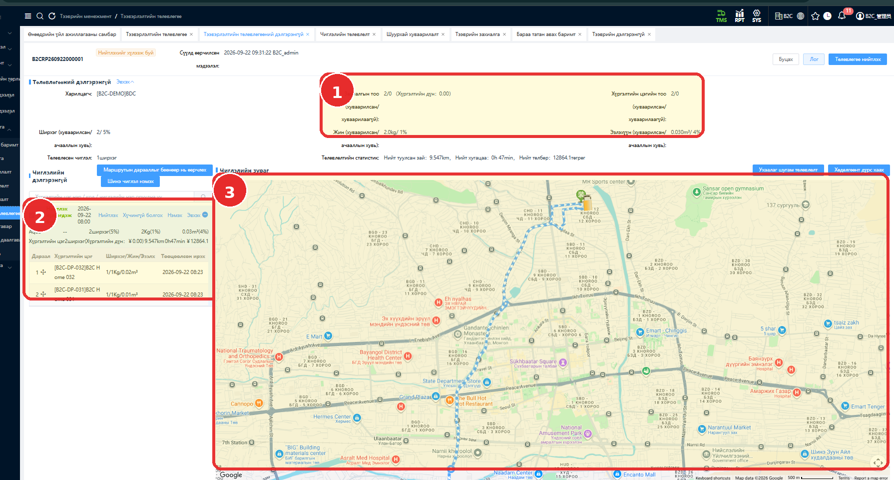

# Smart Scheduling — Ухаалаг төлөвлөлт

[Transportation Management-ийн тойм](../tms/transportation-management.md)

## Энэ хэсэг юу хийдэг вэ?

Систем сонгосон захиалга болон тээврийн багтаамжийн мэдээллийг ашиглан маршруттай төлөвлөгөө боловсруулах боломжтой. Хэрэглэгч захиалга, тээврийн нөөц, төлөвлөх хэмжүүрээ бэлтгэнэ. Үр дүнг Transport Plan дээр шалгана.

## Хэзээ ашиглах вэ?

Захиалгуудыг багтаамж болон төлөвлөлтийн сонголтуудтай нь системээр төлөвлүүлэх үед ашиглана. [Quick / Route / Smart-ийн ялгаа](../tms/transportation-management.md#scheduling)-г эхлээд харна.

## Эхлэхийн өмнө

[Transport Order](../transportation-order/overview.md), [Client ба цэгүүд](../tms/customer-information.md), [Carrier ба тээврийн нөөц](../tms/carrier-information.md)-өө бэлтгэнэ.

**Цэсний зам:** TMS → Transportation Management → Smart Scheduling. Зургийн дээд замд **Smart Dispatch** гэж байна. Өмнөх B2C тестийн эх сурвалж **Intelligent Dispatch** нэр хэрэглэсэн; доор тусдаа жишээгээр хадгалсан.

## Order selection — Захиалга сонгох

| № | Хэсэг | Тайлбар |
|---|---|---|
| ① | Order selection | Үе шатууд, нөхцөл, Filter results болон захиалгын хүснэгт. |
| ② | Дараагийн алхмын орчим | Next step жижиг хүрээний доод талд. |

1. **Client**, **Loading point**, **Required delivery date**-ыг сонгоно.
2. Хэрэгтэй бол Transport type, Order type, Region, Delivery point, Order number, Delivery Point District, More filters-ээр шүүнэ.
3. **Search Now** дарж захиалгын тоо, хүргэлтийн цэг, нийт хэмжээг шалгана.
4. **Next step**-ээр үргэлжлүүлнэ.

Зурагт 100 захиалга, 20 хүргэлтийн цэг харагдана. **Map mode** товч бий. Дараагийн үе нь **Abnormal handling**; асуудалтай захиалга боловсруулах дэлгэцийн нарийвчилсан зураг энэ багцад байхгүй.

## Capacity selection — Багтаамж сонгох

| № | Хэсэг | Тайлбар |
|---|---|---|
| ① | Capacity selection | Planning mode, багтаамжийн нийлбэр, Planning target, тээвэрлэгчээр бүлэглэсэн машины төрлүүд. |
| ② | Алхмын удирдлагын орчим | Previous step / Next step хүрээний доор. Энэ зурагт Next step идэвхгүй. |

### Талбаруудын тайлбар

| Талбар | Тайлбар | Заавал эсэх |
|---|---|---|
| Client / Loading point / Required delivery date | Эхний алхмын үндсэн нөхцөлүүд. | Тийм — * тэмдэгтэй |
| Planning mode | Volume, Weight, Quantity хэмжүүрээс сонгоно. | Зурагт * тэмдэггүй |
| Selected capacity / Capacity difference | Сонгосон багтаамж болон зөрүүг харуулна. Зурагт эзлэхүүний утгууд 0, -1.59. | Харах үзүүлэлт |
| Planning target | Minimum distance, Least time, Minimum cost гэсэн зорилтын сонголт. | Зурагт * тэмдэггүй |
| Carrier | Нөөцийг тээвэрлэгчээр бүлэглэнэ. | Харах мэдээлэл |
| Машины төрөл, Compartment, Load weight, Volume | Төрлийн хэмжээ, даац, эзлэхүүнийг шалгана. | Харах мэдээлэл |
| Departure time / Transport duration | Гарах цаг, санал болгосон үргэлжлэх хугацаа. | Зурагт * тэмдэггүй |
| Return location | Return to warehouse / Do not return. | Зурагт * тэмдэггүй |
| Number of vehicles needed | Тухайн төрөлд ашиглахаар оруулах машины тоо. | Зурагт * тэмдэггүй |
| Maximum delivery points / Unlimited | Хүргэлтийн цэгийн хязгаарын сонголт. | Зурагт * тэмдэггүй |

Тээвэрлэгч, машины төрөл, тоо, цаг болон багтаамжийн мэдээллээ нягтална. Энэ зурагт **Volume** сонгосон, харагдаж буй машины тоонууд 0 байна. Амжилттай төлөвлөсөн тохиргоо гэж хуулж ашиглахгүй.

## Planning — Төлөвлөх ба үр дүнг шалгах

Дэлгэцийн дараалал **Order selection → Abnormal handling → Capacity selection → Start planning**. Одоогийн Capacity selection зурагт Next step идэвхгүй тул цааш амжилттай шилжсэн гэж заахгүй.

**Smart Scheduling-ээр үүссэн plan-ийн жишээ [Transport Plan жагсаалтад](overview.md) харагдана.** Жагсаалтын Planning type нь Smart Scheduling. Түүнийг дээрх хоёр зургийн нэг оролдлогоор үүссэн гэж баталгаажуулаагүй.

## Өмнөх B2C тест: Intelligent Dispatch

[TC-B2C-E2E-001](../testing/tc-b2c-e2e-001.md)-д **2 захиалга / 2 хүргэлтийн цэг** ашиглаж төлөвлөсөн. Эхний оролдлогуудад 0/0 delivery point гарсан. Тээврийн хэрэгслийн сонголт, төлөвлөлтийн тохиргоог өөрчилсний дараа төлөвлөгөө үүссэн боловч өөрчилсөн утгууд эх сурвалжид байхгүй.

Зургийн тэмдэглэгээ: **1** — захиалга, хүргэлтийн цэгийн тоо; **2** — DP-032, DP-031 цэгүүд; **3** — маршрут. Тооцоолсон зай **9.547 km**, хугацаа **47 min** газрын зургийн дээд талд байна.

Энэ төлөвлөгөөнөөс **B2CVS260922000001** Delivery Task үүссэн гэж өмнөх тестэд тэмдэглэсэн. [Машин](../dispatch/assign-vehicle.md), [жолооч оноох](../dispatch/assign-driver.md) зааварт үргэлжилнэ.

## Үйлдэл хийсний дараа

Үүссэн төлөвлөгөөг дугаар, харилцагч, Planning type, маршрут болон цэгийн тоогоор шалгана. Өмнөх B2C-ийн хоёр цэгтэй үр дүн болон шинэ 100 захиалгын сонголтыг нэг төлөвлөлт гэж хольж болохгүй.

## Анхаарах зүйл

Planning target-ийн нэр нь хамгийн бага зай, хугацаа, зардлыг баталгаатай олно гэсэн амлалт биш. Алгоритм, эрэмбэ, зардлын томьёо болон сонгосон багтаамжийн тооцооллын дүрэм баталгаажаагүй.

Өмнөх B2C зурагт DP-032 → DP-031 дараалал харагддаг. Гүйцэтгэлийн үеийн дарааллын ялгаа болон төлөвлөгөөний **12,864.1** дүнг эцсийн settlement **10,000** дүнтэй хэрхэн холбохыг [тестийн бүртгэлд](../testing/tc-b2c-e2e-001.md) баталгаажуулах асуудал болгон хадгалсан.

## Дараагийн алхам

[Transport Plan](overview.md) → [Delivery Task](../dispatch/publish.md).
