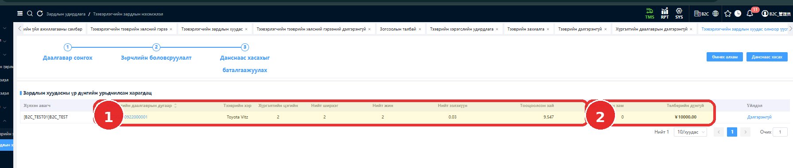
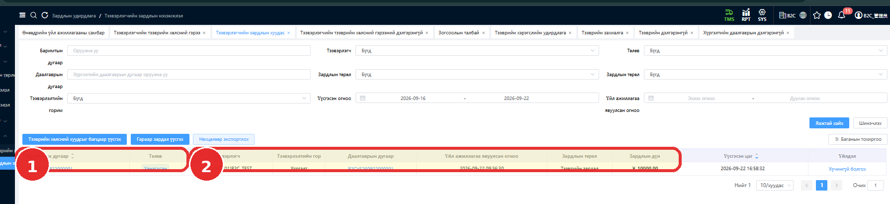
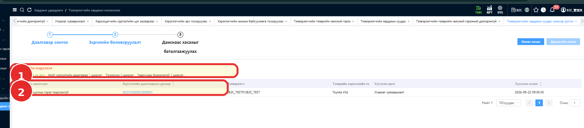

# Тээвэрлэгчийн төлбөр тооцоо, зардлын баримт батлах

## Зорилго

Тээвэрлэгчийн тээврийн хөлсний гэрээ (Carrier Freight Agreement)-гээр төлбөр тооцоо хийж, тээвэрлэгчийн зардлын баримтыг (Carrier Expense Bill) хянан батална.

## Урьдчилсан нөхцөл

Тестийн дараалалд **B2CVS260922000001** хүргэлтийн даалгавар дууссан, тээвэрлэгч нь **[B2C_TEST01] B2C_TEST** байна. Төлбөр тооцоонд ашиглах гэрээ энэ тээвэрлэгчтэй таарсан, идэвхжүүлсэн байна.

## Цэсний зам

Web TMS-ийн **Carrier Freight Agreement**, **Carrier Expense Bill** хэсгүүд. Цэсний бүрэн шатлал болон settlement эхлүүлэх товчны нэрийг эх сурвалжид өгөөгүй.

## Алхамууд

### 1. Тээвэрлэгчийн гэрээг шалгах

1. Хүргэлтийн даалгаврын тээвэрлэгчийг шалгана.
2. Түүнтэй таарах **[B2C_TEST01] B2C_TEST** тээвэрлэгчийн гэрээг бэлтгэж, идэвхжүүлнэ.
3. Тестийн гэрээний тооцооллын төрөл **Delivery Point based**, нэг хүргэлтийн цэгийн үнэ **5,000** эсэхийг шалгана.

<!-- TODO: Screenshot required — B2C_TEST01 тээвэрлэгчийн идэвхжүүлсэн Carrier Freight Agreement, Delivery Point based төрөл, 5,000 тариф -->

### 2. Төлбөр тооцоо хийж, зардлын баримтыг шалгах

1. Хүргэлтийн даалгаварт төлбөр тооцоо (settlement) хийнэ.
2. Хүргэлтийн **2 цэг × 5,000 = 10,000** тооцоог системийн дүнтэй тулгана.

    

    **Зураг дээрх тэмдэглэгээ:** 1 — 2 цэг, 2 ширхэг, 2 kg, 0.03 m³, 9.547 km; 2 — **¥10000.00** дүн. Хажуугийн бодит явсан зам **0** байна. Нэг цэгийн **5,000** тариф энэ зурагт харагдахгүй; тестийн гэрээний мэдээллээр тайлбарласан.

3. Үүссэн **B2CEP260922000001** зардлын баримтыг нээнэ.
4. Доорх мэдээлэл болон анхны **Initial** төлөвийг шалгана.

| Талбар | Тестийн утга |
|---|---|
| Carrier | [B2C_TEST01] B2C_TEST |
| Delivery Task | B2CVS260922000001 |
| Expense type | Transportation Expense |
| Amount | 10,000 |

<!-- TODO: Screenshot required — Carrier Expense Bill-ийн анхны Initial төлөв -->

### 3. Зардлын баримтыг хянан батлах

1. Зардлын баримтад **Review** үйлдэл хийнэ.
2. Батлах тайлбар (approval comment) оруулна.
3. **Approve** үйлдэл хийнэ.
4. Баримтын жагсаалтад **Хянагдсан** төлөвтэй болсныг шалгана.

    

    1-р хүрээнд баримтын дугаар, **Хянагдсан** төлөв; 2-р хүрээнд тээвэрлэгч, хүргэлтийн даалгавар, зардлын төрөл, дүн харагдана.

<!-- TODO: Screenshot required — Review, approval comment оруулах болон Approve хийх дэлгэцүүд; 20 зураг нь эцсийн жагсаалтыг харуулна -->

## Хүлээгдэж буй үр дүн

Систем **10,000** дүн тооцож, **B2CEP260922000001** баримт үүссэн байна. Хянаж баталсны дараа баримт **reviewed/approved** болсон гэж тестийн эх сурвалжид тэмдэглэсэн. 20 зурагт UI дахь эцсийн төлөв **Хянагдсан** гэж харагдана.

## Анхаарах зүйл

Эхний оролдлогын гэрээний тээвэрлэгч **[B2C] B2C**, харин хүргэлтийн даалгаврын тээвэрлэгч **[B2C_TEST01] B2C_TEST** байсан. Төлбөр тооцоо хийхэд **“Төлбөр тооцооны гэрээ таараагүй”** гэсэн шалгалтын мэдэгдэл гарсан. Зөв тээвэрлэгч дээр шинэ гэрээ үүсгэн идэвхжүүлсний дараа амжилттай болсон.

**Зураг дээрх тэмдэглэгээ:** 1 — тохирсон 0, тааруулах боломжгүй 1 даалгавар; 2 — гэрээ тохироогүй шалтгаан. Энэ нь амжилтгүй оролдлогын зураг.

Тестийн UI зардлын дүн дээр **¥** тэмдэг харуулсан. **Валютын харагдацын тохиргоог (Currency display configuration) тусад нь шалгах шаардлагатай.** Монголын production орчинд ₮ байх ёстой эсэх баталгаажаагүй; энд 10,000 дүнг тодорхой валюттай гэж нэрлээгүй.
