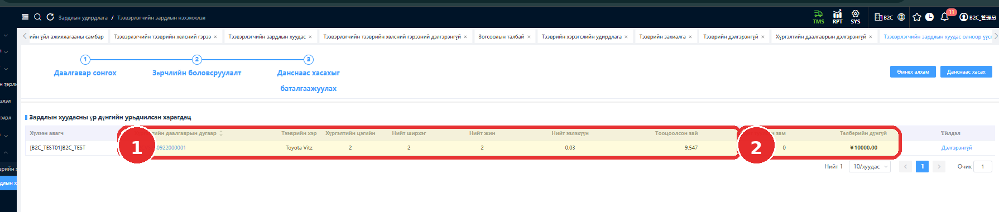
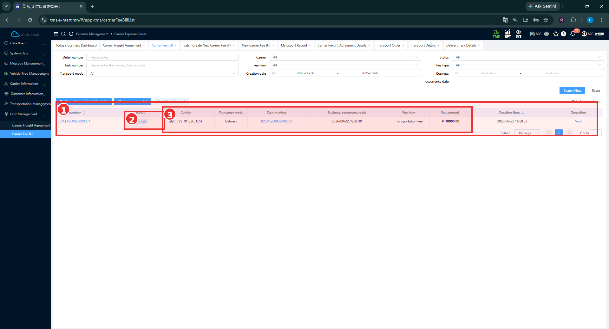
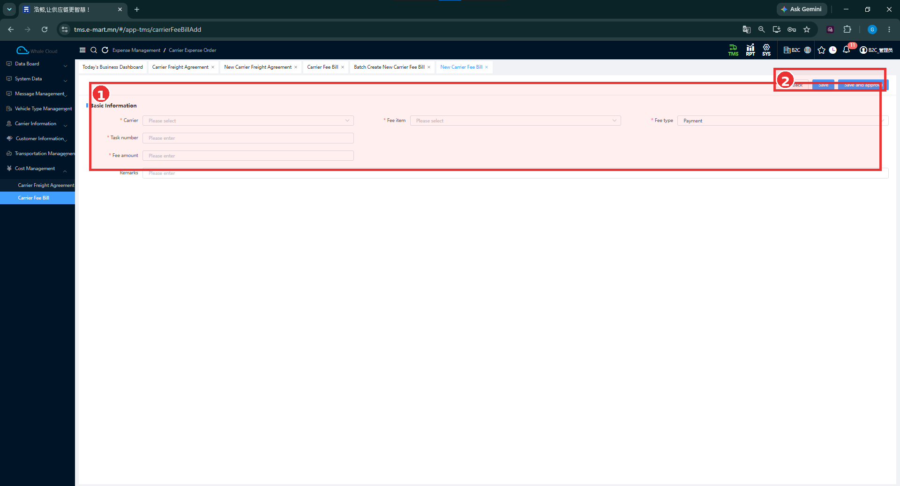
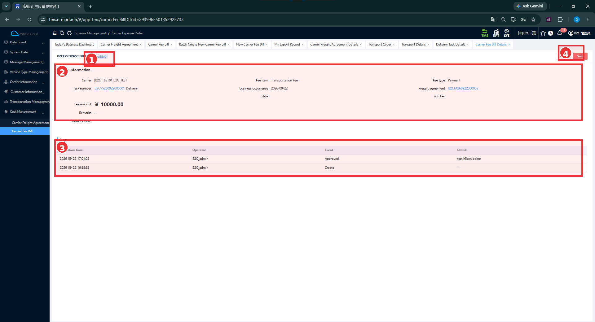

# Carrier Fee Bill

[Cost Management-ийн ерөнхий ойлголт](../tms/cost-management.md)

## Энэ хэсэг юу хийдэг вэ?

Carrier Fee Bill нь тээврийн ажилтай холбоотой тооцоолсон эсвэл гараар бүртгэсэн зардлыг харж, шалгаж, хянах хэсэг юм. Баримтаас ямар тээвэрлэгчийн, ямар даалгаврын, ямар төрлийн зардал болохыг харна. Дэлгэрэнгүйд төлбөрийн гэрээний дугаар болон баримтыг үүсгэж, баталсан түүхийг шалгаж болно.

Өмнөх B2C баримтад **Carrier Expense Bill**, **Transportation Expense** гэж нэрлэсэн. Одоогийн цэсэнд **Carrier Fee Bill**, зардлын нэрд **Transportation Fee** харагдаж байна. Ижил **B2CEP260922000001** баримтын дугаараар өмнөх болон шинэ зургуудыг тулгасан.

## Хэзээ ашиглах вэ?

- Хүргэлтийн даалгаврын тооцсон төлбөрийг шалгах.
- Шаардлагатай зардлыг маягтаар гараар бүртгэх.
- Зардлын дүн, даалгавар, холбогдох гэрээг тулгах.
- Баримт хянагдсан эсэх, хэн хэзээ үйлдэл хийснийг харах.

## Эхлэхийн өмнө

[Delivery Task](../dispatch/publish.md)-ийн дугаар, тээвэрлэгч, гүйцэтгэлийн мэдээллээ бэлтгэнэ. Гэрээнд тулгуурласан төлбөр шалгах бол [Carrier Freight Agreement](../tms/cost-management/carrier-freight-agreement.md)-ийн тээвэрлэгч, төлөв, хугацаа, тарифын нөхцөлийг нягтална. Гараар бүртгэх бол зардлын нэр, төрөл, дүн болон тайлбараа бэлтгэнэ.

**Цэсний зам:** TMS → Cost Management → Carrier Fee Bill.

## Тээврийн зардал хаанаас үүсэх вэ?

Өмнөх [B2C тестэд](../testing/tc-b2c-e2e-001.md) дууссан Delivery Task дээр тээвэрлэгчийн төлбөр тооцож, Transportation Fee бүхий Carrier Fee Bill үүсгэсэн.

```text
Completed Delivery Task — өмнөх тестийн гүйцэтгэсэн ажил
   ↓
Carrier fee calculation — тээвэрлэгчийн төлбөр тооцох
   ↓
Transportation Fee — тооцсон тээврийн зардал
   ↓
Carrier Fee Bill — зардлын баримт
   ↓
Review / Approval — хянаж батлах
```

**Completed болсон бүх даалгаварт төлбөр шууд автоматаар үүснэ гэж баталгаажуулаагүй.** Тооцоонд орох яг нөхцөл, автомат эхлэх хугацаа одоогийн баримтад бүрэн байхгүй.

| Төрөл | Тайлбар |
|---|---|
| Agreement-д тулгуурласан fee | Тээврийн ажил болон гэрээний нөхцөлтэй холбоотойгоор тооцсон зардлын бүртгэл. |
| Manual Fee Bill | Хэрэглэгч Carrier, Task number, Fee item, Fee amount зэрэг мэдээллийг гараар сонгож, оруулан бүртгэх боломж. |

## Тооцоолсон төлбөр — ¥10,000 {#calculated-fee}



| № | Хэсэг | Тайлбар |
|---|---|---|
| 1 | Даалгавар болон тооцооны мэдээлэл | B2CVS260922000001, Toyota Vitz, 2 хүргэлтийн цэг, 2 ширхэг, 2 kg, 0.03 m³, тооцоолсон зай 9.547 km. |
| 2 | Бодит зам ба төлбөр | Бодит явсан зам 0, төлбөрийн дүн ¥10000.00. |

**Энэ тестийн жишээнд систем ¥10,000 төлбөр тооцсон.** Энэ нь бүх B2C хүргэлтэд хэрэглэх тогтмол үнэ биш.

Өмнөх тестийн тэмдэглэлд хүргэлтийн 2 цэг, нэг цэгийн 5,000 тариф хэрэглэсэн гэж бий. Харин энэ зурагт тухайн тарифын талбар харагдахгүй. Шинэ гэрээний **TEST02** зураг дахь **Starting quantity = 5000 unit** нь өөр талбар, өөр гэрээний жишээ юм. Эдгээрээс нийтлэг тооцооны томьёо гаргаж болохгүй.

### Дүнг хэрхэн нягтлах вэ?

1. Үр дүнгийн мөр дэх даалгаврын дугаарыг өөрийн **Task number**-тай тулгана.
2. Тээвэрлэгч болон хүргэлтийн цэг, ачааны хэмжээг шалгана.
3. Тооцсон төлбөрийн дүнг харна.
4. Дараа нь Carrier Fee Bill жагсаалтаас ижил Task number-тай баримтыг олж, дүнг тулгана.

Тооцоолсон зай ба бодит явсан зай нь тусдаа үзүүлэлт. Энэ жишээнд бодит явсан зам 0 байгаа шалтгаан, төлбөрт үзүүлэх нөлөө баталгаажаагүй.

## Жагсаалтаас баримт хайх {#list}



| № | Хэсэг | Тайлбар |
|---|---|---|
| 1 | Баримтын жагсаалт | Баримтын дугаар, төлөв, мэдээлэл, үүсгэсэн цаг болон Operation бүхий мөр. |
| 2 | Status | Audited төлөв. |
| 3 | Холбоотой мэдээлэл | Carrier, Transport mode, Task number, Business occurrence date, Fee item, Fee amount. |

Хайлтын талбарууд болон шинэ баримтын товчнууд нь эдгээр хүрээний дээр байрлана.

### Алхам алхмаар

1. **Order number**-т баримтын дугаар эсвэл **Task number**-т хүргэлтийн даалгаврын дугаар оруулна.
2. Хэрэгтэй бол **Carrier**, **Status**, **Fee item**, **Fee type**, **Transport mode**-оор шүүнэ.
3. **Creation date** буюу үүсгэсэн огноо, **Business occurrence date** буюу ажил гүйлгээ болсон огнооны завсрыг нягтална.
4. **Search Now** дарна. Баримт олдохгүй бол дугаар болон огнооны нөхцөлийг шалгаж, хэрэгтэй үед **Reset** ашиглана.
5. Олдсон мөрийн тээвэрлэгч, Task number, Fee item, Fee amount, Status-ыг тулгана.
6. Цэнхэр **Order number** холбоосоор баримтын дэлгэрэнгүйг нээнэ.

### Жагсаалтын талбарууд

Эдгээр нь харах баганууд; заавал бөглөх маягт биш.

| Талбар | Энгийн тайлбар | Зураг дахь жишээ |
|---|---|---|
| Order number | Зардлын баримтын дугаар. Тээврийн захиалгын дугаартай андуурахгүй. | B2CEP260922000001 |
| Status | Баримтын хяналтын төлөв. | Audited |
| Carrier | Зардал хамаарах тээвэрлэгч. | [B2C_TEST01] B2C_TEST |
| Transport mode | Тээврийн төрөл. | Delivery |
| Task number | Зардал хамаарах тээврийн ажлын дугаар. | B2CVS260922000001 |
| Business occurrence date | Зардалтай холбоотой ажил гүйлгээ болсон огноо, цаг. | 2026-09-22 09:36:30 |
| Fee item | Ямар зардал болохыг заасан нэр. | Transportation Fee |
| Fee amount | Бүртгэсэн зардлын дүн. | ¥10000.00 |
| Creation time | Зардлын баримтыг үүсгэсэн огноо, цаг. | 2026-09-22 16:58:32 |
| Operation | Тухайн мөрд харагдах боломжит ажиллагаа. | Void |

**Task number** нь ямар ажилд хамаарахыг, **Fee item** нь тэр ажилтай холбоотой ямар зардал болохыг ялгана. **Business occurrence date** ба **Creation time** хоёр өөр мэдээлэл.

### Audited гэж юу вэ?

**Audited** гэдэг нь энэ Fee Bill хяналтын шат дамжиж баталгаажсан бүртгэл байдлаар харагдаж байгааг илэрхийлнэ. Энэ бол өмнөх B2C тестийн бодит үр дүн. Дэлгэрэнгүй дэх **Approved** түүхтэй хамт шалгана.

Audited төлөв нь нягтлан бодох бүртгэлд албан ёсоор бичилт хийсэн, төлбөр шилжүүлсэн эсвэл ERP-д дамжуулсан гэсэн баталгаа биш.

## Manual Fee Bill — Гараар зардлын баримт бүртгэх {#manual}

Энэ маягтаар системийн автомат тооцооноос тусдаа, хэрэглэгч шаардлагатай мэдээллээ өөрөө сонгож, дүнг оруулан баримт бүртгэх боломжтой.



| № | Хэсэг | Тайлбар |
|---|---|---|
| 1 | Basic Information | Carrier, Task number, Fee amount, Fee item, Fee type. Remarks нь хүрээний доор байна. |
| 2 | Үйлдлийн товчнууд | Баруун дээд талын Back, Save, Save and approve. |

Жагсаалтын **New Manual fee bill** товчоор орох маягтын tab нь зурагт **New Carrier Fee Bill** гэж харагдана.

### Алхам алхмаар

1. Carrier Fee Bill жагсаалтын **New Manual fee bill** товчийг дарна.
2. **Carrier**-аас зөв тээвэрлэгчээ сонгоно.
3. **Task number**-т холбогдох тээврийн ажлын дугаарыг оруулна.
4. **Fee item**-аас зардлын нэрийг сонгож, **Fee type**-ийг шалгана.
5. **Fee amount**-д бүртгэх дүнгээ оруулна.
6. Шаардлагатай бол **Remarks**-т тайлбар бичнэ.
7. Тээвэрлэгч, даалгавар, зардлын төрөл, дүнгээ тулгаж шалгана.
8. Хадгалах бол **Save** ашиглана. Хадгалахтай хамт батлах ажиллагаа хийх бол **Save and approve**-ийн зориулалтыг доороос уншина.
9. Жагсаалтад буцаж, Task number-оор хайж, бүртгэл болон харагдсан төлөвийг шалгана.

### Талбаруудын тайлбар

**Тийм** гэдэг нь энэ маягтын зурагт улаан **\*** тэмдэгтэй гэсэн үг.

| Талбар | Тайлбар | Заавал эсэх |
|---|---|---|
| Carrier | Зардал хамаарах тээвэрлэгч. | Тийм |
| Task number | Холбогдох тээврийн ажлын дугаар. | Тийм |
| Fee item | Бүртгэх зардлын нэр. Сонголтын жагсаалт зурагт дэлгэгдээгүй. | Тийм |
| Fee type | Төлбөрийн төрөл. Зурагт Payment буюу төлбөр сонгосон. | Тийм |
| Fee amount | Гараар бүртгэх зардлын дүн. | Тийм |
| Remarks | Зардалтай холбоотой нэмэлт тайлбар. | Зурагт * тэмдэггүй |

### Save ба Save and approve

| Товч | Зориулалт |
|---|---|
| Save | Оруулсан мэдээллийг хадгалах үйлдэл. |
| Save and approve | Хадгалахтай хамт батлах ажиллагаа хийх зориулалттай товч. |
| Back | Өмнөх дэлгэц рүү буцах товч. |

Save болон Save and approve-ийн дараах яг төлөв энэ маягтын зургаар баталгаажаагүй. **Save and approve дарвал заавал Audited болно гэж заагаагүй.** Хэн батлах эрхтэй, ямар нөхцөлд гараар баримт үүсгэхийг одоогийн тестээр тогтоогоогүй.

Энэ хоосон маягт нь бүртгэх боломжийг харуулна. Дээрх ¥10,000-ын баримтыг энэ маягтаар гараар үүсгэсэн гэж үзэхгүй.

## Fee Bill Detail — Дэлгэрэнгүй {#detail}



| № | Хэсэг | Тайлбар |
|---|---|---|
| 1 | Төлөв | Баримтын дугаарын хажууд Audited харагдана. |
| 2 | Basic Information | Тээвэрлэгч, даалгавар, зардлын мэдээлэл, гэрээний дугаар, дүн, Remarks. Photos/Videos нэр нь хүрээний доод захад байна. |
| 3 | Log | Үйлдлийн цаг, хэрэглэгч, Event, Details баганууд. |
| 4 | Void | Баруун дээд талын хүчингүй болгох товч. |

### Дэлгэрэнгүйг шалгах дараалал

1. Дээд талын баримтын дугаар, **Audited** төлөвийг шалгана.
2. **Carrier**, **Task number**-ыг Delivery Task-ийн мэдээлэлтэй тулгана.
3. **Fee item**, **Fee type**, **Business occurrence date**, **Fee amount**-ыг уншина.
4. Баруун талын **Freight agreement number**-оос холбогдох гэрээний дугаарыг олно.
5. **Remarks**, **Photos/Videos** хэсэгт нэмэлт мэдээлэл байгаа эсэхийг харна.
6. Доод **Log**-оос үүсгэсэн болон баталсан үйлдлийн цаг, хэрэглэгчийг шалгана.

| Талбар | Энгийн тайлбар |
|---|---|
| Carrier | Баримт хамаарах тээвэрлэгч; [B2C_TEST01] B2C_TEST. |
| Task number | Холбоотой даалгаврын дугаар; B2CVS260922000001, Delivery. |
| Fee item | Зардлын нэр; Transportation Fee буюу тээврийн зардал. |
| Fee type | Төлбөрийн төрөл; Payment. |
| Business occurrence date | Ажил гүйлгээ болсон огноо; дэлгэрэнгүйд 2026-09-22. |
| Freight agreement number | Холбогдох төлбөрийн гэрээний дугаар; B2CFA260922000002. |
| Fee amount | Зардлын дүн; ¥10000.00. |
| Remarks | Нэмэлт тайлбар; зурагт зураастай. |
| Photos/Videos | Зураг, видеоны хэсэг; энэ жишээнд хавсралт харагдахгүй. |

Энэ нь харах дэлгэц тул заавал бөглөх талбарын хүснэгт биш.

### Agreement ↔ Task ↔ Fee Bill

Энэ баримтад дараах мэдээлэл хамт харагдана.

| Холбоотой бүртгэл | Дугаар |
|---|---|
| Carrier Freight Agreement | B2CFA260922000002 |
| Delivery Task | B2CVS260922000001 |
| Carrier Fee Bill | B2CEP260922000001 |

Гэрээний жагсаалт дахь ижил дугаартай гэрээ **Enabled** бөгөөд ижил тээвэрлэгчтэй. [Гэрээний заавраас](../tms/cost-management/carrier-freight-agreement.md) дугаар, тээвэрлэгч, нөхцөлийг хэрхэн шалгахыг үзнэ.

## Log — Үйлдлийн түүхийг унших {#log}

Log-оос тухайн Fee Bill дээр **ямар үйлдэл, хэзээ, ямар хэрэглэгч** хийснийг харна.

| Багана | Тайлбар |
|---|---|
| Operation time | Үйлдэл хийсэн огноо, цаг. |
| Operator | Үйлдэл хийсэн хэрэглэгч. |
| Event | Үйлдлийн нэр. |
| Details | Тухайн үйлдлийн нэмэлт мэдээлэл, тайлбар. |

Зурагт хамгийн сүүлийн үйлдэл дээд мөрд байна. Цагаар нь уншвал:

| Дараалал | Цаг | Event | Утга |
|---|---|---|---|
| 1 | 2026-09-22 16:58:32 | Create | Баримт үүсгэсэн. |
| 2 | 2026-09-22 17:01:02 | Approved | Баримтыг баталсан. |

Хоёр үйлдлийн **Operator** нь **B2C_admin**. Энэ нь тухайн тестийн үйлдэл хийсэн хэрэглэгч болохоос зөвхөн энэ хэрэглэгч батлах эрхтэй гэсэн дүрэм биш. Details дэх тестийн тайлбарыг өөрийн баримтад хуулж хэрэглэх шаардлагагүй.

Өмнөх тестийн тэмдэглэлд **Review → тайлбар оруулах → Approve** гэж бүртгэсэн. Одоогийн зурагт батлах цонх бус, дууссан **Create → Approved** түүх харагдана. Батлах цонхны талбарууд, эрхийн шатлал болон бүх төлөв шилжилтийн алхам одоогоор бүрэн баталгаажаагүй.

## Нэмэлт ажиллагаа

### Void

Жагсаалтын Operation болон дэлгэрэнгүйд **Void** товч харагдана. Энэ нь тухайн бүртгэлийг хүчингүй болгох боломжит ажиллагаа юм. Void хийсний дараах төлөв, буцаах боломж, нягтлан бодох бүртгэлд үзүүлэх нөлөө одоогийн тестээр баталгаажаагүй тул энд алхамчилсан заавар оруулаагүй.

### Batch Create — Олон даалгаврын төлбөрийг хамтад нь бэлтгэх

Жагсаалтад **Batch create new freight fee bills**, tab дээр **Batch Create New Carrier Fee Bill** гэсэн нэр харагдана. Өмнөх тооцооны зураг болон [гэрээ таараагүй үеийн зурагт](../assets/screenshots/tc-b2c-e2e-001/18-cost-agreement-mismatch.png) гурван шаттай дэлгэц байна.

| Үе шат | Ерөнхий зориулалт |
|---|---|
| Task Selection — Даалгавар сонгох | Төлбөр тооцох даалгаврыг сонгох. |
| Abnormal handling — Зөрчлийн боловсруулалт | Тооцоонд саад болсон мэдээллийг шалгах. Өмнөх зурагт гэрээ таараагүй шалтгаан байна. |
| Billing Confirmation — Тооцоог баталгаажуулах | Тооцсон үр дүнг урьдчилан харах, баталгаажуулах үе. Өмнөх Монгол UI-д «Данснаас хасахыг баталгаажуулах» гэж харагдана. |

Өмнөх B2C тестийн баримтад тооцоо болон баримт батлагдсан үр дүн бий. Гэхдээ **Batch Create-ийн бүх дэлгэц, товч, шилжилтийг хамарсан бүрэн амжилттай урсгалыг одоогийн багцаар баталгаажуулаагүй**. Сонгох боломжтой даалгаврын яг нөхцөл ч бүрэн нотлогдоогүй.

Шинэ багцад Batch Create-ийн No Data зураг байхгүй. Хоосон үр дүн гарсан шалтгааныг таамаглан тайлбарлахгүй.

## Үйлдэл хийсний дараа

Тооцсон баримтыг шалгаж байгаа бол ижил **Task number**, **Carrier**, **Fee amount**-тай эсэхийг тулгана. Гэрээтэй баримтад **Freight agreement number**-ийг шалгана. Хянаж баталгаажуулсан жишээнд **Audited** төлөв болон **Approved** түүх хамт байна.

Гараар баримт бүртгэсэн бол жагсаалтаас өөрийн оруулсан мэдээллээ хайж нягтална. Зөвхөн Save товч дарсан гэдгээр батлагдсан гэж үзэхгүй; бодит төлөв, Log-ийг уншина.

## Анхаарах зүйл

Өмнөх тестийн эхний оролдлогод гэрээний тээвэрлэгч **[B2C] B2C**, даалгаврынх **[B2C_TEST01] B2C_TEST** байсан. «Төлбөр тооцооны гэрээ таараагүй» мэдэгдэл гарсан. Зөв тээвэрлэгчийн гэрээг үүсгэж, идэвхжүүлсний дараа тооцоо амжилттай болсон гэж [тестийн бүртгэлд](../testing/tc-b2c-e2e-001.md) тэмдэглэсэн. Гэрээний тээвэрлэгчийг зөвхөн нэрээр нь бус кодтой нь тулгана.

UI дээр **¥** харагдсан тул дүнг тэр тэмдэгтэй нь тайлбарласан. Production орчны валют, хөрвүүлэлт, татвар болон ERP-д дамжуулах дүрэм энэ тестээр баталгаажаагүй.

Өмнөх нотолгооны зургуудыг хуучин замд нь хадгалсан: [гэрээ таараагүй мэдэгдэл](../assets/screenshots/tc-b2c-e2e-001/18-cost-agreement-mismatch.png), [10,000 тооцооны эх зураг](../assets/screenshots/tc-b2c-e2e-001/19-cost-calculation-10000.png), [Хянагдсан төлөвтэй өмнөх жагсаалт](../assets/screenshots/tc-b2c-e2e-001/20-expense-bill-approved.png). Шинэ үндсэн зааварт ижил үр дүнг давхар зураг болгон оруулаагүй.

## Дараагийн алхам

[Холбогдох гэрээний нөхцөлийг шалгах](../tms/cost-management/carrier-freight-agreement.md) → [Delivery Task-ийн мэдээллийг тулгах](../dispatch/publish.md). Бүх урсгалыг [B2C: захиалгаас төлбөр тооцоо хүртэл](../tutorials/order-to-delivery.md), баталгаажаагүй хүрээг [Cost Management-ийн тойм](../tms/cost-management.md)-оос харна.
