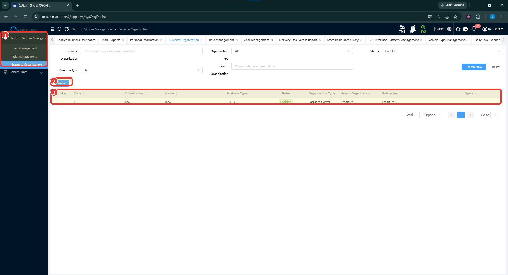

# Бизнес байгууллага (Business Organization)

## Зорилго

Бизнес байгууллагын бүртгэлийг олж, код, нэр, төрөл, төлөв болон харьяаллын мэдээллийг шалгана. Шинэ бүртгэл эхлүүлэх Create үйлдэлтэй танилцана.

Байгууллагын мэдээлэл [хэрэглэгчийн дэлгэрэнгүй](user-management.md) дэх Belonging Organization, Work Organization мэдээлэлтэй хамт харагдана. Мэдээлэл харах хүрээ болон байгууллагагүй хэрэглэгч үүсгэх боломжийг зураг дангаараа батлахгүй.

## Урьдчилсан нөхцөл

- [SYS-ийн тойм](index.md), [тохиргооны дараалал](platform-system-management.md)-тай танилцсан байна.
- Байгууллагын тохиргоог хийх эрхтэй эсэхээ систем хариуцсан ажилтнаас тодруулна. Шаардлагатай role-ийн нэр эх сурвалжид байхгүй.
- Ямар байгууллагын мэдээлэл ашиглахыг тодруулна. TC-B2C-E2E-001-д SYS байгууллагын нэр, код өгөөгүй.

## Цэсний зам

**SYS → Platform System Management → Business Organization**

## Байгууллагын жагсаалт

1. Business Organization цэсийг нээнэ.
2. Код, нэр эсвэл товчилсон нэрээр хайх утга оруулна. Organization Type, Business Type, Parent Organization, Status шүүлтүүрүүд мөн харагдана.
3. **Search Now** дарж жагсаалтыг шалгана. Зурагт Status = Enabled нөхцөлтэй байна.

*Зураг: Бизнес байгууллагын жагсаалт.*

### Зураг дээрх тэмдэглэгээ

1. **Business Organization** — SYS → Platform System Management доторх сонгосон цэс.
2. **Create** — шинэ бизнес байгууллагын бүртгэл эхлүүлэх товч.
3. **Байгууллагын жагсаалт** — код, товчилсон нэр, нэр, бизнесийн төрөл, төлөв, байгууллагын төрөл, дээд байгууллага болон enterprise мэдээлэл.

## Жагсаалтын үндсэн мэдээлэл

| Талбар | Тайлбар |
| ------ | ------- |
| Code | Байгууллагын код. Зурагт B2C гэсэн жишээ байна. |
| Abbreviation | Байгууллагын товчилсон нэр. |
| Name | Байгууллагын нэр. |
| Business Type | Бүртгэлийн бизнесийн төрөл. Сонголтын бүх утга зурагт байхгүй. |
| Status | Бүртгэлийн төлөв; жишээнд Enabled гэж харагдана. |
| Organization Type | Байгууллагын төрөл; жишээнд Logistics Center байна. |
| Parent Organization | Дээд байгууллагын мэдээлэл. Эрх удамших дүрмийг энэ баганаар дүгнэхгүй. |
| Enterprise | Харьяалах enterprise-ийн мэдээлэл. Parent Organization-той ижил ойлголт гэж үзэхгүй. |

## Шинэ байгууллага бүртгэх

Жагсаалтын дээд хэсгийн **Create** товчоор шинэ байгууллага бүртгэх үйлдлийг эхлүүлнэ. Ашиглах байгууллага бүртгэлтэй эсэх, шинэ бүртгэл шаардлагатай эсэхийг эхлээд тодруулна.

!!! note
    Шинэ байгууллага үүсгэх маягтын талбарууд одоогийн баталгаажсан screenshot-д ороогүй тул энэ хувилбарт талбар тус бүрийн зааврыг оруулаагүй.

Жагсаалтын багануудыг үүсгэх маягтын заавал бөглөх талбар гэж үзэхгүй.

## Хадгалах

Хадгалах товчны нэр, амжилтын мэдэгдэл, алдааны нөхцөлийг баталгаажуулаагүй. TODO: үүсгэх маягт болон хадгалсны дараах дэлгэцийн зураг, гүйцэтгэсэн алхмуудыг нэмж баримтжуулах.

## Бүртгэлийг шалгах

Код, нэрээр хайж, жагсаалтын Status, Organization Type, Parent Organization, Enterprise мэдээллийг ашиглах байгууллагын мэдээлэлтэй тулгана. Энэ нь байгаа бүртгэлийн зураг; шинэ байгууллага хадгалсны үр дүнгийн зураг биш.

TC-B2C-E2E-001-ийн **B2C-DEMO / BDC** нь харилцагч, **B2C_TEST01 / B2C_TEST** нь тээвэрлэгчийн жишээ. Эдгээрийг SYS байгууллагын бүртгэл гэж ашиглахгүй. [Үндсэн өгөгдлийн эх сурвалж](../getting-started/overview.md).

## Засварлах

Засварлах үйлдэл, өөрчилж болох талбар, хэрэглэгчийн харьяалалд үзүүлэх нөлөө баталгаажаагүй. TODO: засварын өмнөх ба дараах бүртгэл, бодит үйлдлийн дарааллыг авах.

## Идэвхгүй болгох / боломжтой төлөвийн өөрчлөлт

Жагсаалтад **Enabled** төлөв харагдана. Төлөв өөрчлөх үйлдэл, баталгаажуулах цонх болон холбоотой хэрэглэгчдэд үзүүлэх нөлөө зурагт байхгүй.

## Анхаарах зүйл

Байгууллага, харилцагч, тээвэрлэгчийн ойлголтыг ижил бүртгэл гэж үзэхгүй. Organization үүсээгүйгээс дараагийн тохиргоо заавал хаагдана гэсэн нотолгоо байхгүй.

Нэмж авах зураг: байгууллага үүсгэх маягт, хадгалалтын үр дүн, засварлах үйлдэл, боломжтой төлөвийн өөрчлөлт.

## Түгээмэл алдаа

Business Organization-той холбоотой системийн алдааны мэдэгдэл repository-д бүртгэгдээгүй. Ажиллах үед алдаа гарвал үйлдлийн дараалал, харагдсан мэдэгдэл, хувилбар болон нууц мэдээлэлгүй дэлгэцийн зургийг тэмдэглүүлж шалгуулна.

## Дараагийн алхам

**Гарын авлагын санал болгож буй дараалал:** Business Organization → [User Management](user-management.md) → [Role Management](role-management.md) → [TMS мастер мэдээлэл](../getting-started/overview.md). Энэ нь системийн заавал биелүүлэх хамаарал биш.
