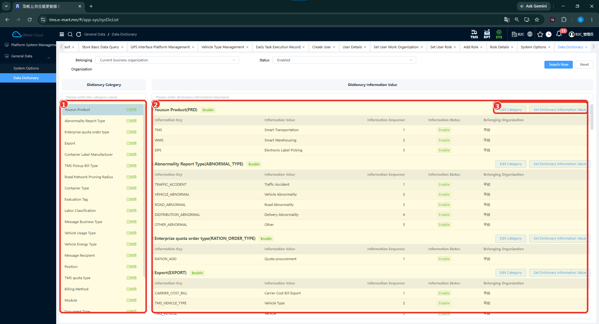

# Өгөгдлийн лавлах (Data Dictionary)

## Зорилго

Системийн төрөл, ангилал болон сонголтын лавлах утгуудыг төвлөрүүлэн харуулах, удирдах бүтэцтэй танилцана. Зурагт ангилал, түүнд хамаарах мэдээллийн түлхүүр, утга тусдаа хэсэгт харагдана.

## Цэсний зам

**SYS → General Data → Data Dictionary**

## Ангилал болон утгуудыг харах

1. Data Dictionary цэсийг нээнэ.
2. Belonging Organization, Status нөхцөлүүдийг шалгана. Зурагт Current business organization болон Enabled байна.
3. Зүүн талын Dictionary Category хэсгээс ангиллыг олно. Ангиллын нэрээр хайх талбар бий.
4. Баруун талын Dictionary Information Value хэсгийн түлхүүр, утга, дараалал, төлөв болон байгууллагын мэдээллийг харна. Түлхүүр/утгаар хайх талбар мөн байна.

*Зураг: Өгөгдлийн лавлахын ангилал болон утгууд.*

### Зураг дээрх тэмдэглэгээ

1. **Dictionary Category** — лавлахын ангиллуудын жагсаалт.
2. **Dictionary Information Value** — ангиллын мэдээллийн түлхүүр, утга, дараалал, төлөв болон харьяалах байгууллага.
3. **Edit Category / Set Dictionary Information Value** — ангилал засварлах болон лавлахын утга тохируулах тусдаа үйлдлүүд.

## Жишээ ангиллууд

Зурагт Container Type, Evaluation Tag, Labor Classification, Vehicle Usage Type, Vehicle Energy Type, Position, Billing Method, Document Type зэрэг ангилал харагдана. Эдгээр нь дэлгэц дээр байгаа ангиллын жишээ бөгөөд бүх утгын жагсаалт биш.

## Мэдээллийн үндсэн баганууд

| Талбар | Тайлбар |
|---|---|
| Information Key | Лавлах мэдээллийн түлхүүр. |
| Information Value | Түлхүүрт харгалзах утга. |
| Information Sequence | UI дээрх дарааллын мэдээлэл. Бусад дэлгэцийн эрэмбэлэх дүрмийг үүнээс дүгнэхгүй. |
| Information Status | Лавлах мэдээллийн төлөв. Зурагт Enable байна. |
| Belonging Organization | Мэдээллийн харьяалах байгууллага. |

## Засварлах хүрээ

Edit Category нь ангилал засварлах, Set Dictionary Information Value нь мэдээллийн утга тохируулах үйлдлийн эхлэл. Дараагийн цонх, хадгалах товч, боломжтой өөрчлөлт болон тэдгээрийн нөлөө зурагт байхгүй.

!!! note
    Бусад TMS form дээрх зарим сонголтын утга Data Dictionary-тэй холбоотой байж болох боловч тухайн холбоосыг тусгайлан баталгаажуулах шаардлагатай. Ижил нэртэй талбар байгаагаар нь аль dropdown ямар dictionary key-тай backend түвшинд холбогддогийг батлахгүй.

## Холбогдох заавар

[Системийн тохиргоо](system-options.md) · [Ерөнхий өгөгдлийн тойм](general-data.md) · [SYS](index.md)
