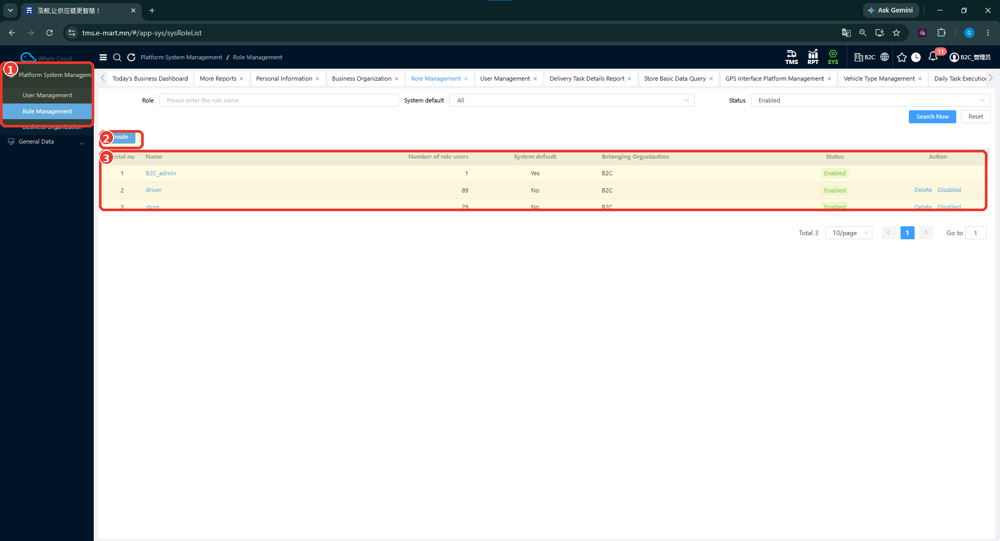
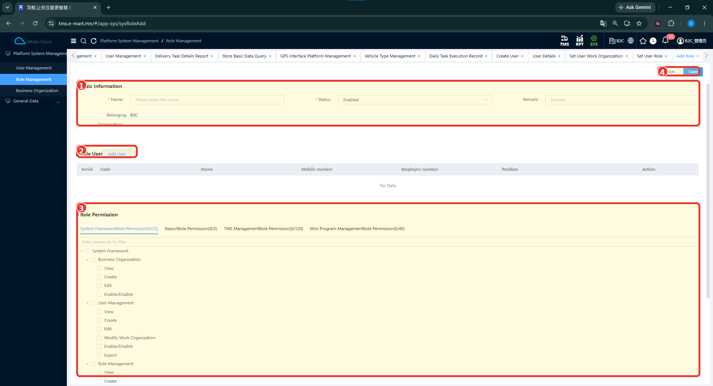
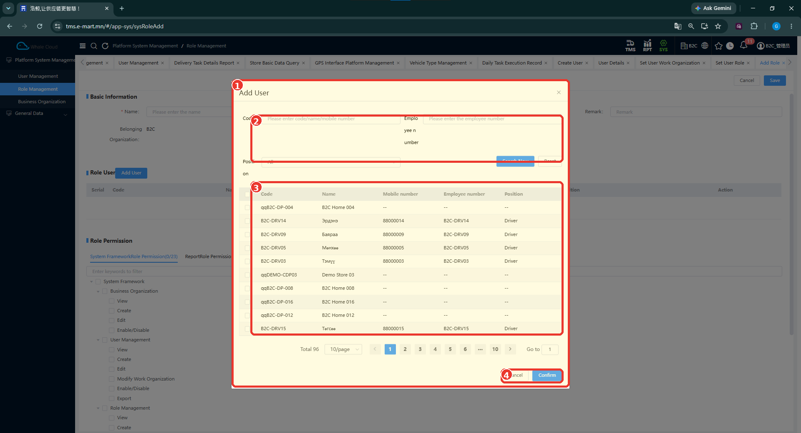
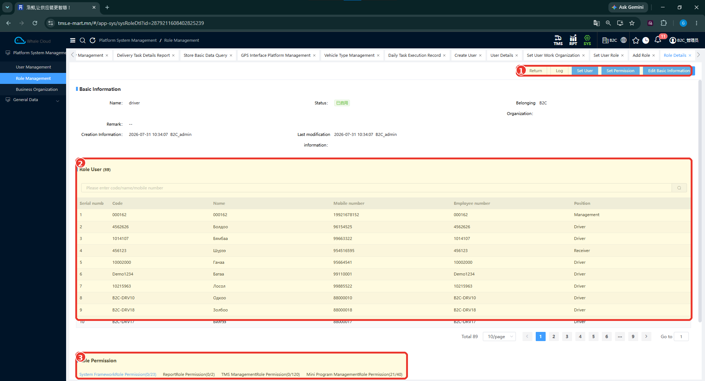

# Эрхийн удирдлага (Role Management)

## Зорилго

Role-ийн жагсаалт, хэрэглэгчийн оноолт, модуль тус бүрийн permission тохиргоотой танилцана. Шинэ role-ийн мэдээлэл оруулах, хэрэглэгч сонгох, дэлгэрэнгүйгээс оноолтыг шалгах дарааллыг тайлбарлана.

Role нь хэрэглэгчид ямар үйлдэл хийх эрх олгохыг тохируулахад хамаарна. Зурагт permission-ийн бүтэц харагдах боловч эрх удамших, role-ийн шатлал, өгөгдөл харах бүх дүрмийг батлахгүй.

## Урьдчилсан нөхцөл

- [Business Organization](business-organization.md) болон [User Management](user-management.md)-ийн баримтжуулсан хүрээтэй танилцана.
- Хэрэглэгчийн хийх ажлыг тодорхойлно.
- Эрх өөрчлөх боломжтой эсэхээ систем хариуцсан ажилтнаас тодруулна. Тохиргоог өөрчлөхөд танай орчинд шаардагдах эрхийг screenshot дангаараа тогтоохгүй.

## Цэсний зам

**SYS → Platform System Management → Role Management**

## Role-ийн жагсаалт

1. Role Management цэсийг нээнэ.
2. Role талбарт нэр оруулж, шаардлагатай бол System default, Status нөхцөлийг сонгоно.
3. **Search Now** дарж хүснэгтийн үр дүнг харна.

*Зураг: Role-ийн үндсэн жагсаалт.*

### Зураг дээрх тэмдэглэгээ

1. **Role Management** — эрхийн удирдлагын цэс.
2. **Create** — шинэ role үүсгэх үйлдлийн эхлэл.
3. **Role-ийн жагсаалт** — B2C_admin, driver, store гэсэн систем дээр байгаа жишээнүүд. Role-ийн бүх permission-ийг нэрнээс нь таамаглахгүй.

| Багана | Тайлбар |
|---|---|
| Name | Role-ийн нэр; дэлгэрэнгүй хуудасны холбоос. |
| Number of role users | Role-д холбогдсон хэрэглэгчийн тоо. |
| System default | Yes / No тэмдэглэгээ. Засварлах, устгах логикийг дүгнэхгүй. |
| Belonging Organization | Role-ийн харьяалах байгууллага. |
| Status | Төлөв; зурагт Enabled байна. |
| Action | Зарим мөрд Delete, Disabled гэсэн үйлдлүүд харагдана. Үр дүнг тусад нь баталгаажуулна. |

## Шинээр үүсгэх / тохируулах

1. Role-ийн жагсаалтаас **Create** дарна.
2. Basic Information хэсгийн Name, Status болон бусад мэдээллийг шалгаж бөглөнө.
3. Хэрэглэгч холбох бол Role User хэсгийн **Add User**-ийг ашиглана. [Сонгох цонхны дараалал](#add-user)-ыг доороос харна.
4. Role Permission хэсэгт холбогдох модуль, үйлдлийн сонголтыг шалгана.
5. Хадгалахад бэлэн бол **Save** дарна.

*Зураг: Role үүсгэх ба permission тохируулах дэлгэц.*

### Зураг дээрх тэмдэглэгээ

1. **Basic Information** — Name, Status, Remark болон Belonging Organization мэдээлэл.
2. **Add User** — role-д хэрэглэгч сонгох цонх нээнэ.
3. **Role Permission** — системийн дөрвөн хэсгийн эрхийг тус тусад нь сонгох tab болон permission tree.
4. **Save** — оруулсан мэдээллийг хадгалах үйлдэл. Хадгалсны дараах үр дүн зурагт байхгүй.

### Permission-ийн бүлгүүд

| UI дахь бүлэг | Харагдаж буй хүрээ |
|---|---|
| System Framework Role Permission | Системийн үндсэн хэсгийн эрхүүд |
| Report Role Permission | Тайлангийн эрхүүд |
| TMS Management Role Permission | TMS-ийн эрхүүд |
| Mini Program Management Role Permission | Mini Program-ийн эрхүүд |

Нэг role-д өөр өөр application/module-ийн эрхийг тус тус тохируулах бүтэц харагдаж байна. System Framework-ийн tree дотор **View**, **Create**, **Edit**, **Enable/Disable**, мөн User Management доор **Modify Work Organization**, **Export** сонголтууд байна.

Эдгээр нь харах, үүсгэх, засварлах, төлөв өөрчлөх, ажлын байгууллага өөрчлөх, экспортлох үйлдэлтэй холбоотой нэршлүүд. Нэг сонголт бусдыг автоматаар идэвхжүүлэх эсэх, эрх удамших дүрэм зурагт батлагдаагүй.

## Талбарын тайлбар

| Талбар | Тайлбар | UI дээр заавал эсэх |
|---|---|---|
| Name | Role-ийн нэр. | * тэмдэгтэй |
| Status | Төлөв; зурагт Enabled сонгогдсон. | * тэмдэгтэй |
| Remark | Тайлбар оруулах талбар. | * харагдахгүй |
| Belonging Organization | Харьяалах байгууллагын мэдээлэл. | * харагдахгүй |
| Add User | Хэрэглэгч сонгох үйлдэл. | Заавал хэрэглэгч холбох эсэх тодорхойгүй |
| Role Permission | Модуль тус бүрийн permission сонголтууд. | Хэдийг сонгох шаардлага зурагт байхгүй |

## Role-д хэрэглэгч нэмэх {#add-user}

1. Role үүсгэх дэлгэцийн **Add User** товчийг дарна.
2. Цонхны Code талбарт код, нэр эсвэл утасны дугаараар хайх утга оруулна. Employee number, Position нөхцөлүүдийг мөн ашиглаж болно.
3. **Search Now** дарна.
4. Тохирох хэрэглэгчийн мөрийн сонголтыг тэмдэглэнэ.
5. **Confirm** дарж сонголтыг баталгаажуулна.

*Зураг: Role-д хэрэглэгч нэмэх Add User цонх.*

### Зураг дээрх тэмдэглэгээ

1. **Add User** — role-д холбох хэрэглэгчийг сонгох цонх.
2. **Хайлтын нөхцөл** — Code, Employee number, Position болон Search Now, Reset үйлдлүүд.
3. **Хэрэглэгчийн жагсаалт / сонголт** — мөрийн зүүн талд сонгох нүдтэй; Code, Name, Mobile number, Employee number, Position баганууд харагдана.
4. **Confirm** — сонгосон хэрэглэгчийг баталгаажуулах товч.

Confirm нь энэ цонхны сонголтыг баталгаажуулах үйлдэл. Role үүсгэх үндсэн дэлгэцийн Save-тай адил үйлдэл гэж үзэхгүй. Confirm болон Save-ийн дараах бодит үр дүнг нэмэлт тестээр баталгаажуулна.

## Хадгалах

Үндсэн мэдээлэл, сонгосон хэрэглэгч, permission тохиргоогоо шалгаад үндсэн дэлгэцийн **Save** товчийг дарна. Амжилтын мэдэгдэл, өөрчлөлт хэрэглэгчийн эрхэд хэзээ үйлчлэх нь зурагт байхгүй.

!!! note
    Хадгалалтын нарийвчилсан дүрэм, role өөрчилсний дараа дахин нэвтрэх шаардлагатай эсэхийг нэмэлт тестээр баталгаажуулна.

## Бүртгэлийг шалгах

1. Role-ийн жагсаалтаас нэрийн холбоосоор дэлгэрэнгүйг нээнэ.
2. Basic Information хэсгийн нэр, төлөв, харьяалах байгууллагыг шалгана.
3. Role User жагсаалтаас холбогдсон хэрэглэгчдийг харна.
4. Role Permission хэсгийн модуль тус бүрийн хураангуйг шалгана.

*Зураг: driver role-ийн дэлгэрэнгүй.*

### Зураг дээрх тэмдэглэгээ

1. **Set User / Set Permission** — хэрэглэгчийн оноолт болон permission-ийг тусад нь удирдах үйлдлүүд. Edit Basic Information мөн харагдана.
2. **Role User** — тухайн role-д холбогдсон олон хэрэглэгчийн жагсаалт. Зурагт 89 гэсэн тоо байна; энэ нь хэрэглэгчийн дээд хязгаар биш.
3. **Permission summary** — модуль тус бүрийн permission хураангуй. Mini Program Management Role Permission-ийн 21/40 тэмдэглэгээ нь тухайн role-д Mini Program-ийн permission тохируулагдсан байгааг UI харуулж байна.

Эдгээр тоо нь зураг авсан үеийн тохиргоо бөгөөд бүх driver role-д мөрдөх бизнесийн дүрэм биш.

### Тестийн хүрээ

| Тестийн хэрэглэгч | Баталгаажсан ажил |
|---|---|
| Driver user | Нийтэлсэн даалгавар харах, ачилт, хүргэлт, сав буцаан татах ажиллагаа |
| Store user — qqB2C-DP-032 | Дэлгүүрийн хүлээн авалт шалгах, тээврийн үнэлгээ илгээх |

[Driver App-ийн нотолгоо](../execution/index.md) · [Store App-ийн нотолгоо](../execution/store-app.md).

Нэг үйлдэл амжилттай болсон нь бүх зөвшөөрөл зөв тохирсны баталгаа биш. Хориотой үйлдэл болон бусдын өгөгдөлд хандах хязгаарлалтыг энэ тестээр шалгаагүй.

## Засварлах

Дэлгэрэнгүй дээрх **Set User**, **Set Permission**, **Edit Basic Information** нь хэрэглэгчийн оноолт, эрх болон үндсэн мэдээллийг тусдаа удирдах үйлдлүүд юм.

Засварын дараагийн цонх, хадгалсан үр дүн, өмнө оноосон хэрэглэгчдэд өөрчлөлт хэрхэн үйлчлэхийг нэмэлт нотолгоогоор баталгаажуулна. Үүсгэх дэлгэцийн Add User цонхыг Set User цонхтой яг адил гэж үзэхгүй.

## Идэвхгүй болгох / боломжтой төлөвийн өөрчлөлт

Жагсаалтад **Enabled** төлөв, зарим мөрд **Disabled**, **Delete** гэсэн үйлдлийн холбоос харагдана. Баталгаажуулах цонх, үр дүн зурагт байхгүй.

Role идэвхгүй болгох, устгах, user-ээс role салгахыг ижил үйлдэл гэж үзэхгүй. System default = Yes тэмдэглэгээнээс аль үйлдэл зөвшөөрөгдөхийг таамаглахгүй.

## Анхаарах зүйл

- Driver болон Store-ийн ялгааг энд зөвхөн тестэд гүйцэтгэсэн ажлаар тайлбарласан.
- Жолоочид хүргэлтийн даалгавар оноох нь SYS хэрэглэгчид role оноохтой ижил үйлдэл биш.
- Store хэрэглэгчийг хүргэлтийн цэгтэй холбосон аргыг role оноолтоос тусад нь баталгаажуулна.
- [Тестийн оролцогчдын лавлах](../reference/user-roles.md)-ыг системийн эрхийн матриц гэж үзэхгүй.
- Нэмж авах зураг: Save-ийн үр дүн, Set User / Set Permission засварын цонх, төлөв өөрчлөх болон устгах баталгаажуулалт.

## Түгээмэл алдаа

Role тохируулахтай холбоотой баталгаажсан алдааны мэдэгдэл байхгүй. Хэрэглэгчид цэс харагдахгүй эсвэл үйлдэл хийх боломжгүй байвал шалтгааныг зөвхөн role-оос болсон гэж дүгнэхгүй; бодит оноолт, organization болон дэлгэцийн мэдэгдлийг хамтад нь шалгуулна.

## Дараагийн алхам

**Гарын авлагын санал болгож буй дараалал:** [Business Organization](business-organization.md) → [User Management](user-management.md) → Role Management → [TMS Master Data — Үндсэн өгөгдөл бэлтгэх](../getting-started/overview.md). Энэ нь системийн заавал биелүүлэх хамаарал биш.
