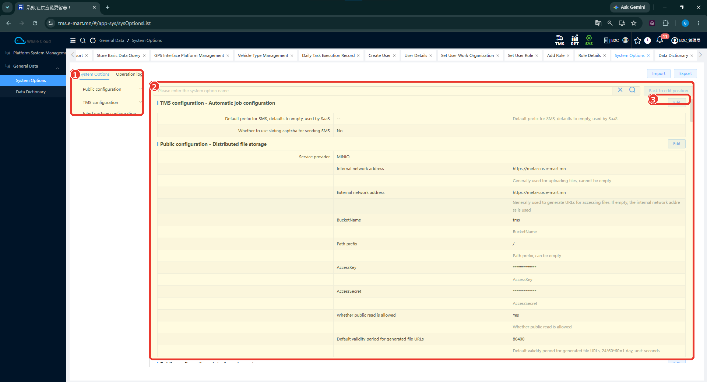

# Системийн тохиргоо (System Options)

## Зорилго

Системийн тохиргооны ангилал, харагдаж буй утга болон засварлах үйлдлийн байрлалтай танилцана. Энэ хуудас нь өдөр тутмын хэрэглэгчид зориулсан тойм, лавлах бөгөөд infrastructure тохируулах заавар биш.

## Цэсний зам

**SYS → General Data → System Options**

## Тохиргоог харах

1. System Options цэсийг нээнэ.
2. Зүүн талын ангиллуудыг харна: Public configuration, TMS configuration, Interface type configuration.
3. Баруун хэсгийн тохиргооны мэдээлэл, утгуудыг шалгана. Нэрээр хайх талбар мөн харагдана.

*Зураг: Системийн тохиргооны үндсэн дэлгэц.*

### Зураг дээрх тэмдэглэгээ

1. **Configuration category** — Public configuration, TMS configuration, Interface type configuration ангиллууд.
2. **Configuration values** — тохиргооны нэр, утга болон тайлбаруудыг харуулах хэсэг.
3. **Edit** — тухайн тохиргооны хэсгийг засварлах үйлдлийн эхлэл. Засварлах маягт зурагт ороогүй.

## Засварлах хүрээ

Edit товч харагдаж байгаа боловч оруулах утга, хадгалах алхам болон өөрчлөлтийн үр дүнг энэ зураг харуулахгүй. Зурагт байгаа дэд бүтцийн утгуудыг шинэ тохиргоонд хуулж ашиглах жишээ гэж үзэхгүй.

!!! warning
    System Options нь системийн төв тохиргоонд нөлөөлөх боломжтой. Production орчинд баталгаагүй утгыг дур мэдэн өөрчлөхгүй.

AccessKey, AccessSecret талбаруудын утга зурагт нууцлагдсан. Бодит утгыг таамаглахгүй. Сүлжээний endpoint, credential болон infrastructure утгуудыг энэ тайлбарт давтан бичээгүй.

!!! note
    Засварлах талбар, утгын шаардлага болон өөрчлөлтийн нөлөөг нэмэлт тестээр баталгаажуулна. Энэ хуудас байгууллагын эрх олгох бодлогыг тодорхойлохгүй.

## Холбогдох заавар

[Ерөнхий өгөгдлийн тойм](general-data.md) · [Өгөгдлийн лавлах](data-dictionary.md) · [SYS](index.md)
