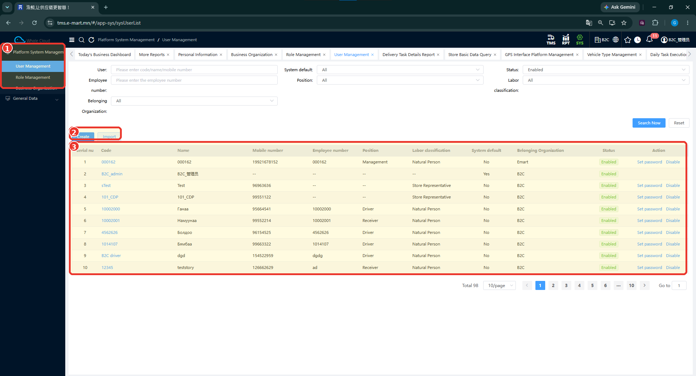
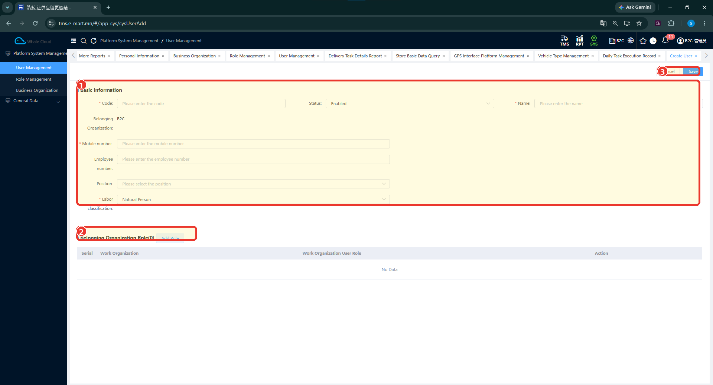
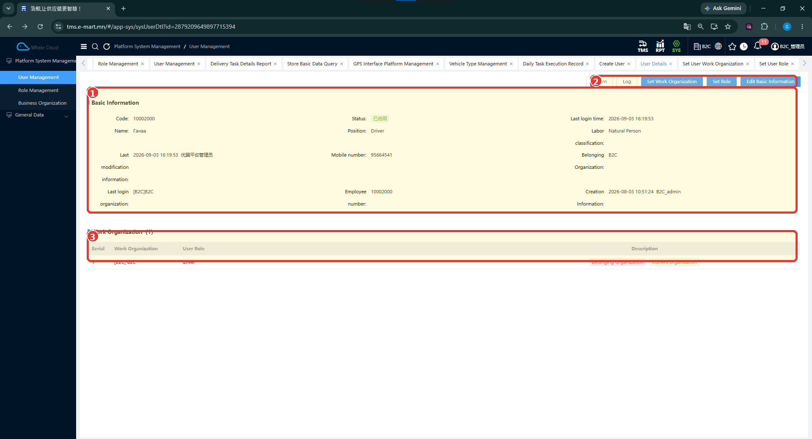

# Хэрэглэгчийн удирдлага (User Management)

## Зорилго

Хэрэглэгчийн жагсаалтаас бүртгэл хайх, шинэ хэрэглэгчийн мэдээлэл оруулах, байгууллага болон role-ийн холбоосыг дэлгэрэнгүйгээс шалгах аргыг тайлбарлана.

TC-B2C-E2E-001-ийн Driver, Store хэрэглэгчдийн жишээг SYS-ийн бодит дэлгэцтэй хамтатган үзнэ. Маягт, товч харагдсан нь хадгалалт болон нэвтрэлтийн бүх дүрмийг батлахгүй.

## Урьдчилсан нөхцөл

- [Байгууллагын удирдлага](business-organization.md)-ын тайлбартай танилцана. Байгууллагын харьяалал заавал шаардах эсэхийг тодруулна.
- Ямар ажил гүйцэтгэх хэрэглэгч хэрэгтэйг тогтооно: Driver App-ийн хүргэлт эсвэл Store App-ийн хүлээн авалт, үнэлгээ.
- Хэрэглэгчийн бүртгэл үүсгэх, өөрчлөх эрхтэй эсэхээ систем хариуцсан ажилтнаас тодруулна. Эрхийн яг нэр баталгаажаагүй.

## Цэсний зам

**SYS → Platform System Management → User Management**

## Хэрэглэгчийн жагсаалт

1. User Management цэсийг нээнэ.
2. User талбарт код, нэр эсвэл утасны дугаараар хайх утга оруулна. Employee number, Position, Labor classification, Belonging Organization, System default, Status нөхцөлүүдийг мөн ашиглаж болно.
3. **Search Now** дарж тохирох бүртгэлийг шалгана.

*Зураг: Хэрэглэгчийн удирдлагын жагсаалт.*

### Зураг дээрх тэмдэглэгээ

1. **User Management** — хэрэглэгчийн удирдлагын цэс.
2. **Create / Import** — шинэ хэрэглэгч үүсгэх болон импортлох үйлдлийн эхлэл. Импортын загвар, файл, шалгах дүрэм зурагт байхгүй.
3. **Хэрэглэгчийн жагсаалт** — код, нэр, утас, ажилтны дугаар, албан тушаал, ангилал, байгууллага, төлөв болон мөрийн үйлдлүүд.

### Жагсаалтын баганууд

| Талбар | Тайлбар |
|---|---|
| Code | Хэрэглэгчийн код; дэлгэрэнгүй рүү орох холбоос. |
| Name | Хэрэглэгчийн нэр. |
| Mobile number | Гар утасны дугаар. |
| Employee number | Ажилтны дугаарын мэдээлэл; автоматаар Employee бүртгэл үүсгэхийн нотолгоо биш. |
| Position | Албан тушаал; Driver зэрэг утга харагдана. |
| Labor classification | Хөдөлмөрийн ангилал; Natural Person, Store Representative жишээ байна. |
| System default | Yes / No тэмдэглэгээ. Үүнээс засварлах, устгах дүрэм дүгнэхгүй. |
| Belonging Organization | Харьяалах байгууллага. |
| Status | Бүртгэлийн төлөв; Enabled жишээ харагдана. |
| Action | Зарим мөрд Set password, Disable үйлдэл байна. |

**Set password** нь нууц үг тохируулах үйлдлийн эхлэл. Цонх, нууц үгийн шаардлага болон authentication дүрэм зурагт байхгүй.

## Шинээр үүсгэх / тохируулах

1. Жагсаалтын **Create** товчийг дарна.
2. Basic Information хэсгийн Code, Name, Mobile number, Labor classification мэдээллийг бөглөнө. Эдгээр нь зурагт * тэмдэгтэй.
3. Status, Belonging Organization болон нэмэлт мэдээллийг шалгана. Байгууллага утга хэлбэрээр харагдаж байгаа тул автоматаар оноодог дүрэм гэж дүгнэхгүй.
4. Role холбох үйлдлийг эхлүүлэх **Add Role** товч байна. Дараагийн цонхны талбарууд зурагт байхгүй.
5. Мэдээллээ шалгаад баруун дээд хэсгийн **Save** товчийг ашиглана.

*Зураг: Шинэ хэрэглэгч үүсгэх маягт.*

### Зураг дээрх тэмдэглэгээ

1. **Basic Information** — хэрэглэгчийн үндсэн мэдээллийн талбарууд.
2. **Add Role** — Belonging Organization Role хэсгийн role нэмэх үйлдэл. Доорх хүснэгтэд Work Organization, Work Organization User Role баганууд байна.
3. **Save** — оруулсан мэдээллийг хадгалах товч. Хадгалсны дараах дэлгэц энэ зурагт ороогүй.

Store хэрэглэгчийг хүргэлтийн цэгт автоматаар эсвэл тусгай функцээр үүсгэдэг гэсэн өмнөх тэмдэглэл бий. TC-B2C-E2E-001-д аль аргыг ашигласныг тодорхойлоогүй тул SYS-ээс заавал гараар үүсгэнэ гэж заагаагүй. [Үндсэн өгөгдлийн тайлбар](../getting-started/overview.md).

## Талбарын тайлбар

| Талбар | Тайлбар | UI дээр заавал эсэх |
| ------ | ------- | ------------------ |
| Code | Хэрэглэгчийн код. Формат, давхардлыг шалгах дүрэм харагдаагүй. | * тэмдэгтэй |
| Status | Төлөв; зурагт Enabled сонгогдсон. | * харагдахгүй |
| Name | Хэрэглэгчийн нэр. | * тэмдэгтэй |
| Belonging Organization | Харьяалах байгууллага; зурагт B2C байна. Өөрчлөх арга харуулаагүй. | * харагдахгүй |
| Mobile number | Гар утасны дугаар. Нэвтрэх нэр гэж дүгнэхгүй. | * тэмдэгтэй |
| Employee number | Ажилтны дугаар. Employee бүртгэлтэй backend түвшинд холбох арга баталгаажаагүй. | * харагдахгүй |
| Position | Албан тушаал сонгох талбар. | * харагдахгүй |
| Labor classification | Хөдөлмөрийн ангилал; зурагт Natural Person сонгогдсон. | * тэмдэгтэй |
| Add Role | Role нэмэх товч; текст бөглөх талбар биш. | Заавал ашиглах эсэх тодорхойгүй |

Од (*) тэмдэг харагдахгүй байгаа нь backend ямар ч шаардлага тавьдаггүй гэсэн баталгаа биш.

## Хадгалах

Үүсгэх маягтын **Save** товчийг дарж хадгалах үйлдлийг эхлүүлнэ. Амжилтын мэдэгдэл, давхардлын шалгалт, хадгалсны дараах шилжилт зурагт байхгүй.

!!! note
    Хадгалалтын нарийвчилсан дүрэм болон алдааны нөхцөлийг нэмэлт тестээр баталгаажуулна.

Нууц үгийн анхны утга, үүсгэх дүрэм, нэвтрэх арга, утасны дугаараар баталгаажуулах шаардлага өгөөгүй.

## Бүртгэлийг шалгах

1. Жагсаалтаас хэрэглэгчийн **Code** холбоосоор дэлгэрэнгүйг нээнэ.
2. Basic Information хэсгийн үндсэн мэдээллийг шалгана.
3. Work Organization хүснэгтийн байгууллага болон User Role утгыг тулгана.

*Зураг: Driver төрлийн хэрэглэгчийн дэлгэрэнгүй.*

### Зураг дээрх тэмдэглэгээ

1. **Basic Information** — хэрэглэгчийн үндсэн мэдээлэл. Жишээнд Position = Driver байна.
2. **Set Work Organization / Set Role / Edit Basic Information** — ажлын байгууллага, role болон үндсэн мэдээллийг тохируулах тусдаа үйлдлүүд. Дараагийн цонхны талбарууд зурагт байхгүй.
3. **Work Organization** — Work Organization, User Role баганатай хүснэгт. Жишээнд B2C байгууллага, driver role харагдана.

UI дээр **User → Work Organization → User Role** холбоо харагдаж байна. Position = Driver болон User Role = driver нь тусдаа мэдээлэл; албан тушаал сонгоход role автоматаар оноогдоно гэж үзэхгүй.

### Тестийн үр дүнтэй тулгах

1. Нийтэлсэн даалгавар Driver App-ийн Current хэсэгт харагдсан эсэх: [даалгавар нийтлэх](../dispatch/publish.md).
2. **qqB2C-DP-032** Store хэрэглэгчийн Receipt List → Received: [Store App](../execution/store-app.md).
3. Store App-аас илгээсэн үнэлгээний Web үр дүн: [үнэлгээ шалгах](../execution/store-app.md#3-web-tms).

[Role-д хэрэглэгч нэмэх зураг](role-management.md#add-user)-т B2C-DRV05 нь Code болон Employee number баганад харагдана. Энэ нь нэвтрэх нэр, нууц үгийн дүрмийг батлахгүй.

Эдгээр тест нь бэлэн хэрэглэгчээр ажилласан нотолгоо. SYS бүртгэл болон бүх эрх зөв тохирсныг дангаар нь батлахгүй.

## Засварлах

Дэлгэрэнгүй дэх **Edit Basic Information** нь үндсэн мэдээлэл засварлах үйлдлийн эхлэл. **Set Work Organization**, **Set Role** нь байгууллага болон role тохируулах тусдаа товчнууд.

Цонхны талбар, хадгалах дараалал, өмнөх даалгаварт үзүүлэх нөлөө зурагт байхгүй. Role талаас хэрэглэгч сонгох цонхыг [Role Management](role-management.md#add-user)-ээс харна.

## Идэвхгүй болгох / боломжтой төлөвийн өөрчлөлт

Жагсаалтын зарим мөрд **Disable** үйлдэл, **Enabled** төлөв харагдана. Идэвхгүй болгох цонх болон үр дүн зурагт байхгүй.

Хүргэлтийн **Completed**, хүлээн авалтын **Received** нь хэрэглэгчийн бүртгэлийн төлөв биш. Disable хийсний дараах нэвтрэлт, даалгаварт үзүүлэх нөлөөг нэмэлт тестээр шалгана.

## Анхаарах зүйл

- Тестийн код, хэрэглэгчийн нэр нь жишээ өгөгдөл; шинэ бүртгэлд хуулж ашиглах утга биш.
- User code, Employee number, Position, User Role-ийг ялгана. Автоматаар ажилтан үүсгэх, role оноох дүрэм нотлогдоогүй.
- Role оноох дэлгэрэнгүй хүрээг [Role Management](role-management.md)-ээс харна.
- Нэмж авах зураг: Add Role, Set Role, Set Work Organization, Edit Basic Information, Set password, Disable цонх болон хадгалалтын үр дүн.

## Түгээмэл алдаа

Хэрэглэгч үүсгэх эсвэл нэвтрэх үеийн баталгаажсан алдааны мэдэгдэл байхгүй. Нэвтрэх боломжгүй тохиолдлыг шууд role эсвэл organization-тай холбон тайлбарлахгүй; бодит мэдэгдэл болон тохиргоог систем хариуцсан ажилтнаар шалгуулна.

## Дараагийн алхам

**Гарын авлагын санал болгож буй дараалал:** Business Organization → User Management → [Role Management](role-management.md) → [TMS мастер мэдээлэл](../getting-started/overview.md). Энэ нь системийн заавал биелүүлэх хамаарал биш.

[Дараагийн алхам: TMS → Тээвэрлэгчийн мэдээлэл](../tms/carrier-information.md).
