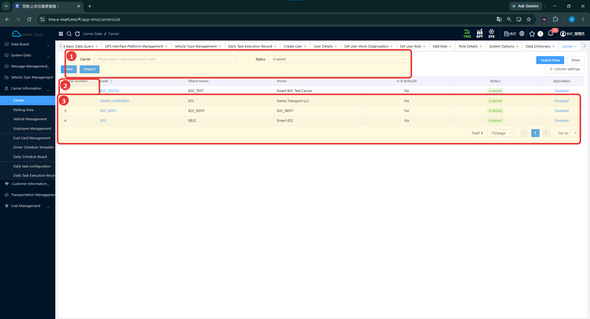
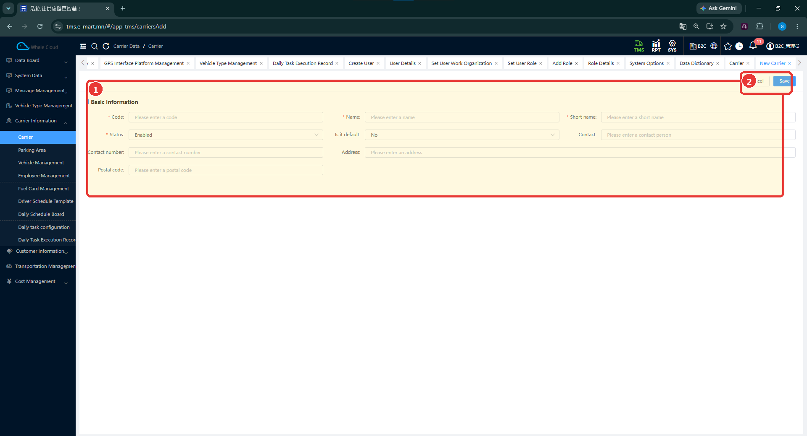
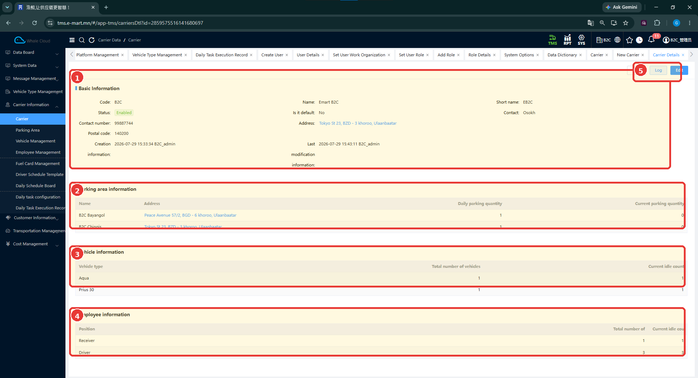

# Тээвэрлэгч (Carrier)

[Тээвэрлэгчийн мэдээллийн тойм](../carrier-information.md)

## Энэ хэсэг юу хийдэг вэ?

Тээвэрлэгч нь тээврийн хэрэгсэл, ажилтан, зогсоолыг харьяалуулдаг үндсэн бүртгэл юм. Тээвэрлэгчийн дэлгэрэнгүйд эдгээр мэдээллийг нэг дор харуулна. Тээвэрлэгчийг SYS-ийн байгууллага эсвэл харилцагчтай ижил бүртгэл гэж ойлгож болохгүй.

## Хэзээ ашиглах вэ?

- Шинэ тээвэрлэгчийн мэдээлэл оруулах.
- Машин, ажилтан нэмэхийн өмнө харьяалуулах тээвэрлэгчээ шалгах.
- Тээвэрлэгчийн нөөц, холбоо барих мэдээллийг харах.

## Эхлэхийн өмнө

Тээвэрлэгчийн код, бүтэн нэр, товч нэрийг бэлтгэнэ. Өмнө бүртгэсэн эсэхийг хайлтаар шалгана.

**Цэсний зам:** TMS → Carrier Information → Carrier.

## Дэлгэцийн бүтэц

**Carrier** хайлтад код, нэр эсвэл товч нэр оруулж, шаардлагатай бол **Status** сонгоод **Search Now** дарна. **Reset** нь хайлтын нөхцөлийг цэвэрлэхэд хэрэглэгдэнэ. Жагсаалтаас код, товч нэр, бүтэн нэр, анхдагч эсэх болон төлөвийг харна.

| № | Хэсэг | Тайлбар |
|---|---|---|
| 1 | Хайлт, үйлдлүүд | Carrier, Status шүүлтүүр болон New, Import. |
| 2 | Хүснэгтийн эхний хэсэг | Мөрийн дугаар орчмыг тэмдэглэсэн жижиг хүрээ. |
| 3 | Жагсаалт | Тээвэрлэгчдийн мэдээлэл, төлөв болон хуудаслалт. |

## Шинээр бүртгэх

1. **New** дарна.
2. **Code**, **Name**, **Short name** талбарыг бөглөнө.
3. **Status** болон **Is it default?** сонголтыг нягтална.
4. Холбоо барих болон хаягийн мэдээллээ оруулна.
5. **Save** дарна. Бүртгэхгүйгээр хаах бол **Cancel** дарна.
6. Жагсаалтаас кодоор хайж хадгалсан бүртгэлээ шалгана.

| № | Хэсэг | Тайлбар |
|---|---|---|
| 1 | Үндсэн мэдээлэл | Код, нэр, төлөв, холбоо барих мэдээлэл. |
| 2 | Save / Cancel | Хадгалах эсвэл хаах. |

## Талбаруудын тайлбар

**Тийм** гэж тэмдэглэсэн талбарууд зурагт улаан **\*** тэмдэгтэй.

| Талбар | Тайлбар | Заавал эсэх |
|---|---|---|
| Code | Тээвэрлэгчийн код. Тестийн жишээ: B2C_TEST01. | Тийм |
| Name | Бүтэн нэр. Жишээ: Emart B2C Test Carrier. | Тийм |
| Short name | Жагсаалтад ялгаж харах товч нэр. Жишээ: B2C_TEST. | Тийм |
| Status | Идэвхтэй эсвэл идэвхгүй төлөвийн сонголт. | Тийм |
| Is it default? | Анхдагч тээвэрлэгч эсэх. Зурагт No сонгосон. | Зурагт * тэмдэггүй |
| Contact | Холбоо барих хүний нэр. | Зурагт * тэмдэггүй |
| Contact number | Холбоо барих утасны дугаар. | Зурагт * тэмдэггүй |
| Address | Тээвэрлэгчийн хаяг. | Зурагт * тэмдэггүй |
| Postal code | Шуудангийн код. | Зурагт * тэмдэггүй |

## Дэлгэрэнгүй мэдээлэл

**Carrier Details** дэлгэцээр тээвэрлэгчийн үндсэн мэдээлэл болон харьяа нөөцийг шалгана. Доорх зураг нь **B2C** кодтой тээвэрлэгчийн жишээ; B2C_TEST01 тестийн тээвэрлэгчтэй нэг бүртгэл биш.

| № | Хэсэг | Тайлбар |
|---|---|---|
| 1 | Basic Information | Тээвэрлэгчийн үндсэн болон холбоо барих мэдээлэл. |
| 2 | Parking area information | Зогсоолын нэр, хаяг болон тоон мэдээлэл. |
| 3 | Vehicle information | Төрлөөр бүлэглэсэн тээврийн хэрэгслийн нийт болон сул тоо. |
| 4 | Employee information | Албан үүргээр бүлэглэсэн ажилтны нийт болон сул тоо. |
| 5 | Log / Edit | Бүртгэлийн түүх харах, засварлах үйлдлүүд. |

Энэ нэгтгэл нь мэдээллүүдийн харьяаллыг ойлгоход тусална. Тоо харагдаж байгаа нь систем тухайн нөөцийг хүргэлтэд автоматаар оноосон гэсэн үг биш.

## Бүртгэсний дараа юу шалгах вэ?

- Код, бүтэн нэр, товч нэр зөв эсэх.
- Сонгосон төлөв зөв эсэх.
- Холбоо барих мэдээлэл алдаагүй эсэх.
- Дараа нь зогсоол, ажилтан, машин нэмэхдээ зөв тээвэрлэгчийг сонгож байгаа эсэх.

## Засварлах ба төлөв

Дэлгэрэнгүйд **Edit**, **Log**, жагсаалтад идэвхгүй болгох үйлдэл харагдана. Засварлах бол эхлээд тээвэрлэгчийн кодыг нягтална. Засварын цонх, төлөв солих баталгаажуулалт болон бусад бүртгэлд үзүүлэх нөлөө одоогийн тестээр баталгаажаагүй.

## Анхаарах зүйл

**Is it default?** сонголт ямар үйлдэлд автоматаар ашиглагдах, **Import** файлын загвар ямар байх нь одоогийн тестээр баталгаажаагүй. Кодын давхардлын шалгалтын дүрмийг мөн таамаглахгүй.

## Дараагийн алхам

[Зогсоол нэмэх](parking-area.md) → [Ажилтан бүртгэх](employee-management.md).
