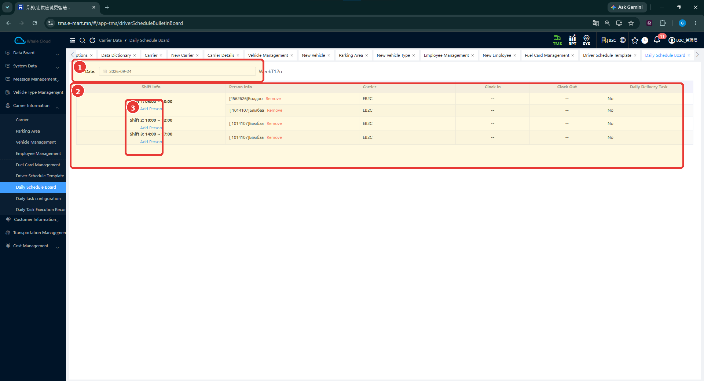
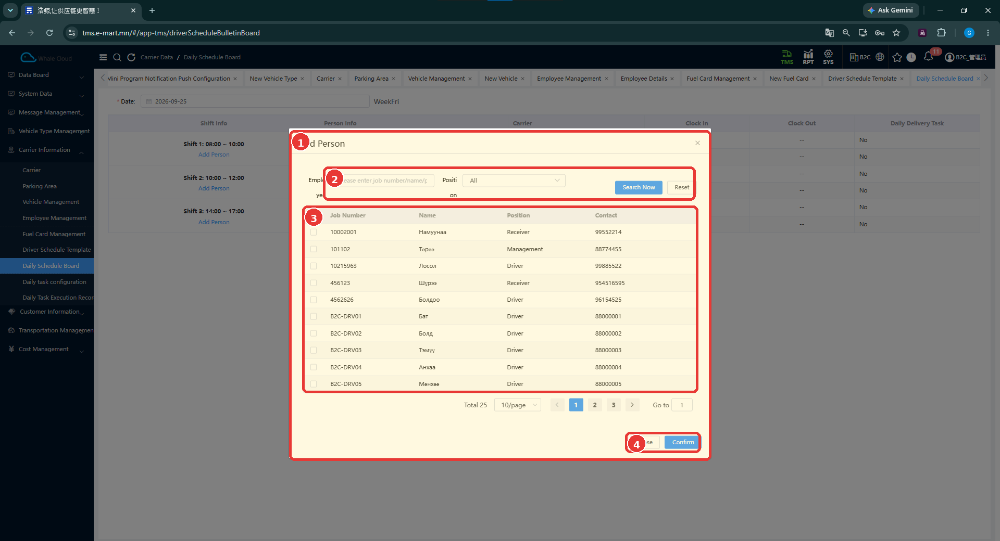

# Өдрийн хуваарийн самбар (Daily Schedule Board)

[Тээвэрлэгчийн мэдээллийн тойм](../carrier-information.md)

## Энэ хэсэг юу хийдэг вэ?

Сонгосон өдрийн ээлж, ажилтан болон холбогдох тээвэрлэгчийн мэдээллийг харуулна. Ээлжид ажилтан нэмэх боломжтой. Мөн ирсэн, гарсан цаг болон өдрийн хүргэлтийн даалгаврын мэдээллийн баганууд байна.

## Хэзээ ашиглах вэ?

- Тухайн өдрийн ажиллах хүмүүсийг шалгах.
- Тодорхой ээлжид ажилтан нэмэх.
- Ажилтны цаг, хүргэлтийн даалгаврын мэдээллийг харах.

## Эхлэхийн өмнө

[Ажилтны бүртгэл](employee-management.md) болон шалгах өдрөө бэлтгэнэ. [Хуваарийн загвар](driver-schedule-template.md)-ын цагтай тулгаж болно; загвараас самбар руу автоматаар шилжих дүрэм одоогийн тестээр баталгаажаагүй.

**Цэсний зам:** TMS → Carrier Information → Daily Schedule Board.

## Дэлгэцийн бүтэц

**Date**-аар зөв өдрөө сонгоод ээлж бүрийн цаг, ажилтнуудыг харна. Нэг өдрийн мэдээллийг өөр өдрийнхтэй андуурахгүйн тулд хүн нэмэхийн өмнө огноог дахин нягтална.

| № | Хэсэг | Тайлбар |
|---|---|---|
| 1 | Date | Харах өдрийг сонгоно. |
| 2 | Өдрийн хүснэгт | Ээлж, хүн, тээвэрлэгч, цаг, даалгаврын мэдээлэл. |
| 3 | Add Person | Тухайн ээлжид хүн нэмнэ. |

## Талбаруудын тайлбар

Доорх нь харах мэдээллийн баганууд; заавал бөглөх маягт биш.

| Талбар | Тайлбар |
|---|---|
| Date | Самбарт харах өдөр. |
| Shift Info | Ээлжийн дугаар болон цаг. |
| Person Info | Ээлжид хуваарилсан ажилтан. |
| Carrier | Ажилтны тээвэрлэгч. |
| Clock In | Ирсэн цагийн мэдээлэл. |
| Clock Out | Гарсан цагийн мэдээлэл. |
| Daily Delivery Task No | Өдрийн хүргэлтийн даалгаврын дугаарын мэдээлэл. |

## Ээлжид ажилтан нэмэх

1. **Date**-аар зөв өдрөө сонгоно.
2. Хүн нэмэх ээлжийн **Add Person** дарна.
3. **Employee** талбарт ажилтны дугаар эсвэл нэр оруулж, шаардлагатай бол **Position** сонгоно.
4. **Search Now** дарна. Нөхцөлийг цэвэрлэх бол **Reset** ашиглана.
5. Ажилтны дугаар, нэр, албан үүргийг шалгаад мөрийн сонгох нүдийг тэмдэглэнэ.
6. **Confirm** дарна. Сонголт хийхгүй буцах бол **Close** дарна.
7. Самбарт зөв огноо, зөв ээлжийн дор ажилтан орсныг шалгана.

| № | Хэсэг | Тайлбар |
|---|---|---|
| 1 | Add Person | Ээлжид хүн нэмэх цонх. |
| 2 | Хайлт | Employee болон Position. |
| 3 | Сонгох жагсаалт | Ажилтны дугаар, нэр, албан үүрэг, холбоо барих мэдээлэл. |
| 4 | Close / Confirm | Хаах эсвэл сонголтыг баталгаажуулах. |

## Нэмсний дараа юу шалгах вэ?

- Зөв огнооны самбар дээр байгаа эсэх.
- Ажилтан зөв цагийн ээлжид орсон эсэх.
- Ажилтны нэр, дугаар болон тээвэрлэгч зөв эсэх.
- Нэмэхээс өмнөх жагсаалттай тулгаж, хэрэггүй давхардал үүссэн эсэх.

## Анхаарах зүйл

**Clock In / Clock Out**-д **--** харагдсаныг шууд тасалсан гэж дүгнэхгүй. Цаг бүртгэх дүрэм одоогийн тестээр баталгаажаагүй. Ажилтны хажууд **Remove** харагдах боловч хасалтын баталгаажуулалт, хүргэлтийн даалгаварт нөлөөлөх дүрэм нотлогдоогүй.

Хоёр зураг өөр огноотой тул нэмэх үйлдлийн өмнөх ба дараах үр дүн гэж үзэхгүй.

## Дараагийн алхам

[Тээвэр төлөвлөх](../../planning/overview.md) → [Жолоочийн хүргэлтийн гүйцэтгэл](../../execution/index.md).
