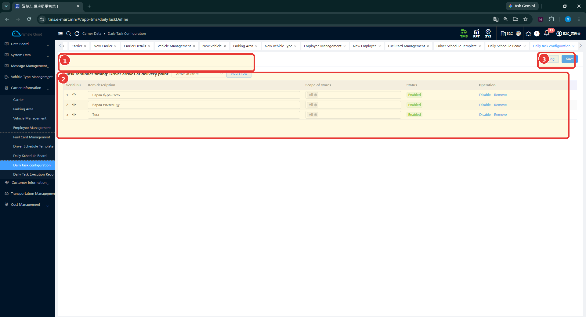

# Өдөр тутмын ажлын тохиргоо (Daily Task Configuration)

[Тээвэрлэгчийн мэдээллийн тойм](../carrier-information.md)

## Энэ хэсэг юу хийдэг вэ?

Жолооч хүргэлтийн тодорхой үе шатанд хүрэхэд шалгах, сануулах ажлын зүйлсийг тохируулна. Зурагт хүргэлтийн цэгт ирэх үеийн **Arrive at Store** сонголт харагдана. Энд тохируулсан зүйлсийн гүйцэтгэлийг тусдаа бүртгэлийн хэсгээс шалгана.

## Хэзээ ашиглах вэ?

- Хүргэлтийн цэг дээр шалгах зүйл нэмэх.
- Шалгах ажлын тайлбар, хамрах дэлгүүрийн мэдээллийг нягтлах.
- Одоо байгаа шалгах ажлын төлөвийг харах.

## Эхлэхийн өмнө

Жолоочоор юуг шалгуулах, ямар дэлгүүрт хамаарахыг тодорхойлно. Зурагт **Бараа бүрэн эсэх**, **Бараа гэмтсэн үү** гэсэн жишээ байна.

**Цэсний зам:** TMS → Carrier Information → Daily Task Configuration.

## Дэлгэцийн бүтэц

| № | Хэсэг | Тайлбар |
|---|---|---|
| 1 | Дээд хэсгийн тэмдэглэгээ | Сануулах үеийн мөр хүрээний яг доор байрлана: Task reminder timing, Arrive at Store, Add a row. |
| 2 | Ажлын хүснэгт | Item description, Scope of stores, Status болон Disable / Remove. |
| 3 | Save / Log | Тохиргоог хадгалах, бүртгэлийн түүх харах үйлдлүүд. |

## Шалгах ажил тохируулах

1. **Task reminder timing** мөрийг шалгана. Зурагт **Driver arrives at delivery point**, сонголтод **Arrive at Store** байна.
2. Шинэ зүйл нэмэх бол **Add a row** дарна.
3. **Item description** хэсэгт ойлгомжтой, богино тайлбар оруулна. Жишээ: **Бараа бүрэн эсэх**.
4. **Scope of stores** хэсгийн хамрах хүрээг шалгана. Зурагт **All** харагдана.
5. Мөрийн **Status** болон агуулгыг нягтална.
6. **Save** дарж тохиргоог хадгална.
7. Хүснэгтэд ажлын тайлбар, хамрах хүрээ, төлөв зөв байгааг дахин шалгана.

## Талбаруудын тайлбар

| Талбар | Тайлбар | Заавал эсэх |
|---|---|---|
| Task reminder timing | Ажил сануулах үе шат; зурагт хүргэлтийн цэгт ирэх үе. | Зурагт * тэмдэггүй |
| Item description | Жолоочийн шалгах зүйлийн тайлбар. | Зурагт * тэмдэггүй |
| Scope of stores | Ажил хамаарах дэлгүүрүүдийн хүрээ; All нь бүгд гэсэн сонголт. | Зурагт * тэмдэггүй |
| Status | Тухайн ажлын төлөв; зурагт Enabled. | Зурагт * тэмдэггүй |

## Хадгалсны дараа юу шалгах вэ?

- Сануулах үе шат зөв эсэх.
- Ажлын тайлбар ойлгомжтой, давхардалгүй эсэх.
- Хамрах дэлгүүрүүдийн хүрээ зөв эсэх.
- Ашиглах ажлуудын төлөв Enabled байгаа эсэх.

## Төлөв өөрчлөх ба хасах

Мөр бүрд **Disable**, **Remove** харагдана. Disable нь идэвхгүй болгох, Remove нь мөрийг хасах үйлдэл. Үйлдэл сонгохын өмнө ажлын тайлбарыг нягтална. Хасалтын баталгаажуулалт болон өмнөх гүйцэтгэлийн бүртгэлд үзүүлэх нөлөө одоогийн тестээр баталгаажаагүй.

## Анхаарах зүйл

Дэлгүүр тус бүр сонгох цонх, шинэ мөр нэмсний дараах дэлгэц, Save-ийн дараах үр дүнгийн зураг байхгүй. Шалгах ажлыг бөглөөгүй үед хүргэлт хаагдах эсэх, сануулга Mini App дээр яг хэрхэн харагдах нь одоогийн тестээр баталгаажаагүй.

## Дараагийн алхам

[Өдөр тутмын ажлын гүйцэтгэлийн бүртгэл](daily-task-execution-record.md)-ээс бодит хүргэлтийн мэдээллийг шалгана.
