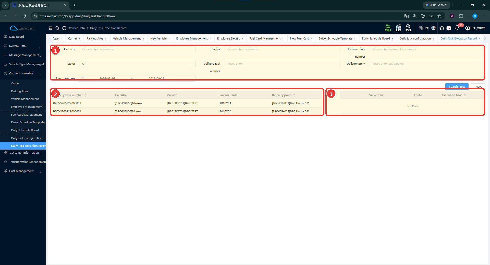

# Өдөр тутмын ажлын гүйцэтгэлийн бүртгэл (Daily Task Execution Record)

[Тээвэрлэгчийн мэдээллийн тойм](../carrier-information.md)

## Энэ хэсэг юу хийдэг вэ?

Өдөр тутмын шалгах ажлын гүйцэтгэлийг хүргэлтийн даалгавар, ажилтан, хүргэлтийн цэгтэй холбон шалгах хэсэг юм. Зүүн талд хүргэлттэй холбоотой бүртгэлүүд, баруун талд шалгах зүйл, зураг, гүйцэтгэлийн цагийн хэсэг байна. Жагсаалтад хүргэлтийн мөр харагдсанаар бүх шалгах ажил дууссан гэж дүгнэхгүй.

## Хэзээ ашиглах вэ?

- Тодорхой хүргэлтийн шалгах ажлын бүртгэл хайх.
- Ажилтан, машин, хүргэлтийн цэгээр мэдээлэл тулгах.
- Гүйцэтгэлийн зураг болон цагийн мэдээлэл байгаа эсэхийг шалгах.

## Эхлэхийн өмнө

Хүргэлтийн даалгаврын дугаар, шалгах цэг эсвэл огноогоо мэдэж байна. Ямар ажил тохируулсныг [Өдөр тутмын ажлын тохиргоо](daily-task-configuration.md)-оос харна.

**Цэсний зам:** TMS → Carrier Information → Daily Task Execution Record.

## Дэлгэцийн бүтэц

| № | Хэсэг | Тайлбар |
|---|---|---|
| 1 | Хайлт | Ажилтан, тээвэрлэгч, машин, төлөв, даалгавар, хүргэлтийн цэг, хугацаа. |
| 2 | Бүртгэлийн жагсаалт | Хүргэлтийн даалгавар болон түүнтэй холбоотой мөрүүд. |
| 3 | Дэлгэрэнгүй | View item, Photo, Execution time; энэ зурагт No Data байна. |

## Бүртгэл хайж шалгах

1. **Delivery task number**-т шалгах даалгаврын дугаарыг оруулна.
2. Хэрэгтэй бол **Executor**, **Carrier**, **License plate number**, **Delivery point** нөхцөлөө нэмнэ.
3. **Status** болон **Execution time** хугацааны нөхцөлийг нягтална.
4. **Search Now** дарна. Дахин эхлэх бол **Reset** ашиглана.
5. Зүүн жагсаалтын даалгаврын дугаар, ажилтан, машин, цэгийг тулгана.
6. Баруун талын **View item**, **Photo**, **Execution time** хэсэгт гүйцэтгэлийн мэдээлэл байгаа эсэхийг шалгана.

## Хайлтын талбаруудын тайлбар

Эдгээр нь хайлтын нөхцөл; шинэ бүртгэл үүсгэх талбарууд биш.

| Талбар | Тайлбар |
|---|---|
| Executor | Гүйцэтгэгч ажилтнаар хайх. |
| Carrier | Тээвэрлэгчээр шүүх. |
| License plate number | Тээврийн хэрэгслийн улсын дугаар. |
| Status | Бүртгэлийн төлөвийн шүүлтүүр; зурагт All. |
| Delivery task number | Хүргэлтийн даалгаврын дугаар. |
| Delivery point | Хүргэлтийн цэгээр шүүх. |
| Execution time | Гүйцэтгэлийн хугацааны эхлэл, төгсгөл. |

## B2C тестийн бодит жишээ

Зурагт [TC-B2C-E2E-001](../../testing/tc-b2c-e2e-001.md)-тэй холбоотой дараах мэдээлэл харагдана.

| Мэдээлэл | Зураг дахь утга |
|---|---|
| Delivery task number | B2CVS260922000001 |
| Executor | B2C-DRV05 |
| Carrier | B2C_TEST01 |
| License plate | 1018УБА |
| Delivery point | DP031 болон DP032 цэгийн хоёр мөр |

!!! note "Мөр байгаа нь гүйцэтгэл бүрэн гэсэн баталгаа биш"
    Энэ зурагт хүргэлтийн мөрүүд байгаа боловч баруун талын дэлгэрэнгүй **No Data** байна. Тухайн шалгах ажлуудыг бүрэн гүйцэтгэсэн эсэх, яагаад дэлгэрэнгүй хоосон байгааг одоогийн тестээр баталгаажуулаагүй. Үүнийг шууд амжилттай эсвэл гүйцэтгээгүй гэж дүгнэхгүй.

## Шалгасны дараа юу нягтлах вэ?

- Даалгаврын дугаар зөв эсэх.
- Гүйцэтгэгч, тээвэрлэгч, улсын дугаар тохирч байгаа эсэх.
- Зөв хүргэлтийн цэгийн мэдээлэл харж байгаа эсэх.
- Дэлгэрэнгүйд ажлын нэр, зураг, цаг бодитоор байгаа эсэх.

## Анхаарах зүйл

Үр дүн гарахгүй бол эхлээд хэт нарийсгасан нөхцөл болон хугацаагаа шалгана. Энэ дэлгэц дээр шинээр бүртгэх, хадгалах үйлдэл харагдахгүй тул тэдгээрийн алхам оруулаагүй. Мөрөөс дэлгэрэнгүй нээх яг ямар үйлдэл шаардлагатай нь одоогийн тестээр баталгаажаагүй.

## Дараагийн алхам

[Жолоочийн хүргэлтийн гүйцэтгэл](../../execution/index.md), [TC-B2C-E2E-001 тестийн бүртгэл](../../testing/tc-b2c-e2e-001.md)-тэй тулгаж шалгана.
