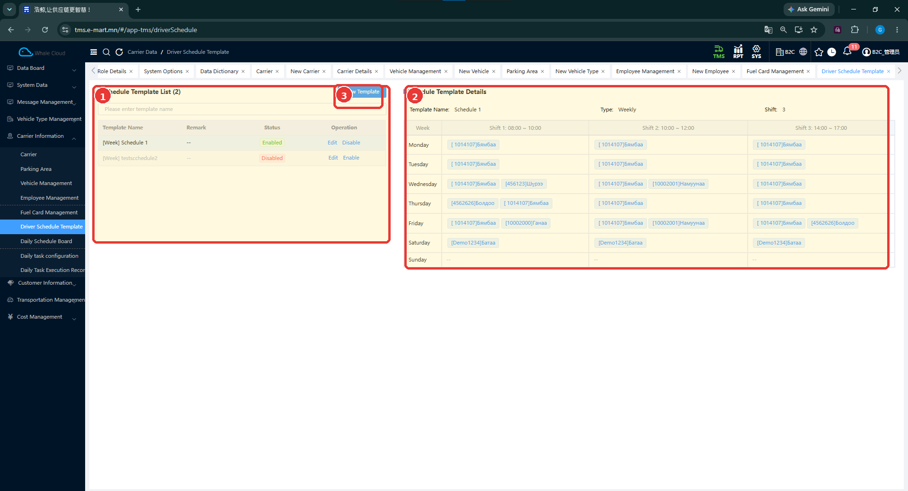
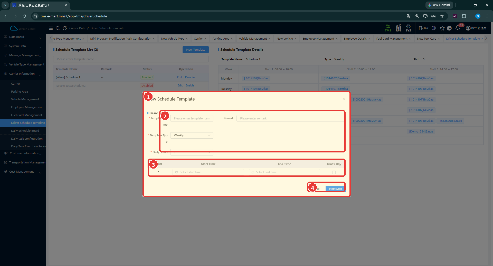

# Жолоочийн хуваарийн загвар (Driver Schedule Template)

[Тээвэрлэгчийн мэдээллийн тойм](../carrier-information.md)

## Энэ хэсэг юу хийдэг вэ?

Хуваарийн загвар нь ажилтны ээлжийн цагийг урьдчилан зохион байгуулах мэдээлэл юм. Зурагт долоо хоногийн загвар, даваагаас ням хүртэлх өдрүүд, ээлжүүд болон ажилтнууд харагдана. Загвар нь тухайн өдрийн бодит хуваарьтай адил ойлголт биш; өдрийн хуваарийг тусдаа самбараас шалгана.

## Хэзээ ашиглах вэ?

- Давтагдах ээлжийн цагийн загвар бэлтгэх.
- Бүртгэлтэй загварын өдөр, ээлж, ажилтны мэдээллийг харах.
- Өдрийн хуваарьтай тулгахын өмнө загвараа шалгах.

## Эхлэхийн өмнө

Загварын нэр, өдөрт хэдэн ээлжтэй байх, ээлжийн эхлэх ба дуусах цагийг бэлтгэнэ. Ажилтны мэдээллээ [Employee Management](employee-management.md)-д шалгана.

**Цэсний зам:** TMS → Carrier Information → Driver Schedule Template.

## Дэлгэцийн бүтэц

Зүүн талын **Schedule Template List** нь загваруудын жагсаалт. Нэрээр хайж, шалгах загвараа сонгоно. Баруун талын **Schedule Template Details** нь сонгосон загварын өдрүүд, ээлжийн цаг, ажилтнуудыг харуулна.

| № | Хэсэг | Тайлбар |
|---|---|---|
| 1 | Schedule Template List | Загварын нэр, төлөв, Edit, Enable / Disable. |
| 2 | Schedule Template Details | Weekly загварын Monday–Sunday багана, Shift 1–3 болон ажилтнууд. |
| 3 | New Template | Шинэ загвар эхлүүлэх товч. |

Жишээний гурван ээлж **08:00–10:00**, **10:00–12:00**, **14:00–17:00** байна. Эдгээр нь зураг дахь загварын цаг болохоос бүх байгууллагад мөрдөх хуваарь биш.

## Шинэ загварын эхний алхам

1. **New Template** дарна.
2. **Template Name** оруулна.
3. **Template Type** сонгоно. Зурагт **Weekly** буюу долоо хоногийн төрөл байна.
4. **Daily Shifts** хэсэгт өдрийн ээлжийн тоог тохируулна.
5. Ээлж бүрийн **Start Time**, **End Time**-ыг оруулна.
6. Ээлж дараагийн өдөрт шилжих бол **Cross-Day** сонголтыг нягтална.
7. **Next Step** дарж дараагийн алхам руу орно. Цонхноос буцах бол **Close** дарна.

| № | Хэсэг | Тайлбар |
|---|---|---|
| 1 | Шинэ загварын цонх | Загвар үүсгэх эхний алхам. |
| 2 | Үндсэн мэдээлэл | Нэр, төрөл, тайлбар; Daily Shifts нь энэ хэсгийн доор байрлана. |
| 3 | Ээлжийн цаг | Start Time, End Time, Cross-Day. |
| 4 | Close / Next Step | Хаах эсвэл дараагийн алхамд орох. |

## Талбаруудын тайлбар

| Талбар | Тайлбар | Заавал эсэх |
|---|---|---|
| Template Name | Загварыг ялгах нэр. | Тийм — * тэмдэгтэй |
| Template Type | Загварын төрөл; зурагт Weekly. | Тийм — * тэмдэгтэй |
| Remark | Загварын тайлбар. | Зурагт * тэмдэггүй |
| Daily Shifts | Нэг өдөрт байх ээлжийн тоо. | Тийм — * тэмдэгтэй |
| Start Time | Тухайн ээлжийн эхлэх цаг. | Зурагт * тэмдэггүй |
| End Time | Тухайн ээлжийн дуусах цаг. | Зурагт * тэмдэггүй |
| Cross-Day | Ээлж дараагийн өдөрт шилжих тохиолдолд ашиглах сонголт. | Зурагт * тэмдэггүй |

## Хадгалалт ба шалгалтын хүрээ

!!! note "Дараагийн алхмын нотолгоо"
    Өгсөн зураг Next Step хүртэлх маягтыг харуулна. Үүний дараах ажилтан сонгох, эцэслэн хадгалах цонх болон амжилтын үр дүн одоогийн тестээр баталгаажаагүй. Тиймээс Next Step дарсныг загвар хадгалагдсан гэж үзэхгүй.

Бүртгэлтэй загварыг шалгахдаа:

- Зүүн жагсаалтын нэр, төлөв зөв эсэхийг нягтлах.
- Баруун талд зөв загварын дэлгэрэнгүй нээгдсэн эсэхийг шалгах.
- Өдөр, ээлжийн тоо, цаг болон ажилтнуудыг тулгах.

## Анхаарах зүйл

**Edit**, **Enable / Disable** үйлдлүүд жагсаалтад харагдана. Загварын өөрчлөлт өдрийн самбарт автоматаар хэрхэн очих, цаг давхцах болон Cross-Day-ийн нарийн шалгалт одоогийн тестээр баталгаажаагүй.

## Дараагийн алхам

[Өдрийн хуваарийн самбар](daily-schedule-board.md)-т огноо болон тухайн өдрийн ажилтнуудыг шалгана.
