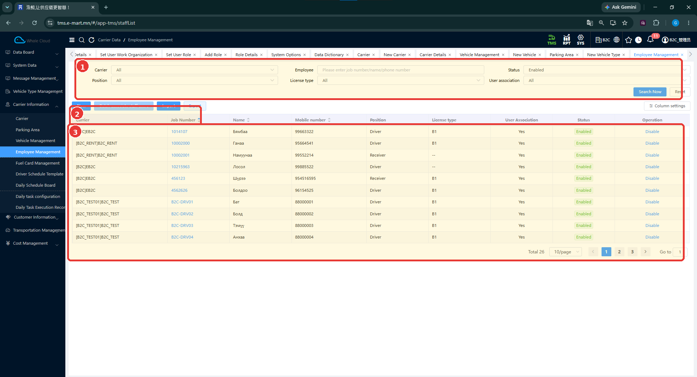
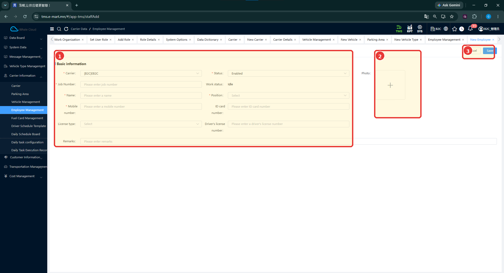
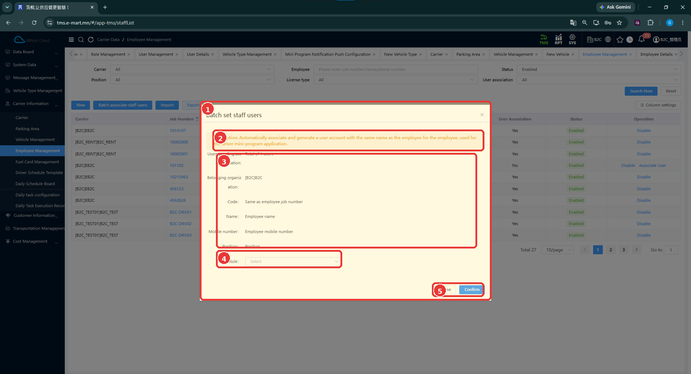

# Ажилтны удирдлага (Employee Management)

[Тээвэрлэгчийн мэдээллийн тойм](../carrier-information.md)

## Энэ хэсэг юу хийдэг вэ?

Энд тээвэрлэгчид харьяалах жолооч болон бусад ажилтны мэдээллийг бүртгэнэ. **Employee** бол TMS доторх ажилтны бүртгэл, **User** бол систем эсвэл Mini App-д нэвтрэх хэрэглэгчийн бүртгэл юм. Ажилтан бүртгэснийг нэвтрэх данс бэлэн болсон гэж ойлгож болохгүй. Хоёр бүртгэлийг холбох тусдаа үйлдэл бий.

## Хэзээ ашиглах вэ?

- Шинэ жолооч эсвэл бусад ажилтан бүртгэх.
- Ажилтныг тээврийн хэрэгсэл, ээлжид сонгохын өмнө мэдээллийг нь шалгах.
- Driver Mini App ашиглах ажилтны хэрэглэгчийн холбоог бэлтгэх.

## Эхлэхийн өмнө

[Тээвэрлэгчээ](carrier.md) шалгаж, ажилтны дугаар, нэр, утас, албан үүргийн мэдээллээ бэлтгэнэ. Mini App хэрэглэгч холбох бол [SYS байгууллага](../../sys/business-organization.md) болон [role](../../sys/role-management.md)-ийн мэдээллээ нягтална.

**Цэсний зам:** TMS → Carrier Information → Employee Management.

## Дэлгэцийн бүтэц

1. **Carrier**, **Position**, **License type**, **User association**, **Status** нөхцөлийг хэрэгцээгээр сонгоно.
2. **Employee** талбарт ажилтны дугаар, нэр эсвэл утсаар хайна.
3. **Search Now** дарна; нөхцөлийг цэвэрлэх бол **Reset** ашиглана.
4. Хүснэгтийн **User Association**-оор хэрэглэгчийн холбоог шалгана. **Yes** нь холбоотойг илэрхийлнэ.

| № | Хэсэг | Тайлбар |
|---|---|---|
| 1 | Шүүлтүүрүүд | Тээвэрлэгч, ажилтан, албан үүрэг, хэрэглэгчийн холбоо болон төлөв. |
| 2 | Үйлдлүүд | New, Batch associate staff users, Import, Export байрлах хэсэг. |
| 3 | Жагсаалт | Ажилтны дугаар, нэр, утас, албан үүрэг, холбоо болон төлөв. |

## Шинээр бүртгэх

1. **New** дарна.
2. **Carrier** сонгож, **Job Number**, **Name**, **Mobile number**-ыг бөглөнө.
3. **Position** болон **Status**-ыг сонгоно.
4. Холбогдох үнэмлэхийн мэдээлэл, зураг, тайлбарыг оруулна.
5. **Save** дарна. Бүртгэхгүйгээр хаах бол **Cancel** дарна.
6. Ажилтны дугаараар хайж, хадгалсан мэдээлэл болон **User Association**-ыг шалгана.

| № | Хэсэг | Тайлбар |
|---|---|---|
| 1 | Basic Information | Харьяалал, ажилтны дугаар, нэр болон бусад мэдээлэл. |
| 2 | Photo | Ажилтны зураг оруулах хэсэг. |
| 3 | Save / Cancel | Хадгалах эсвэл хаах. |

## Талбаруудын тайлбар

**Тийм** нь зураг дээр улаан **\*** тэмдэгтэйг заана.

| Талбар | Тайлбар | Заавал эсэх |
|---|---|---|
| Carrier | Ажилтан харьяалах тээвэрлэгч. | Тийм |
| Job Number | Ажилтны дугаар. Тестийн жолоочийн жишээ: B2C-DRV05. | Тийм |
| Name | Ажилтны нэр. | Тийм |
| Mobile number | Ажилтны гар утасны дугаар. | Тийм |
| Position | Ажилтны албан үүрэг. Жишээ: Driver. | Тийм |
| Status | Бүртгэлийн төлөв. | Тийм |
| Work status | Ажлын төлөв; зурагт Idle харагдана. | Зурагт * тэмдэггүй |
| ID card number | Иргэний үнэмлэхийн дугаарын талбар. | Зурагт * тэмдэггүй |
| License type | Жолоодох эрхийн ангилал. | Зурагт * тэмдэггүй |
| Driver's license number | Жолооны үнэмлэхийн дугаар. | Зурагт * тэмдэггүй |
| Photo | Ажилтны зураг. | Зурагт * тэмдэггүй |
| Remarks | Нэмэлт тайлбар. | Зурагт * тэмдэггүй |

## Mini App хэрэглэгчтэй холбох { #mini-app }

**Batch associate staff users** цонхны тайлбарын дагуу ажилтанд ижил нэртэй хэрэглэгчийн данс үүсгэж, холбон Driver Mini App-д ашиглах зориулалттай. Энэ нь ажилтны бүртгэл ба нэвтрэх дансны хоорондын холбоо юм.

1. Ажилтны дугаар, нэр, утас, хэрэглэгчийн холбоог жагсаалтаас шалгана.
2. **Batch associate staff users** дарна.
3. **Users waiting association** хэсгийн тоог нягтална. Зурагт нэг хэрэглэгч байна.
4. **Belonging organization**-д зөв байгууллага байгаа эсэхийг шалгана.
5. Ажилтнаас авах код, нэр, утас, албан үүргийг шалгана.
6. **Role** хэсгээс ашиглах эрхийн бүлгийг сонгоно.
7. **Confirm** дарна. Үйлдэл хийхгүйгээр хаах бол **Close** дарна.
8. Ажилтны **User Association**, дараа нь [SYS хэрэглэгчийн бүртгэл](../../sys/user-management.md) дэх байгууллага болон role-ийг шалгана.

| № | Хэсэг | Тайлбар |
|---|---|---|
| 1 | Batch set staff users | Ажилтны хэрэглэгчийн холбоог тохируулах цонх. |
| 2 | Системийн тайлбар | Ижил нэртэй дансыг үүсгэж, холбон Driver Mini App-д ашиглахыг тайлбарласан. |
| 3 | Байгууллага ба ажилтны мэдээлэл | Хэрэглэгчийн байгууллага, код, нэр, утас, албан үүргийн эх үүсвэр. |
| 4 | Role | Хэрэглэгчид өгөх эрхийн бүлэг. |
| 5 | Close / Confirm | Хаах эсвэл баталгаажуулах. |

| Талбар | Тайлбар | Заавал эсэх |
|---|---|---|
| Belonging organization | Хэрэглэгчийн харьяалах SYS байгууллага; Carrier-тай адил ойлголт биш. | Зурагт * тэмдэггүй |
| Code | Employee Job Number-той ижил утга авна гэж цонхонд тайлбарласан. | Авч ашиглах мэдээлэл |
| Name | Employee Name-аас авна. | Авч ашиглах мэдээлэл |
| Mobile number | Employee Mobile number-аас авна. | Авч ашиглах мэдээлэл |
| Position | Ажилтны албан үүргийн мэдээлэл. | Авч ашиглах мэдээлэл |
| Role | Хэрэглэгчийн эрхийн бүлгийн сонголт. | Тийм — * тэмдэгтэй |

!!! note "Холболтын үр дүнг шалгах"
    Цонхны тайлбар нь боломжийн зориулалтыг батална. Харин Confirm хийсний дараах үр дүнгийн зураг байхгүй. Аль ажилтнуудыг багцад хамруулах дүрэм, өмнө байгаа данстай давхцах үед хийх үйлдэл, нууц үг болон нэвтрэлтийн дүрэм одоогийн тестээр баталгаажаагүй.

[TC-B2C-E2E-001](../../testing/tc-b2c-e2e-001.md)-д Driver болон Store хэрэглэгч ашигласан. Driver нь жолоочийн, Store нь дэлгүүрийн хэрэглээтэй холбоотой. **Position** сонголт дангаараа Mini App-ийн **Role** оноосны баталгаа болохгүй.

## Бүртгэсний дараа юу шалгах вэ?

- Ажилтны дугаар, нэр, утас болон тээвэрлэгч зөв эсэх.
- Position болон Status зөв эсэх.
- Холболтын дараа User Association өөрчлөгдсөн эсэх.
- SYS дээр хэрэглэгчийн код, байгууллага, role зөв эсэх.

## Анхаарах зүйл

Жагсаалтад **Disable**, **Import / Export** үйлдлүүд харагдана. Идэвхгүй болгох нь нэвтрэх эрхэд яг хэрхэн нөлөөлөх, импортын файлын загвар ямар байх нь одоогийн тестээр баталгаажаагүй.

## Дараагийн алхам

[Тээврийн хэрэгсэлд тогтмол ажилтан холбох](vehicle-management.md#regular-staff), [SYS хэрэглэгч](../../sys/user-management.md), [SYS role](../../sys/role-management.md), [Driver Mini App](../../mini-app/driver-app.md).
