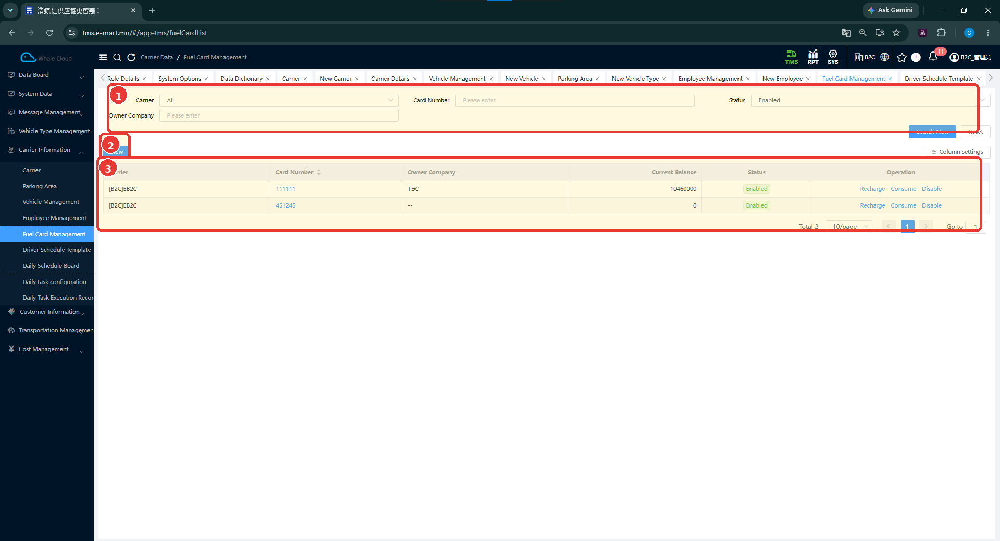
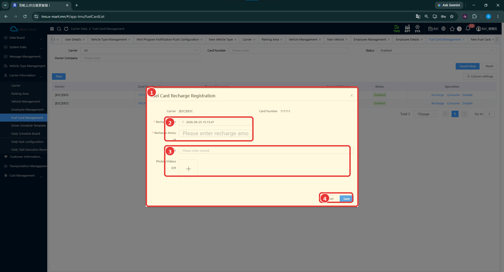
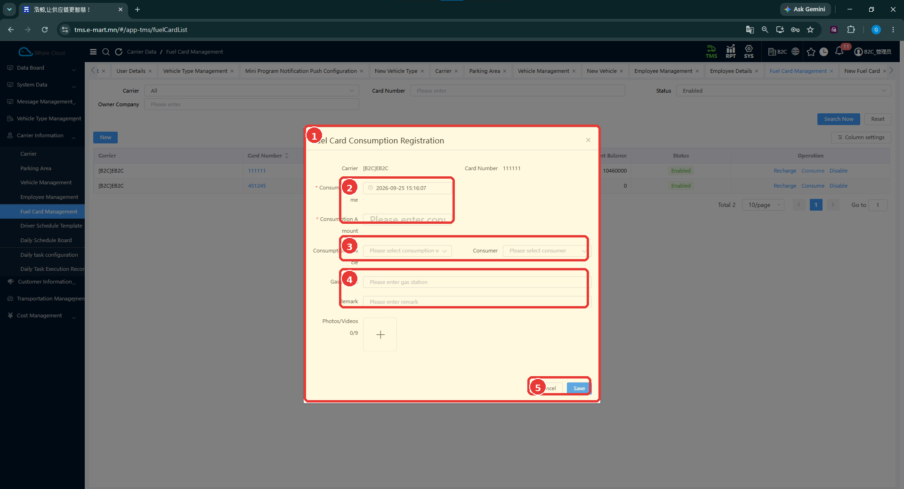

# Түлшний картын удирдлага (Fuel Card Management)

[Тээвэрлэгчийн мэдээллийн тойм](../carrier-information.md)

## Энэ хэсэг юу хийдэг вэ?

Түлшний картын мэдээлэл, харагдаж буй үлдэгдэл болон цэнэглэлт, зарцуулалтын бүртгэлийг удирдана. Энэ нь хэрэгцээтэй үед ашиглах нэмэлт бүртгэл юм. Тээврийн үндсэн мэдээллээ бэлтгэх бүх тохиолдолд заавал түлшний карт үүсгэх дүрэм нотлогдоогүй.

## Хэзээ ашиглах вэ?

- Тээвэрлэгчийн түлшний карт, үлдэгдлийг шалгах.
- Картын цэнэглэлтийг бүртгэх.
- Тээврийн хэрэгсэлтэй холбоотой түлшний зарцуулалтыг бүртгэх.

## Эхлэхийн өмнө

Зөв тээвэрлэгч, картын дугаараа мэдэж байх хэрэгтэй. Гүйлгээний цаг, дүн, тайлбар болон байгаа бол баримтаа бэлтгэнэ. Зарцуулалтад холбох машин, ажилтнаа нягтална.

**Цэсний зам:** TMS → Carrier Information → Fuel Card Management.

## Дэлгэцийн бүтэц

**Carrier**, **Card Number**, **Owner Company**, **Status** нөхцөлөөр хайна. **Search Now** дарж үр дүнг харна, **Reset**-ээр нөхцөлийг цэвэрлэнэ. Гүйлгээ эхлүүлэхдээ картын дугаар болон тээвэрлэгчийг заавал тулгана.

| № | Хэсэг | Тайлбар |
|---|---|---|
| 1 | Хайлт | Тээвэрлэгч, картын дугаар, эзэмшигч байгууллага, төлөв. |
| 2 | New | Шинэ картын бүртгэл эхлүүлэх товч. |
| 3 | Жагсаалт | Current Balance, Status болон Recharge, Consume, Disable үйлдлүүд. |

| Жагсаалтын талбар | Тайлбар |
|---|---|
| Carrier | Картын тээвэрлэгч. |
| Card Number | Гүйлгээ хийх картыг ялгах дугаар. |
| Owner Company | Картын эзэмшигч байгууллага. |
| Current Balance | Системд харагдаж буй одоогийн үлдэгдэл. |
| Status | Картын бүртгэлийн төлөв. |

## Цэнэглэлт бүртгэх (Recharge)

1. Зөв картын мөрөнд **Recharge** дарна.
2. Цонхонд харагдах **Carrier**, **Card Number**-ыг шалгана.
3. **Recharge Time**, **Recharge Amount**-ыг оруулна.
4. Хэрэгтэй бол **Remark**, **Photos/Videos** хэсгийг бөглөнө.
5. **Save** дарна. Хадгалахгүй буцах бол **Cancel** дарна.
6. Картын жагсаалтад буцаж мэдээллээ шалгана.

| № | Хэсэг | Тайлбар |
|---|---|---|
| 1 | Цэнэглэлтийн цонх | Сонгосон картын мэдээлэлтэй. |
| 2 | Гүйлгээний мэдээлэл | Recharge Time, Recharge Amount. |
| 3 | Тайлбар ба баримт | Remark, Photos/Videos. |
| 4 | Save / Cancel | Хадгалах эсвэл хаах. |

| Талбар | Тайлбар | Заавал эсэх |
|---|---|---|
| Recharge Time | Цэнэглэлтийн огноо, цаг. | Тийм — * тэмдэгтэй |
| Recharge Amount | Цэнэглэлтийн дүн. | Тийм — * тэмдэгтэй |
| Remark | Гүйлгээний тайлбар. | Зурагт * тэмдэггүй |
| Photos/Videos | Гүйлгээний зураг, видео баримт. | Зурагт * тэмдэггүй |

## Зарцуулалт бүртгэх (Consume)

1. Зөв картын мөрөнд **Consume** дарна.
2. Картын мэдээллийг нягтлаад **Consumption Time**, **Consumption Amount** оруулна.
3. Холбогдох **Consumption Vehicle**, **Consumer**-ыг сонгоно.
4. **Gas Station**, **Remark** болон байгаа бол **Photos/Videos** баримтаа оруулна.
5. **Save** дарна. Хадгалахгүй буцах бол **Cancel** дарна.
6. Жагсаалтаас зөв картын мэдээллийг дахин шалгана.

| № | Хэсэг | Тайлбар |
|---|---|---|
| 1 | Зарцуулалтын цонх | Сонгосон картын гүйлгээ. |
| 2 | Цаг ба дүн | Consumption Time, Consumption Amount. |
| 3 | Машин ба ажилтан | Consumption Vehicle, Consumer. |
| 4 | Байршил ба тайлбар | Gas Station, Remark. |
| 5 | Save / Cancel | Хадгалах эсвэл хаах. |

| Талбар | Тайлбар | Заавал эсэх |
|---|---|---|
| Consumption Time | Зарцуулалтын огноо, цаг. | Тийм — * тэмдэгтэй |
| Consumption Amount | Зарцуулалтын дүн. | Тийм — * тэмдэгтэй |
| Consumption Vehicle | Зарцуулалтад холбох тээврийн хэрэгсэл. | Зурагт * тэмдэггүй |
| Consumer | Зарцуулалтад холбох ажилтан. | Зурагт * тэмдэггүй |
| Gas Station | Шатахуун түгээх станцын мэдээлэл. | Зурагт * тэмдэггүй |
| Remark | Гүйлгээний тайлбар. | Зурагт * тэмдэггүй |
| Photos/Videos | Зарцуулалтын баримт; маягтын доод хэсэгт байна. | Зурагт * тэмдэггүй |

## Бүртгэсний дараа юу шалгах вэ?

- Гүйлгээг зөв тээвэрлэгчийн зөв карт дээр хийсэн эсэх.
- Огноо, цаг, дүнг баримттайгаа тулгасан эсэх.
- Зарцуулалтад зөв машин, ажилтан сонгосон эсэх.
- Жагсаалтын Current Balance болон төлөвийг шалгах.

## Анхаарах зүйл

Үлдэгдэл тооцох томьёо, валют, гүйлгээ засах эсвэл буцаах дүрэм одоогийн тестээр баталгаажаагүй. **Save**-ийн дараах үлдэгдлийн өөрчлөлтийн зураг байхгүй тул тоон жишээгээр үр дүн амлахгүй.

## Нэмэлт боломж

**New**, **Disable** товч харагдана. Шинэ картын маягт, идэвхгүй болгох баталгаажуулалтын зураг байхгүй тул эдгээрийн дэлгэрэнгүй алхмыг одоогийн тестээр баталгаажуулаагүй.

## Дараагийн алхам

[Өдөр тутмын ажлын тохиргоо](daily-task-configuration.md) эсвэл [тээвэрлэгчийн бэлтгэх дараалал](../carrier-information.md).
