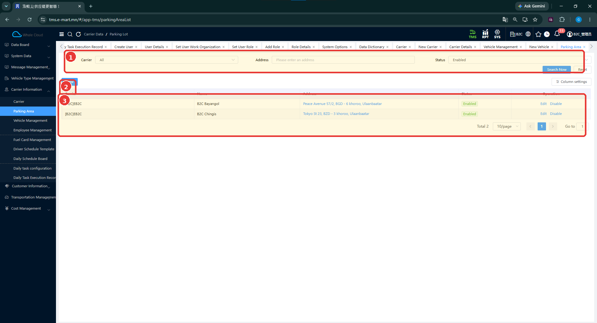
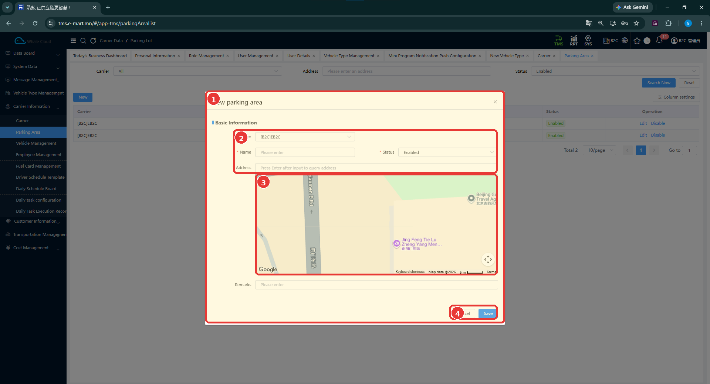

# Зогсоол (Parking Area)

[Тээвэрлэгчийн мэдээллийн тойм](../carrier-information.md)

## Энэ хэсэг юу хийдэг вэ?

Зогсоол нь тээвэрлэгчийн тээврийн хэрэгсэл байрлах газрын нэр, хаягийн бүртгэл юм. Зогсоол бүртгэхдээ тээвэрлэгчийг сонгоно. Энэ мэдээлэл тээвэрлэгчийн дэлгэрэнгүй дэх зогсоолын хэсэгтэй холбоотой.

## Хэзээ ашиглах вэ?

- Тээвэрлэгчийн ашиглах зогсоолыг нэмэх.
- Зогсоолын хаяг, харьяаллыг шалгах.
- Бүртгэлтэй зогсоолын мэдээллийг засварлах.

## Эхлэхийн өмнө

[Тээвэрлэгчээ](carrier.md) шалгаж, зогсоолын нэр, бодит хаягаа бэлтгэнэ.

**Цэсний зам:** TMS → Carrier Information → Parking Area.

## Дэлгэцийн бүтэц

**Carrier**, **Address**, **Status** нөхцөлөөр хайж **Search Now** дарна. Жагсаалтаас тээвэрлэгч, зогсоолын нэр, хаяг, төлөвийг шалгана.

| № | Хэсэг | Тайлбар |
|---|---|---|
| 1 | Хайлт | Тээвэрлэгч, хаяг, төлөвөөр шүүнэ. |
| 2 | New | Зогсоол нэмэх цонхыг нээнэ. |
| 3 | Жагсаалт | Бүртгэлүүд болон Edit, Disable үйлдлүүд. |

## Шинээр бүртгэх

1. **New** дарна.
2. **Carrier** хэсгээс харьяалах тээвэрлэгчийг сонгоно.
3. **Name** талбарт зогсоолын нэрийг оруулж, **Status**-ыг сонгоно.
4. **Address** талбарт хаягаа бичнэ. Талбарын зааврын дагуу **Enter** дарж хаяг хайна.
5. Газрын зурагт харагдах байршлыг бодит хаягтайгаа тулгаж шалгана.
6. Шаардлагатай бол **Remarks** бичнэ.
7. **Save** дарж, жагсаалтаас нэр, хаягаар нь шалгана. Хаах бол **Cancel** дарна.

| № | Хэсэг | Тайлбар |
|---|---|---|
| 1 | Бүртгэлийн цонх | Шинэ зогсоолын мэдээлэл. |
| 2 | Үндсэн талбарууд | Carrier, Name, Status, Address. |
| 3 | Газрын зураг | Хаягтай холбоотой байршлыг шалгах хэсэг. |
| 4 | Save / Cancel | Хадгалах эсвэл хаах. |

## Талбаруудын тайлбар

| Талбар | Тайлбар | Заавал эсэх |
|---|---|---|
| Carrier | Зогсоол харьяалах тээвэрлэгч. | Зурагт тэмдэглэгээ тод харагдахгүй |
| Name | Зогсоолыг ялгах нэр. | Тийм — * тэмдэгтэй |
| Status | Бүртгэлийн төлөв. | Тийм — * тэмдэгтэй |
| Address | Зогсоолын хаяг; Enter дарж хаяг хайх заавартай. | Зурагт * тэмдэггүй |
| Remarks | Нэмэлт тайлбар. | Зурагт * тэмдэггүй |

## Бүртгэсний дараа юу шалгах вэ?

- Зөв тээвэрлэгчид харьяалуулсан эсэх.
- Зогсоолын нэр, хаяг зөв эсэх.
- Жагсаалтын төлөв зөв эсэх.
- Тээвэрлэгчийн дэлгэрэнгүйд зогсоолын мэдээллээ шалгах.

## Засварлах ба төлөв

Тухайн зогсоолын мөрөнд **Edit**, **Disable** байна. Эхлээд нэр, хаягийг нь нягталж байж үйлдлээ сонгоно. Засварын маягт болон идэвхгүй болгосны дараах бусад бүртгэлийн өөрчлөлт одоогийн тестээр баталгаажаагүй.

## Анхаарах зүйл

Зураг дээрх газрын зургийн эхний байрлалыг өөрийн зогсоолын хаяг гэж ашиглахгүй. Газрын зураг дээр товших, тэмдэглэгээ чирэх, координат автоматаар хадгалах ажиллагаа одоогийн тестээр баталгаажаагүй.

## Дараагийн алхам

[Ажилтан бүртгэх](employee-management.md) → [Тээврийн хэрэгсэл бүртгэх](vehicle-management.md).
