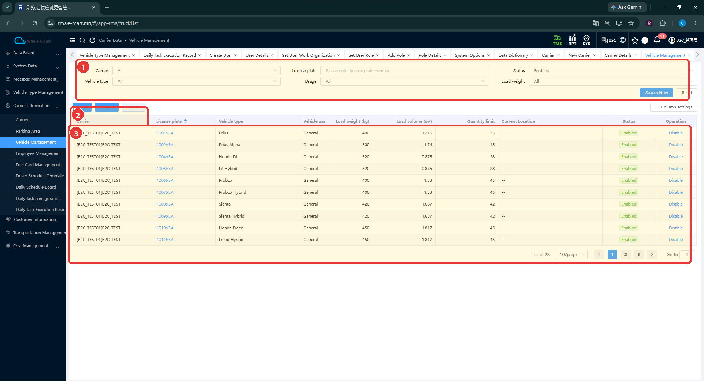
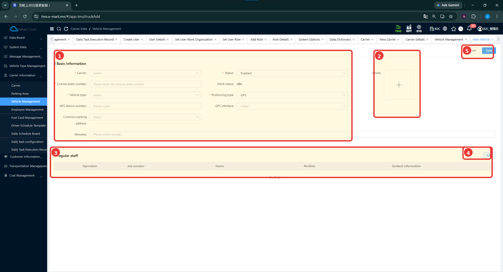
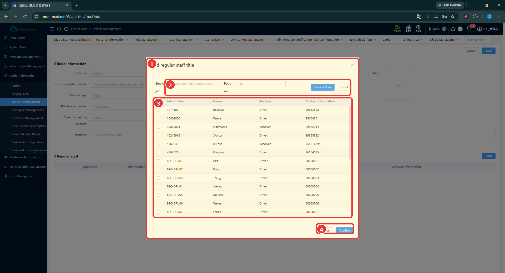

# Тээврийн хэрэгслийн удирдлага (Vehicle Management)

[Тээвэрлэгчийн мэдээллийн тойм](../carrier-information.md)

## Энэ хэсэг юу хийдэг вэ?

Энд улсын дугаартай бодит тээврийн хэрэгсэл буюу машиныг бүртгэнэ. **Vehicle Type** нь Toyota Vitz зэрэг ерөнхий төрөл, **Vehicle** нь 1018УБА зэрэг тодорхой машин юм. Машинд тээвэрлэгч, төрөл болон тогтмол ажилтны мэдээлэл холбоно.

## Хэзээ ашиглах вэ?

- Шинэ машин бүртгэх.
- Машины харьяалал, төрөл, төлөвийг шалгах.
- Машинд тогтмол ажиллах жолооч, бусад ажилтныг холбох.

## Эхлэхийн өмнө

[Тээвэрлэгч](carrier.md), [тээврийн хэрэгслийн төрөл](../vehicle-type-management.md)-өө шалгана. Улсын дугаар болон байршлын төхөөрөмж ашигладаг бол холбогдох мэдээллээ бэлтгэнэ. Тогтмол ажилтан холбохын өмнө [ажилтан](employee-management.md)-аа бүртгэнэ.

**Цэсний зам:** TMS → Carrier Information → Vehicle Management.

## Дэлгэцийн бүтэц

**Carrier**, **Vehicle type**, **License plate**, **Usage**, **Status**, **Load weight** нөхцөлөөр **Search Now** дарж хайна. **Reset** ашиглан нөхцөлийг цэвэрлэнэ. Хүснэгтэд харьяалал, улсын дугаар, төрөл, даац, багтаамж, тоо хэмжээний хязгаар, одоогийн байршил, төлөв харагдана.

| № | Хэсэг | Тайлбар |
|---|---|---|
| 1 | Хайлт | Харьяалал, төрөл, улсын дугаар болон бусад нөхцөл. |
| 2 | Үйлдлийн хэсэг | New / Import / Export орчим дахь тэмдэглэгээ. |
| 3 | Жагсаалт | Машины мэдээлэл, төлөв болон хуудаслалт. |

## Шинээр бүртгэх

1. **New** дарна.
2. **Carrier**, **Vehicle type** сонгож, **License plate number** оруулна.
3. **Status**, **Positioning type**-ыг тохируулна.
4. Ашиглах GPS мэдээлэл, ердийн зогсоолын хаяг, тайлбар, зургийг бэлтгэсэн мэдээлэлтэйгээ тулгаж оруулна.
5. Хэрэгтэй бол доорх **Regular staff** хэсгээр ажилтан нэмнэ.
6. **Save** дарна. Хаах бол **Cancel** дарна.
7. Улсын дугаараар хайж бүртгэлээ шалгана.

| № | Хэсэг | Тайлбар |
|---|---|---|
| 1 | Basic Information | Харьяалал, улсын дугаар, төрөл, төлөв, байршлын мэдээлэл. |
| 2 | Photo | Тээврийн хэрэгслийн зураг. |
| 3 | Regular staff | Холбосон ажилтнуудын хүснэгт. |
| 4 | Add | Тогтмол ажилтан сонгох цонх. |
| 5 | Save / Cancel | Машины бүртгэлийг хадгалах эсвэл хаах. |

## Талбаруудын тайлбар

**Тийм** нь зураг дээр улаан **\*** тэмдэгтэйг заана.

| Талбар | Тайлбар | Заавал эсэх |
|---|---|---|
| Carrier | Машин харьяалах тээвэрлэгч. | Тийм |
| License plate number | Бодит улсын дугаар. Жишээ: 1018УБА. | Тийм |
| Vehicle type | Урьдчилан бүртгэсэн тээврийн хэрэгслийн төрөл. | Тийм |
| Status | Бүртгэлийн төлөв. | Тийм |
| Work status | Ажлын төлөв; зурагт Idle харагдана. | Зурагт * тэмдэггүй |
| Positioning type | Байршил тогтоох төрлийн сонголт. | Тийм |
| GPS device number | GPS төхөөрөмжийн дугаар. | Зурагт * тэмдэггүй |
| GPS interface | GPS холболтын сонголт. | Зурагт * тэмдэггүй |
| Common parking address | Ердийн зогсоолын хаяг. | Зурагт * тэмдэггүй |
| Photo | Тээврийн хэрэгслийн зураг. | Зурагт * тэмдэггүй |
| Remarks | Нэмэлт тайлбар. | Зурагт * тэмдэггүй |
| Regular staff | Тогтмол ажилтны холбоосын хүснэгт. | Зурагт * тэмдэггүй |

## Тогтмол ажилтан холбох (Regular staff) { #regular-staff }

1. Машины маягтын **Regular staff** хэсэгт **Add** дарна.
2. **Employee** талбарт ажилтны дугаар эсвэл нэр оруулж, шаардлагатай бол **Position** сонгоно.
3. **Search Now** дарна.
4. Зөв ажилтны мөрийн сонгох нүдийг тэмдэглэнэ.
5. **Confirm** дарна. Сонгохгүй буцах бол **Close** дарна.
6. Үндсэн маягтын Regular staff хүснэгтэд ажилтнаа шалгаад **Save** дарна.

| № | Хэсэг | Тайлбар |
|---|---|---|
| 1 | Ажилтан сонгох цонх | Add regular staff title гэсэн гарчигтай. |
| 2 | Хайлт | Employee, Position, Search Now, Reset. |
| 3 | Сонгох хүснэгт | Ажилтны дугаар, нэр, албан үүрэг, холбоо барих мэдээлэл. |
| 4 | Close / Confirm | Хаах эсвэл сонголтыг баталгаажуулах. |

Жагсаалтад **Driver**, **Receiver** зэрэг албан үүрэгтэй ажилтнууд харагдана. Тогтмол ажилтан холбосноор ухаалаг төлөвлөлт зөвхөн тэр жолоочийг заавал сонгоно гэсэн дүрэм одоогийн тестээр баталгаажаагүй.

## Бүртгэсний дараа юу шалгах вэ?

- Улсын дугаар алдаагүй эсэх.
- Тээвэрлэгч болон төрөл зөв эсэх.
- Төрөлтэй холбоотой даац, багтаамжийн мэдээлэл зөв харагдаж байгаа эсэх.
- Regular staff-д зөв ажилтан сонгосон эсэх.
- Төлөв болон байршлын тохиргоо зорьсон утгатай эсэх.

## Анхаарах зүйл

GPS талбар бөглөсөн нь байршлын интеграц ажилласны баталгаа биш. Төхөөрөмж холбох нарийн дүрэм, Import / Export загвар, жагсаалтын **Disable** үйлдлийн бусад бүртгэлд үзүүлэх нөлөө одоогийн тестээр баталгаажаагүй.

## Дараагийн алхам

[Хуваарийн загвар](driver-schedule-template.md) → [Өдрийн хуваарь](daily-schedule-board.md) → [Тээвэр төлөвлөх](../../planning/overview.md).
