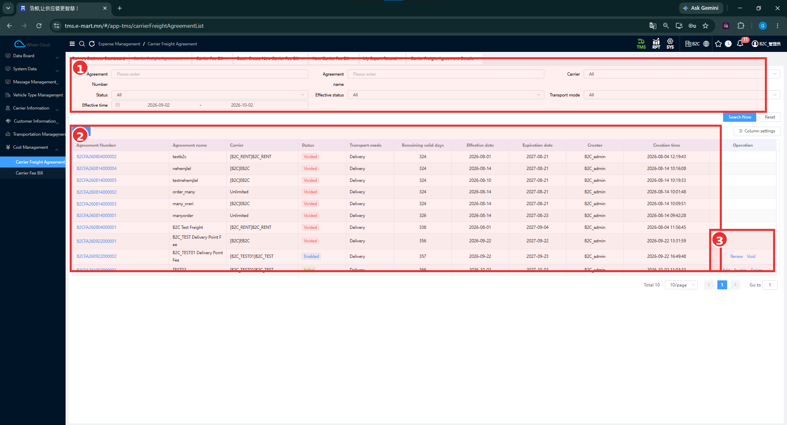
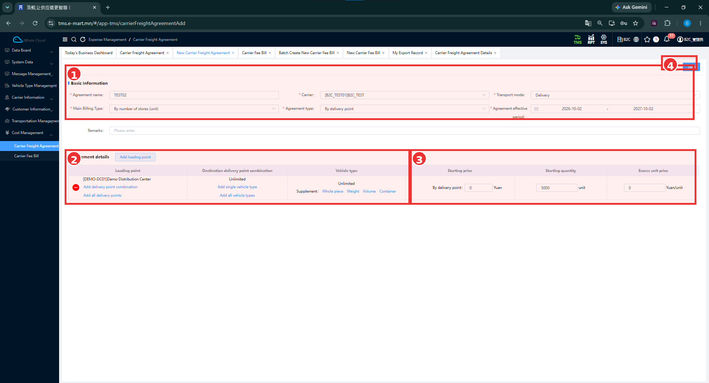

# Carrier Freight Agreement

[Cost Management-ийн ерөнхий ойлголт](../cost-management.md)

## Энэ хэсэг юу хийдэг вэ?

Carrier Freight Agreement нь тээвэрлэгчид ямар нөхцөлөөр, ямар төрлийн тээвэрлэлтэд, ямар тариф ашиглан төлбөр тооцохыг урьдчилан тохируулдаг хэсэг юм. Гэрээнд тээвэрлэгч, хугацаа, ачилтын болон хүргэлтийн цэг, шаардлагатай бол машины төрлийг заана. Систем тээврийн ажлын мэдээллийг энэ нөхцөлтэй холбон зардлын дүн гаргах боломжтой.

Тээвэрлэгчтэй тохирсон үнийг зөв бүртгэх нь зардлыг шалгах үндэс болно. Өмнөх B2C тестэд гэрээний тээвэрлэгч даалгаврынхаас зөрсөн үед төлбөр тооцох боломжгүй болсон.

## Хэзээ ашиглах вэ?

Шинэ тээвэрлэгчтэй төлбөрийн нөхцөл тохируулах, одоо байгаа гэрээний тариф болон хугацааг шалгах, зардлын баримтад ямар гэрээ холбогдсоныг нягтлахад ашиглана.

## Эхлэхийн өмнө

Ерөнхийдөө дараах мэдээллийг урьдчилан бэлтгэнэ.

- [Carrier](../carrier-information/carrier.md) бүртгэлтэй эсэх, код ба нэр зөв эсэх.
- Ашиглах [Loading Point](../customer-information/client-loading-point.md), [Delivery Point](../customer-information/client-delivery-point.md).
- Машины төрлөөр нөхцөл тохируулах бол [Vehicle Type](../vehicle-type-management.md).
- Тээврийн төрөл, гэрээний эхлэх ба дуусах огноо, тохирсон тариф.

Энэ жагсаалт нь бүх төрлийн гэрээнд ижил хамаарлыг заавал шаардана гэсэн дүрэм биш. Доорх тестийн утгуудыг бодит гэрээнд шууд хуулж ашиглахгүй.

**Цэсний зам:** TMS → Cost Management → Carrier Freight Agreement.

## Дэлгэцийн бүтэц

| № | Хэсэг | Тайлбар |
|---|---|---|
| 1 | Хайлтын нөхцөл | Гэрээний дугаар, нэр, тээвэрлэгч, төлөв, хугацаа болон тээврийн төрлөөр шүүнэ. |
| 2 | Гэрээний жагсаалт | Гэрээнүүдийн үндсэн мэдээлэл, Initial, Enabled, Voided төлөвүүд харагдана. Доод TEST02 мөр хэсэгчлэн харагдсан. |
| 3 | Operation | Баруун доод хүрээнд Renew, Void болон доод мөрийн Edit, Enable, Delete харагдана. |

**Search Now**, **Reset** товчнууд 1-р хүрээний доор, баруун талд байна. Жагсаалтын зүүн дээд шинэ бүртгэлийн товчны бичвэр 2-р тэмдэглэгээнд халхлагдсан; нээгдсэн маягтын нэр нь **New Carrier Freight Agreement**.

### Гэрээ хайх

1. **Agreement Number** эсвэл **Agreement name** оруулна.
2. Хэрэгтэй бол **Carrier**, **Status**, **Transport mode** сонгоно.
3. **Effective status**, **Effective time** нөхцөлөө нягтална. Зурагт хугацааны завсар сонгосон байна.
4. **Search Now** дарна. Нөхцөлийг цэвэрлэх бол **Reset** ашиглана.
5. Олдсон мөрийн тээвэрлэгч, төлөв, хугацааг хамтад нь шалгана.

| Хайлтын талбар | Тайлбар |
|---|---|
| Agreement Number | Гэрээний дугаараар хайх. |
| Agreement name | Гэрээний нэрээр хайх. |
| Carrier | Тухайн тээвэрлэгчийн гэрээг шүүх. |
| Status | Гэрээний бүртгэлийн төлөвөөр шүүх. |
| Effective status | Хүчинтэй байдлаар шүүх; Status-аас тусдаа нөхцөл. Сонголтуудын жагсаалт зурагт дэлгэгдээгүй. |
| Transport mode | Тээврийн төрлөөр шүүх. |
| Effective time | Хүчинтэй хугацаатай холбоотой огнооны завсраар шүүх. |

### Жагсаалтын талбарууд

Эдгээр нь харах баганууд; бөглөх маягт биш.

| Талбар | Тайлбар |
|---|---|
| Agreement Number | Гэрээг ялгах дугаар. Цэнхэр холбоосоор харагдана. |
| Agreement name | Гэрээнд өгсөн нэр. |
| Carrier | Гэрээний тээвэрлэгч. Зарим мөрд Unlimited харагдана; хамрах нарийн дүрэм зурагт байхгүй. |
| Status | Initial, Enabled, Voided зэрэг бүртгэлийн төлөв. |
| Transport mode | Гэрээний тээврийн төрөл. Жишээнд Delivery буюу хүргэлт. |
| Remaining valid days | Дэлгэцэд тооцож харуулсан хүчинтэй үлдэх хоног. |
| Effective date | Гэрээ хүчинтэй болох огноо. |
| Expiration date | Гэрээний хугацаа дуусах огноо. |
| Creator | Гэрээг үүсгэсэн хэрэглэгч. |
| Creation time | Үүсгэсэн огноо, цаг. |
| Operation | Тухайн мөрд харагдах боломжит үйлдлүүд. |

Voided мөрд ч Remaining valid days харагдаж байна. Үлдэх хоногийн тоог дангаар нь гэрээ ашиглаж болохын баталгаа гэж үзэхгүй.

## Гэрээний төлөв

| Төлөв | Энгийн тайлбар |
|---|---|
| Initial | Гэрээ үүссэн боловч хараахан идэвхжээгүй. |
| Enabled | Ашиглах боломжтой идэвхтэй гэрээ. Хугацаа болон тээврийн ажлын мэдээлэлтэй нь хамт шалгана. |
| Voided | Хүчингүй болгосон гэрээ. |

Эдгээр төлөв жагсаалтад бодитоор харагдсан. Бүх гэрээ заавал нэг дарааллаар эдгээр төлөвийг дамжина гэж баталгаажуулаагүй.

### Operation дахь үйлдлүүд

| Үйлдэл | Зориулалт, харагдсан жишээ |
|---|---|
| Renew | Гэрээний хугацаа сунгах ажиллагаа. Enabled мөрд харагдана. Дараах үр дүн баталгаажаагүй. |
| Void | Гэрээг хүчингүй болгох ажиллагаа. Enabled мөрд харагдана. Бусад баримтад үзүүлэх нөлөө баталгаажаагүй. |
| Edit | Гэрээг засварлах. TEST02-ийн Initial мөрд харагдана. |
| Enable | Гэрээг идэвхжүүлэх. TEST02-ийн Initial мөрд харагдана. |
| Delete | Гэрээг устгах ажиллагаа. TEST02-ийн Initial мөрд харагдана. Устгах нөхцөл, үр дүн баталгаажаагүй. |

Энэ нь үйлдэл бүрийг зөвшөөрөх бүх нөхцөлийн жагсаалт биш.

## Шинэ гэрээ үүсгэх

### Дэлгэцийн бүтэц

| № | Хэсэг | Тайлбар |
|---|---|---|
| 1 | Basic Information | Гэрээний нэр, тээвэрлэгч, тээврийн төрөл, тооцох төрөл, хугацаа. Remarks нь хүрээний доод захын доор байна. |
| 2 | Add loading point | Agreement details хэсэгт ачилтын цэг нэмэх товч. |
| 3 | Agreement details | Тарифын хүснэгт. Энэ хоосон маягтад No Data байна. |
| 4 | Save | Баруун дээд талын хадгалах товч. |

### Алхам алхмаар

1. Жагсаалтын шинэ бүртгэлийн товчоор **New Carrier Freight Agreement** маягтыг нээнэ.
2. **Agreement name**-д гэрээг ялгах нэр оруулна.
3. **Carrier**-аас төлбөр тохирсон тээвэрлэгчээ сонгоно. Хоосон маягтын Unlimited утгыг бодит гэрээний сонголт гэж шууд үлдээхгүй.
4. **Transport mode**-оос гэрээний тээврийн төрлийг сонгоно. Доорх бөглөсөн жишээнд **Delivery** байна.
5. **Main Billing Type**, **Agreement type**-ийг тохирсон төлбөрийн нөхцөлдөө нийцүүлэн сонгоно.
6. **Agreement effective period**-д эхлэх болон дуусах огноог тохируулна. Шаардлагатай бол **Remarks** бичнэ.
7. **Agreement details → Add loading point** ашиглан ачилтын цэг нэмнэ.
8. Доорх тарифын хэсгийн дагуу хүргэлтийн цэгийн хослол, машины төрөл, үнийн нөхцөлийг нягталж бөглөнө.
9. Тээвэрлэгч, хугацаа, тариф болон нэгжүүдээ дахин шалгаад **Save** дарна.
10. Жагсаалтаас гэрээний нэрээр хайж, хадгалсан мэдээлэл болон **Status**-ыг шалгана.

Цэг, машины төрөл сонгох тусдаа цонх болон Save-ийн баталгаажуулах мэдэгдэл энэ багцад байхгүй.

### Үндсэн талбаруудын тайлбар

**Тийм** гэдэг нь зурагт улаан **\*** тэмдэгтэй гэсэн үг. Тэмдэггүй талбарыг бүх нөхцөлд албагүй гэж дүгнээгүй.

| Талбар | Тайлбар | Заавал эсэх |
|---|---|---|
| Agreement name | Гэрээг ялгах нэр. | Тийм |
| Carrier | Төлбөр тооцох тээвэрлэгч. | Тийм |
| Transport mode | Ямар төрлийн тээвэрлэлтэд гэрээ ашиглахыг сонгоно. | Тийм |
| Main Billing Type | Төлбөр тооцох үндсэн хэмжүүр. Жишээнд By number of stores (unit) буюу дэлгүүрийн тоогоор. | Тийм |
| Agreement type | Тарифыг ямар нөхцөлөөр бүлэглэх сонголт. Жишээнд By delivery point буюу хүргэлтийн цэгээр. | Тийм |
| Agreement effective period | Гэрээ хүчинтэй байх эхлэх, дуусах огноо. | Тийм |
| Remarks | Гэрээтэй холбоотой нэмэлт тайлбар. | Зурагт * тэмдэггүй |

## Pricing / Agreement details — Тарифын нөхцөл {#pricing}

**Main Billing Type** нь юуны тоо хэмжээг ашиглахыг, **Agreement type** нь тэр тарифыг ямар хүрээнд тохируулахыг ерөнхийд нь ялгана. Зурагт **By number of stores (unit)**, **By delivery point** сонгосон байна.

| № | Хэсэг | Тайлбар |
|---|---|---|
| 1 | Сонгосон үндсэн нөхцөл | TEST02, [B2C_TEST01] B2C_TEST, Delivery, By number of stores (unit), By delivery point болон хугацаа. |
| 2 | Тариф хамрах мэдээлэл | Loading point, Destination delivery point combination, Vehicle type болон Supplement сонголтууд. |
| 3 | Үнийн талбарууд | Starting price, Starting quantity, Excess unit price. |
| 4 | Save | Оруулсан мэдээллийг хадгалах товч. |

Хоосон маягтын хүснэгтэд **Destination Region**, харин By delivery point сонгосон жишээнд **Destination delivery point combination** гэж харагдана. Сонгосон нөхцөлдөө тохирох баганын нэрийг уншина.

### Ачилтын цэг, хүргэлтийн цэг, машины төрөл

| Талбар / үйлдэл | Энгийн тайлбар | Заавал эсэх |
|---|---|---|
| Loading point | Тариф хамаарах ачилтын цэг. Жишээнд [DEMO-DC01] Demo Distribution Center. | Зурагт * тэмдэггүй |
| Destination delivery point combination | Тариф хамаарах хүргэлтийн цэгүүдийн хослол. Жишээнд Unlimited байна. | Зурагт * тэмдэггүй |
| Vehicle type | Тарифт хамруулах машины төрөл. Улсын дугаартай бодит машин биш. Жишээнд Unlimited. | Зурагт * тэмдэггүй |
| Starting price | Үндсэн эхлэх төлбөр. | Зурагт * тэмдэггүй |
| Starting quantity | Үндсэн төлбөрт хамаарах эхний тоо хэмжээ. | Зурагт * тэмдэггүй |
| Excess unit price | Эхний хэмжээнээс хэтэрсэн нэгж бүрт тооцох нэмэлт үнэ. | Зурагт * тэмдэггүй |

Мөрийг **аль ачилтын цэгээс → ямар хүргэлтийн цэгүүдэд → ямар машины төрөлд → ямар тариф хэрэглэх вэ?** гэсэн дарааллаар уншина.

1. **Add loading point**-оор нэмсэн ачилтын цэгээ нягтална.
2. Зурагт **Add delivery point combination**, **Add all delivery points** үйлдлүүд байна. Тохирсон хүргэлтийн цэгийн хүрээг сонгохдоо эдгээр нэрийг ялгана.
3. Машины төрлийн хэсэгт **Add single vehicle type**, **Add all vehicle types** харагдана. Тохирох төрлөө сонгож, хүснэгтийн утгыг шалгана.
4. **Starting price**, **Starting quantity**, **Excess unit price**-д тохирсон нөхцөлөө оруулна.
5. Үнийн дүн, тоо хэмжээ болон хажуугийн нэгжийг хамтад нь шалгана.

**Unlimited** нь тухайн баганад тодорхой цэгийн хослол эсвэл төрөл заагаагүй харагдац юм. Ямар ажлуудыг хамруулах, бусад гэрээтэй хэрхэн давуу эрхээр сонгох нарийн дүрэм одоогийн тестээр баталгаажаагүй.

### Starting price, Starting quantity, Excess unit price-ийг ялгах

Starting price нь **мөнгөн дүн**, Starting quantity нь **тоо хэмжээ**, Excess unit price нь **нэгжийн нэмэлт үнэ** юм. Иймээс ижил тоо харагдсан ч талбарын нэр болон нэгжийг эхэлж уншина.

**TEST02 зурагт** Starting price = **0 Yuan**, Starting quantity = **5000 unit**, Excess unit price = **0 Yuan/unit** байна. Эндэх **5000 нь Starting quantity** болохоос нэг хүргэлтийн цэгийн үнэ биш. Энэ зургийг ¥10,000 гарсан B2C тестийн тариф эсвэл тооцооны томьёоны баталгаа гэж ашиглахгүй.

Зураг нь талбаруудыг харуулж байгаа боловч эдгээр утгыг ашиглан эцсийн төлбөрийг яг ямар томьёогоор гаргахыг батлахгүй.

### Supplement — Нэмэлт нөхцөлийн сонголтууд

Vehicle type хэсэгт дараах холбоосууд харагдана.

| Сонголт | Нэрийн энгийн тайлбар |
|---|---|
| Whole piece | Барааны ширхэгийн тоотой холбоотой нэмэлт сонголт. |
| Weight | Жинтэй холбоотой нэмэлт сонголт. |
| Volume | Эзлэхүүнтэй холбоотой нэмэлт сонголт. |
| Container | Савны тоотой холбоотой нэмэлт сонголт. |

Эдгээрийг нээсэн маягт, нэмэлт тариф болон тооцоонд үзүүлэх нөлөө зурагт байхгүй. Бүх сонголтыг заавал тохируулах шаардлагатай гэж үзэхгүй.

## Үйлдэл хийсний дараа

Жагсаалтын доод мөрд **TEST02**, **Initial**, мөн **Edit / Enable / Delete** харагдана. Энэ нь гэрээ хадгалсны дараа Initial төлөвтэй бүртгэл жагсаалтад харагдаж болох жишээ юм. Save бүр заавал Initial үүсгэдэг гэсэн бүх нөхцөлийн дүрэм баталгаажаагүй.

Идэвхжүүлэх шаардлагатай бол зөв гэрээний **Enable** үйлдлийг ашиглана. Үйлдлийн дараа жагсаалтаас ижил гэрээг дахин хайж, харагдсан төлөвийг шалгана. Enable-ийн баталгаажуулах цонх болон дараагийн бүх үйл явц автоматаар эхлэх эсэх одоогийн зурагт байхгүй.

## Delivery Task болон Carrier Fee Bill-тэй холбогдох нь

B2C тестийн **B2CFA260922000002** гэрээ жагсаалтад **Enabled** төлөвтэй, **[B2C_TEST01] B2C_TEST** тээвэрлэгчтэй байна. [Carrier Fee Bill-ийн дэлгэрэнгүй](../../reference/cost-settlement.md#detail)-д энэ дугаар, **B2CVS260922000001** даалгавар, **¥10,000** дүн хамт харагдана.

Үүгээр гэрээ, тээврийн ажил, зардлын баримтын холбоог шалгана. TEST02-ийн тарифыг энэ баримтад ашигласан гэж ойлгохгүй.

## Анхаарах зүйл

Төлбөр тооцоход асуудал гарвал гэрээ ба Delivery Task-ийн **Carrier**-ийг эхэлж тулгана. Мөн гэрээний төлөв, хугацаа, Transport mode, цэг болон машины төрлийн нөхцөлийг нягтална. Энэ нь шалгах мэдээллийн жагсаалт; гэрээ сонгох алгоритмын дүрэм биш.

Renew, Void, Delete-ийн дараах үр дүн, төлөв шилжих бүх нөхцөл, тооцооны томьёо болон олон гэрээнээс сонгох дараалал одоогийн тестээр бүрэн баталгаажаагүй.

## Дараагийн алхам

[Delivery Task-ийн мэдээллийг шалгах](../../dispatch/publish.md) → [Carrier Fee Bill-ийн дүн, гэрээ, түүхийг харах](../../reference/cost-settlement.md).
