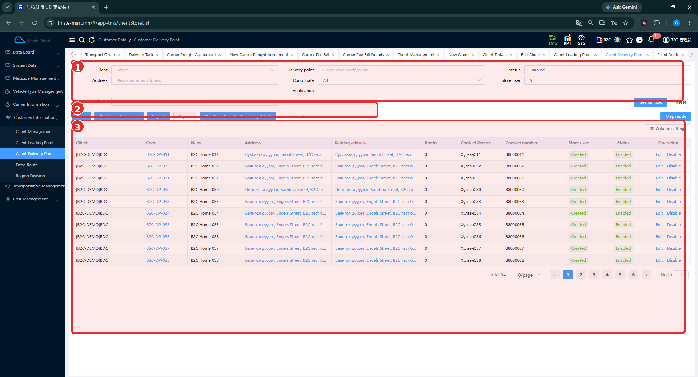
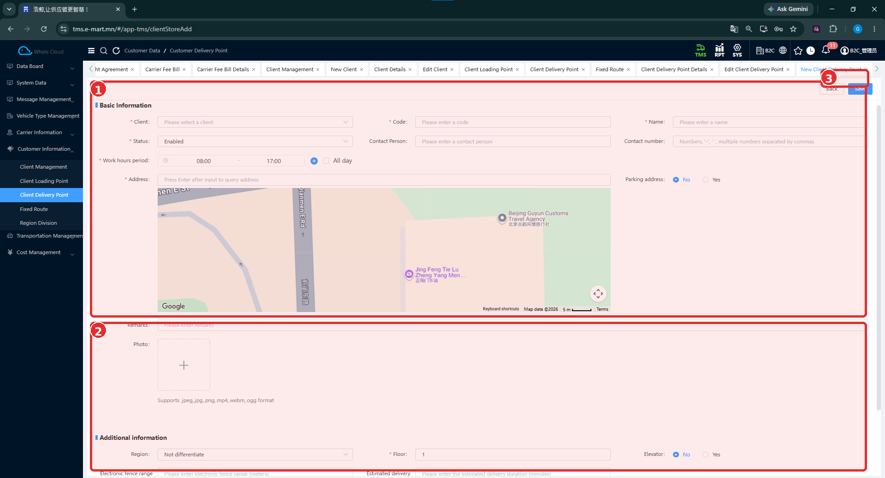
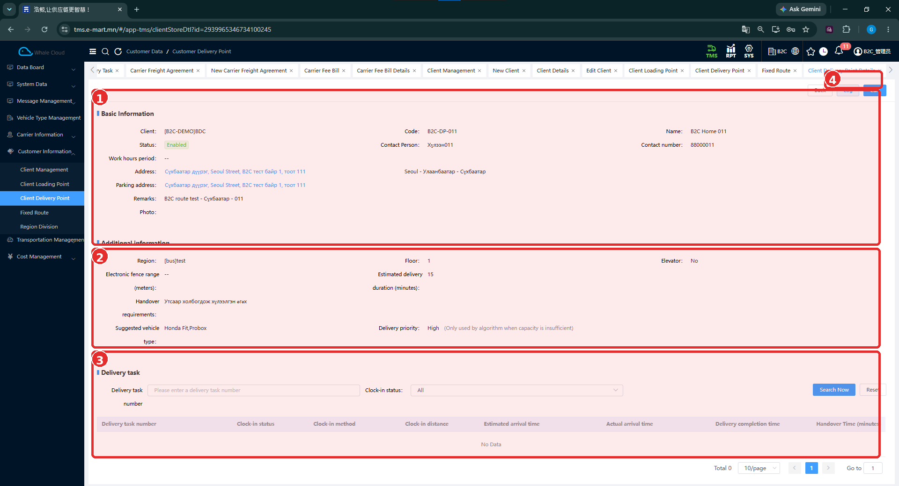
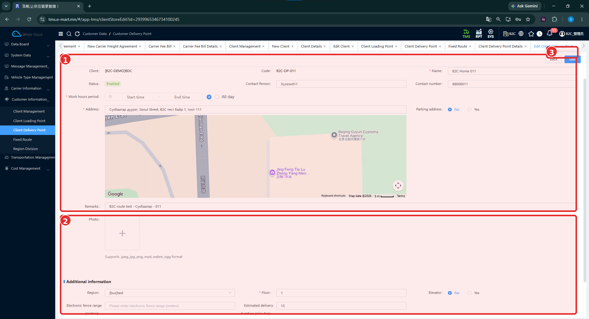
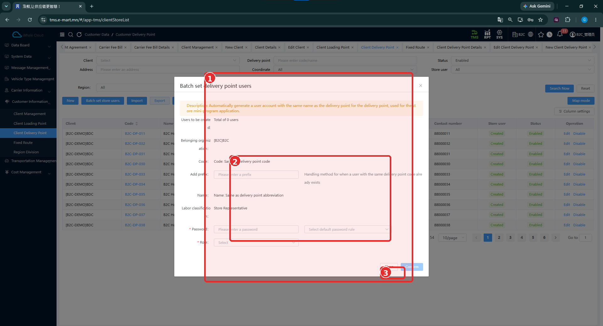
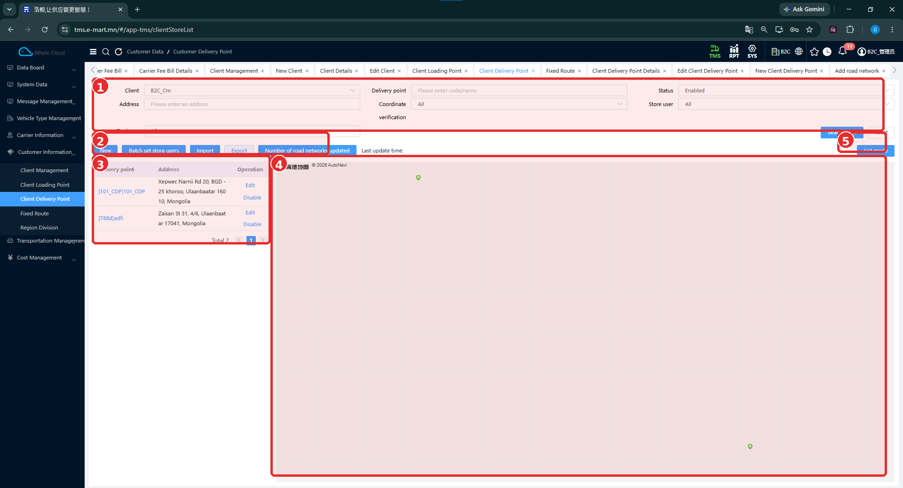
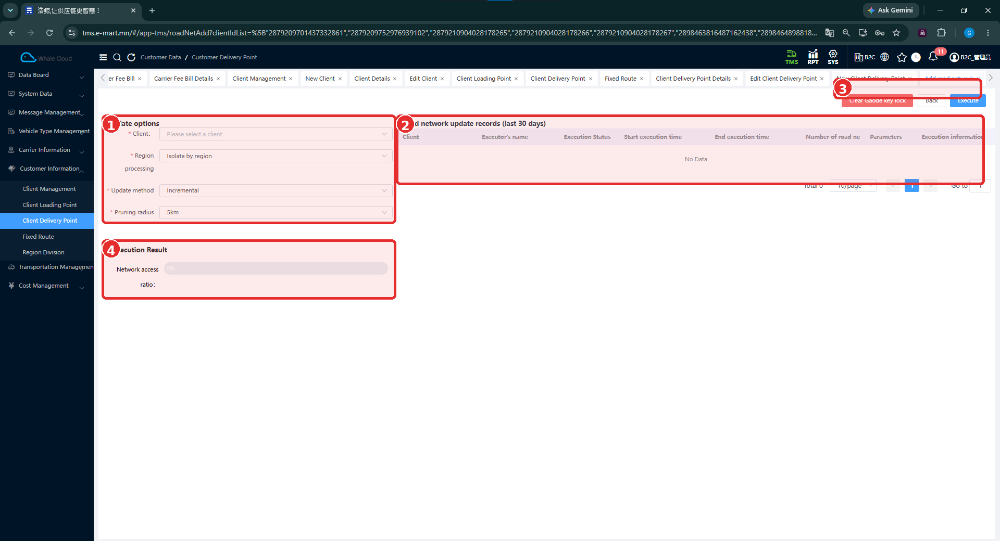

# Хүргэлтийн цэг (Client Delivery Point)

[Харилцагчийн мэдээллийн тойм](../customer-information.md)

## Энэ хэсэг юу хийдэг вэ?

Хүргэлтийн цэг нь барааг хаана хүргэхийг тодорхойлдог бүртгэл юм. Харилцагч, хаяг, холбоо барих хүн, ажиллах цаг болон хүлээлгэн өгөх нэмэлт мэдээллийг агуулна. Өмнөх B2C тестэд **B2C Home 031**, **B2C Home 032** цэгүүдийг захиалга, төлөвлөлт, Driver App-ийн хүргэлтэд ашигласан.

## Хэзээ ашиглах вэ?

- Шинэ хүргэлтийн хаяг бүртгэх.
- Захиалга бэлтгэхийн өмнө цэгийн мэдээллийг шалгах, засах.
- Дэлгүүрийн талд Store Mini App хэрэглэгч бэлтгэх.
- Цэгүүдийг жагсаалт болон газрын зургаар харах.

## Эхлэхийн өмнө

[Харилцагч](client-management.md), цэгийн код, нэр, бодит хаяг, холбоо барих мэдээлэл, ажиллах цагийг бэлтгэнэ. Store хэрэглэгч тохируулах бол [SYS байгууллага](../../sys/business-organization.md), [хэрэглэгч](../../sys/user-management.md), [role](../../sys/role-management.md)-ийн мэдээллээ шалгана.

**Цэсний зам:** TMS → Customer Information → Client Delivery Point.

## Дэлгэцийн бүтэц

**Client**, **Delivery point** буюу код/нэр, **Address**, **Status**, **Coordinate verification**, **Store user**, **Region** нөхцөлөөр хайна. **Search Now** дарж үр дүнг харна; **Reset**-ээр нөхцөлийг цэвэрлэнэ.

Жагсаалтад харилцагч, код, нэр, хаяг, зогсоолын хаяг, зураг, холбоо барих хүн, дугаар, Store хэрэглэгчийн байдал болон төлөв байна. **Created** нь Store хэрэглэгч үүссэн гэсэн тэмдэглэгээ; энэ нь нэвтрэлт амжилттай болсны баталгаа биш.

| № | Хэсэг | Тайлбар |
|---|---|---|
| 1 | Хайлт | Харилцагч, цэг, хаяг, төлөв болон бусад шүүлтүүр. |
| 2 | Үйлдлүүд | New, Batch set store users, Import, Export, Number of road networks updated. |
| 3 | Жагсаалт | Бүртгэлүүд, Edit / Disable, Column settings болон хуудаслалт. |

## Шинээр бүртгэх

1. **New** дарна.
2. **Client** сонгоод **Code**, **Name**-ыг оруулна.
3. **Status**, холбоо барих хүн болон утсыг бөглөнө.
4. **Work hours period**-д ажиллах цагийг тохируулна. **All day** сонголт хажууд нь байна.
5. **Address**-т хаягаа бичиж, талбарын зааврын дагуу **Enter** дарж хайна.
6. Газрын зургийн байршлыг бодит хаягтайгаа тулгаж шалгана. **Parking address** сонголтыг нягтална.
7. Шаардлагатай бол **Remarks**, **Photo**, **Region**, **Floor**, **Elevator** мэдээллийг оруулна.
8. Маягтыг доош гүйлгэж үлдсэн талбаруудыг шалгана. Доод хэсэг энэ зурагт бүрэн харагдахгүй.
9. **Save** дарна. Хадгалахгүй буцах бол **Back** ашиглана.
10. Хадгалсны дараа жагсаалтад бүртгэл нэмэгдсэн эсэхийг кодоор хайж шалгана.

| № | Хэсэг | Тайлбар |
|---|---|---|
| 1 | Basic Information | Харилцагч, код, нэр, төлөв, цаг, хаяг болон газрын зураг. |
| 2 | Нэмэлт мэдээллийн эхлэл | Remarks, Photo, Additional information; доод тал нь тасарсан. |
| 3 | Дээд талын үйлдлүүд | Back, Save товчнууд хүрээний доод захад байна. |

## Талбаруудын тайлбар

**Тийм** гэж зөвхөн шинэ маягтад улаан одтой харагдсан талбарыг тэмдэглэв.

| Талбар | Тайлбар | Заавал эсэх |
|---|---|---|
| Client | Цэг харьяалах харилцагч. | Тийм |
| Code | Хүргэлтийн цэгийн код. Жишээ: B2C-DP-032. | Тийм |
| Name | Цэгийн нэр. Жишээ: B2C Home 032. | Тийм |
| Status | Бүртгэлийн төлөв. | Тийм |
| Contact Person | Бараа хүлээн авах талын холбоо барих хүн. | Зурагт * тэмдэггүй |
| Contact number | Холбоо барих утас. Олон дугаарыг таслалаар тусгаарлах тайлбар харагдана. | Зурагт * тэмдэггүй |
| Work hours period | Цэгийн ажиллах цаг; шинэ маягт дээр 08:00–17:00 харагдана. | Тийм |
| All day | Бүтэн өдрийн сонголт. | Зурагт * тэмдэггүй |
| Address | Хүргэлтийн бодит хаяг. | Тийм |
| Parking address | Зогсоолын хаягтай холбоотой Yes / No сонголт. Yes сонгосны дараах маягт харагдаагүй. | Зурагт * тэмдэггүй |
| Remarks | Нэмэлт тайлбар. | Зурагт * тэмдэггүй |
| Photo | Зураг, видео хавсаргах хэсэг. jpeg, jpg, png, mp4, webm, ogg форматыг UI-д дурдсан. | Зурагт * тэмдэггүй |
| Region | Цэгийн харьяалах бүс. Шинэ маягт дээр Not differentiate харагдана. | Зурагт * тэмдэггүй |
| Floor | Хүргэлтийн давхар. | Тийм |
| Elevator | Цахилгаан шат байгаа эсэхийн Yes / No сонголт. | Зурагт * тэмдэггүй |
| Electronic fence range (meters) | Байршлын цахим хязгаарын хэмжээ, метрээр. | Шинэ зурагт хэсэгчлэн харагдана |
| Estimated delivery duration (minutes) | Хүргэлтэд тооцсон хугацаа, минутаар. | Шинэ зурагт хэсэгчлэн харагдана |

Дэлгэрэнгүй зурагт доорх нэмэлт мэдээлэл харагдана. Шинэ маягтад оруулах хэсэг нь харагдаагүй тул заавал эсэхийг батлахгүй.

| Талбар | Тайлбар | Заавал эсэх |
|---|---|---|
| Handover requirements | Бараа хүлээлгэн өгөх шаардлага. Жишээ: утсаар холбогдож хүлээлгэн өгөх. | Шинэ маягтад харагдаагүй |
| Suggested vehicle type | Санал болгох машины төрөл; дэлгэрэнгүйд Honda Fit, Probox гэсэн жишээ байна. | Шинэ маягтад харагдаагүй |
| Delivery priority | Хүргэлтийн эрэмбэ; зурагт High. UI тайлбарт багтаамж хүрэлцээгүй үед алгоритм ашиглана гэж тэмдэглэсэн. | Шинэ маягтад харагдаагүй |

## Дэлгэрэнгүй харах

Жагсаалтын **Code** холбоосоор цэгийн дэлгэрэнгүйг нээнэ. Үндсэн мэдээлэл, нэмэлт шаардлага болон **Delivery task** хүснэгтийг шалгана. Доорх зураг **B2C-DP-011** цэгийнх бөгөөд DP-031/032 тестийн үр дүнгийн зураг биш.

| № | Хэсэг | Тайлбар |
|---|---|---|
| 1 | Basic Information | Харилцагч, код, нэр, цаг, хаяг, холбоо барих мэдээлэл. |
| 2 | Additional information | Бүс, давхар, цахилгаан шат, хугацаа, хүлээлгэн өгөх шаардлага, төрөл, эрэмбэ. |
| 3 | Delivery task | Даалгаврын дугаар, Clock-in status-аар хайх хэсэг; зурагт No Data байна. |
| 4 | Дээд талын үйлдлүүд | Back, Log, Edit. |

**No Data** гэдэг нь энэ харагдацад мөр байхгүйг илэрхийлнэ. Цэгт хэзээ ч хүргэлт хийгдээгүй гэж дангаар нь дүгнэхгүй.

## Засварлах

1. Жагсаалтын зөв мөрийн **Edit**, эсвэл дэлгэрэнгүйн **Edit** дарна.
2. Харилцагч, кодыг тулгана. Засварын зурагт эдгээр нь текстээр харагдана.
3. Нэр, холбоо барих мэдээлэл, цаг, хаяг болон шаардлагатай нэмэлт мэдээллийг засна.
4. **Save** дарж, дэлгэрэнгүйгээс утгуудыг дахин шалгана.

| № | Хэсэг | Тайлбар |
|---|---|---|
| 1 | Үндсэн мэдээлэл | Нэр, холбоо барих мэдээлэл, цаг, хаяг, газрын зураг, тайлбар. |
| 2 | Зураг ба нэмэлт мэдээлэл | Photo, Region, Floor, Elevator; доод тал нь тасарсан. |
| 3 | Back / Save | Буцах, өөрчлөлтийг хадгалах. |

## Store хэрэглэгч үүсгэх тохиргоо { #store-user }

**Batch set store users** цонхны тайлбарт хүргэлтийн цэгт зориулан хэрэглэгчийн данс автоматаар үүсгэж, Store Mini App-д ашиглахыг заасан.

**Хүргэлтийн цэг → Store хэрэглэгч → Store Mini App → хүлээн авалтын мэдээлэл / тээврийн үнэлгээ.**

1. Хүргэлтийн цэгийн жагсаалтад харилцагч, цэг болон **Store user** мэдээллийг шалгана.
2. **Batch set store users** дарна.
3. **Users to be created** тоо болон **Belonging organization**-ыг нягтална. Энэ зурагт **Total of 0 users** байна.
4. **Code**, **Name**, **Labor classification**-д ямар мэдээлэл ашиглахыг шалгана. Хэрэгтэй бол **Add prefix**-ийг нягтална.
5. **Password** болон **Role** нь улаан одтой. Нууц үгийн шаардлага, тохирох role-ийг байгууллагын бодит тохиргоотой тулгаж бөглөнө.
6. Үүсгэх хэрэглэгч болон утгууд зөв үед **Confirm** ашиглана. Хаах бол **Close** дарна.
7. Дараа нь жагсаалтын **Store user**, [SYS хэрэглэгчийн бүртгэл](../../sys/user-management.md) болон role-ийг шалгана.

| № | Хэсэг | Тайлбар |
|---|---|---|
| 1 | Batch set delivery point users | Үүсгэх хэрэглэгчийн тоо, байгууллага болон тохиргооны цонх. |
| 2 | Дансны тохиргоо | Код, угтвар, нэр, ангилал, нууц үг орчим; Role нь хүрээний доод талд байна. |
| 3 | Доод талын үйлдлүүд | Close / Confirm орчим дахь тэмдэглэгээ. |

| Талбар | Тайлбар | Заавал эсэх |
|---|---|---|
| Users to be created | Үүсгэх хэрэглэгчдийн тоо; зурагт 0. | Харах мэдээлэл |
| Belonging organization | Хэрэглэгчийн харьяалах SYS байгууллага; зурагт B2C. | Зурагт * тэмдэггүй |
| Code | Цонхны тайлбарт хүргэлтийн цэгийн кодтой ижил гэж заасан. | Авч ашиглах мэдээлэл |
| Add prefix | Кодын угтвар; ижил кодтой хэрэглэгч байгаа тохиолдлын тайлбар хажууд нь бий. | Зурагт * тэмдэггүй |
| Name | Талбарын тайлбарт delivery point abbreviation-аас авна гэж бичсэн. | Авч ашиглах мэдээлэл |
| Labor classification | Зурагт Store Representative. | Харах мэдээлэл |
| Password | Нууц үг оруулах талбар. | Тийм |
| Select default password rule | Нууц үгийн дүрэм сонгох жагсаалтын эхлэл; сонголтууд нь харагдаагүй. | Зурагт тусдаа * тэмдэггүй |
| Role | Хэрэглэгчийн эрхийн бүлэг. | Тийм |

!!! note "Үүсгэлтийн нотолгооны хүрээ"
    Зурагт үүсгэх хэрэглэгч 0 тул данс амжилттай үүсгэсэн үр дүнг батлахгүй. Багцад ямар цэгүүд орох дүрэм, угтвар залгах нарийн логик, нууц үгийн шаардлага, анхны утга, OTP болон нэвтрэх нэрийн дүрэм одоогийн тестээр баталгаажаагүй. Цонхны ерөнхий тайлбар нь цэгтэй ижил нэртэй данс гэж, Name мөр нь цэгийн товчилсон нэр гэж заасан тул үүссэн нэрийг SYS дээр шалгана.

Өмнөх [B2C тестэд](../../testing/tc-b2c-e2e-001.md) DP-032 цэгийн **qqB2C-DP-032** хэрэглэгчээр Store App-ийн **Receipt List → Received** мэдээллийг шалгаж, **Transport Evaluation** илгээсэн. Энэ кодыг бүх хэрэглэгчид мөрдөх нэршил гэж үзэхгүй. Тухайн дансыг дээрх цонхоор үүсгэснийг өмнөх тест нотлоогүй.

## Газрын зургаар харах

Жагсаалтын **Map mode** товчоор газрын зургийн харагдац руу орно. Зүүн талд цэгүүд, баруун талд газрын зураг харагдана. **List mode**-оор жагсаалт руу буцна.

| № | Хэсэг | Тайлбар |
|---|---|---|
| 1 | Хайлт | Жагсаалттай ижил шүүлтүүрүүд. |
| 2 | Үйлдлүүд | Шинээр нэмэх, Store хэрэглэгч, импорт/экспорт орчим. |
| 3 | Цэгийн жагсаалт | Цэг, хаяг, Edit / Disable. |
| 4 | Газрын зураг | Цэгийн тэмдэглэгээнүүд; суурь зураг энэ зурагт бүрэн харагдахгүй. |
| 5 | List mode | Жагсаалтын горимд буцах товч. |

## Нэмэлт ажиллагаа: Road Network Update { #road-network }

Үндсэн бүртгэл үүсгэх урсгалын дараа шаардлагатай үед авч үзэх боломж юм. Жагсаалтад **Number of road networks updated**, дараагийн дэлгэцэд **Add road network** гэсэн нэр харагдана.

| № | Хэсэг | Тайлбар |
|---|---|---|
| 1 | Update options | Шинэчлэлтийн сонголтууд. |
| 2 | Road network update records (last 30 days) | Сүүлийн 30 хоногийн гүйцэтгэгч, төлөв, эхэлсэн/дууссан цаг; зурагт No Data. |
| 3 | Дээд талын үйлдлүүд | Clear GaoDe key lock, Back, Execute. |
| 4 | Execution Result | Network access ratio; зурагт 0%. |

| Талбар | Тайлбар | Заавал эсэх |
|---|---|---|
| Client | Шинэчлэлт хийх харилцагчийн сонголт. | Тийм |
| Region processing | Бүс боловсруулах сонголт; зурагт Isolate by region. | Тийм |
| Update method | Шинэчлэх арга; зурагт Incremental. | Тийм |
| Pruning radius | Хамрах радиусын сонголт; зурагт 5km. | Тийм |

**Execute** нь үйлдлийг эхлүүлэх товч боловч энэ багцад амжилттай гүйцэтгэсэн үр дүн байхгүй. Сонголтуудын нарийн үйлчлэл, **Clear GaoDe key lock**-ийн нөхцөл, маршрутын тооцоонд үзүүлэх нөлөө одоогийн тестээр баталгаажаагүй. Иймээс дээрх жишээ утгуудыг заавал хэрэглэх тохиргоо гэж үзэхгүй.

## Бүртгэсний дараа шалгах зүйл

- Зөв харилцагчид зөв код, нэртэй цэг нэмэгдсэн эсэх.
- Хаяг, газрын зураг, холбоо барих хүн болон утас тохирч байгаа эсэх.
- Ажиллах цаг, давхар болон нэмэлт шаардлага зөв эсэх.
- Store хэрэглэгч үүсгэсэн бол цэгийн тэмдэглэгээ, SYS дэх данс, role зөв эсэх.

## Анхаарах зүйл

Delivery priority-ийн нарийн тооцоо, машины төрлийг заавал мөрдөх эсэх, координатын баталгаажуулалт, газрын зургийн автоматаар шинэчлэгдэх дүрмийг нотлоогүй. Import / Export-ийн формат, Disable үйлдлийн бусад бүртгэлд үзүүлэх нөлөө мөн одоогийн тестээр баталгаажаагүй.

## Дараагийн алхам

[Тогтмол маршрут](fixed-route.md), [бүсийн хуваарилалт](region-division.md), [тээврийн захиалга](../../transportation-order/overview.md), [Store App-ийн хүлээн авалт ба үнэлгээ](../../execution/store-app.md).
