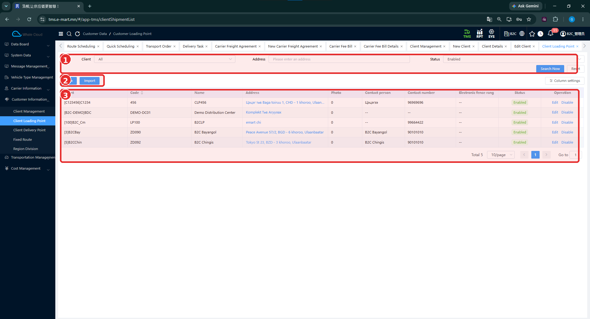
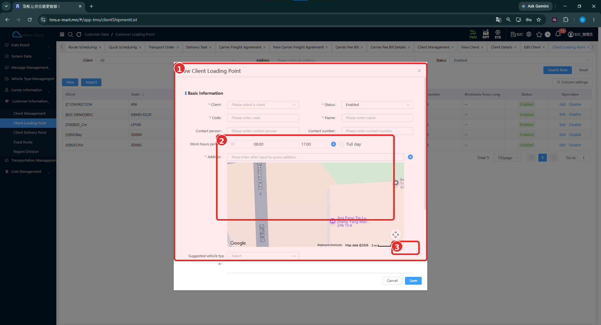
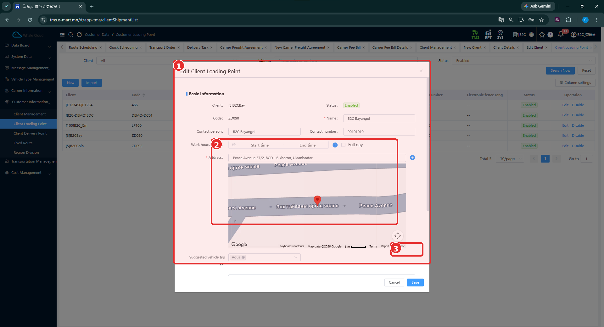

# Ачилтын цэг (Client Loading Point)

[Харилцагчийн мэдээллийн тойм](../customer-information.md)

## Энэ хэсэг юу хийдэг вэ?

Ачилтын цэг нь тухайн харилцагчийн бараа ачигдах газар юм. Цэгийн нэр, хаяг, холбоо барих мэдээлэл болон ажиллах цагийг бүртгэнэ. Өмнөх B2C тестэд **DEMO-DC01 — Demo Distribution Center** цэгээс бараа ачсан.

## Хэзээ ашиглах вэ?

- Харилцагчийн шинэ ачилтын цэг нэмэх.
- Захиалга бэлтгэхийн өмнө ачилтын хаяг, холбоо барих мэдээллийг шалгах.
- Цэгийн нэр, ажиллах цаг, хаягийг шинэчлэх.

## Эхлэхийн өмнө

[Харилцагч](client-management.md) бүртгэлтэй байна. Цэгийн код, нэр, бодит хаяг болон ажиллах цагийг бэлтгэнэ. Санал болгох машины төрөл ашиглах бол [төрлийн бүртгэл](../vehicle-type-management.md)-ээ шалгана.

**Цэсний зам:** TMS → Customer Information → Client Loading Point.

## Дэлгэцийн бүтэц

**Client**, **Address**, **Status** нөхцөлөө сонгож **Search Now** дарна. **Reset**-ээр нөхцөлийг цэвэрлэнэ. Жагсаалтад харилцагч, код, нэр, хаяг, зураг, холбоо барих хүн, дугаар, **Electronic fence range**, төлөв харагдана.

| № | Хэсэг | Тайлбар |
|---|---|---|
| 1 | Хайлт | Client, Address, Status болон хайх товчнууд. |
| 2 | New / Import | Шинээр нэмэх, импортлох үйлдэл. |
| 3 | Жагсаалт | Ачилтын цэгүүд, Edit, Disable болон хуудаслалт. |

## Шинээр бүртгэх

1. **New** дарна.
2. **Client**-ээс зөв харилцагчаа сонгоно.
3. **Code**, **Name** оруулж, **Status**-ыг нягтална.
4. **Contact person**, **Contact number** болон **Work hours period**-ыг бөглөнө.
5. **Address**-т хаягаа бичиж, талбарын зааврын дагуу **Enter** дарж хайна.
6. Газрын зурагт харагдах байршлыг бодит хаягтайгаа тулгана.
7. Шаардлагатай бол **Suggested vehicle type** сонгоно. Маягтын доод хэсгийг гүйлгэж нягтална.
8. **Save** дарна. Хадгалахгүй хаах бол **Cancel** ашиглана.
9. Жагсаалтад цэг нэмэгдсэн эсэхийг харилцагч, хаягаар хайж шалгана.

| № | Хэсэг | Тайлбар |
|---|---|---|
| 1 | Бүртгэлийн маягт | Үндсэн мэдээлэл болон доод захад Suggested vehicle type. |
| 2 | Цаг, хаяг, газрын зураг | Ажиллах цаг болон байршлын хэсгийг хамарсан хүрээ. |
| 3 | Газрын зургийн доод баруун хэсэг | Save / Cancel нь энэ тэмдэглэгээнээс доор, цонхны ёроолд байна. |

## Талбаруудын тайлбар

Энд заавал эсэхийг **шинэ бүртгэлийн** зураг дээрх улаан одоор тэмдэглэсэн.

| Талбар | Тайлбар | Заавал эсэх |
|---|---|---|
| Client | Ачилтын цэг харьяалах харилцагч. | Тийм |
| Code | Цэгийн код. Жишээ: DEMO-DC01. | Тийм |
| Name | Цэгийн нэр. Жишээ: Demo Distribution Center. | Тийм |
| Status | Бүртгэлийн төлөв. | Тийм |
| Contact person | Холбоо барих хүн. | Зурагт * тэмдэггүй |
| Contact number | Холбоо барих утас. | Зурагт * тэмдэггүй |
| Work hours period | Ажиллах цагийн эхлэл, төгсгөл; зурагт 08:00–17:00. | Зурагт * тэмдэггүй |
| Full day | Бүтэн өдрийн сонголт; цагийн талбарын хажууд байна. | Зурагт * тэмдэггүй |
| Address | Ачилтын газрын хаяг. Enter дарж хайх заавартай. | Тийм |
| Suggested vehicle type | Тухайн цэгт санал болгох тээврийн хэрэгслийн төрөл. | Зурагт * тэмдэггүй |

Цаг болон хаягийн хажууд нэмэх тэмдэгтэй товчнууд харагдана. Тэдгээрийг дарсны дараах дэлгэц, зурагт харагдахгүй доод талбаруудын ажиллагаа одоогийн тестээр баталгаажаагүй.

## Засварлах

1. Жагсаалтаас зөв харилцагч, кодтой цэгээ олно.
2. Тухайн мөрийн **Edit** дарна.
3. Цонхны харилцагч, кодыг тулгаж шалгана. Зурагт эдгээр нь текстээр харагдана.
4. Нэр, холбоо барих мэдээлэл, цаг, хаяг болон санал болгох төрлийг шаардлагын дагуу засна.
5. **Save** дарж, жагсаалтаас өөрчлөлтөө шалгана.

| № | Хэсэг | Тайлбар |
|---|---|---|
| 1 | Edit Client Loading Point | Бүртгэлтэй цэгийн мэдээлэл. |
| 2 | Цаг ба байршил | Work hours period, Address болон газрын зураг. |
| 3 | Газрын зургийн доод хэсэг | Хадгалах товч энэ хүрээнээс доор байрлана. |

Энэ зурагт **ZD090 — B2C Bayangol** цэгийг засварлаж байна. Шинэ маягтад мэдээлэл оруулаад хадгалсан үр дүн гэж үзэхгүй.

## Бүртгэсний дараа шалгах зүйл

- Зөв харилцагч, код, нэртэй цэг бүртгэгдсэн эсэх.
- Хаяг, газрын зургийн байршил хоорондоо тохирч байгаа эсэх.
- Холбоо барих мэдээлэл, ажиллах цаг зөв эсэх.
- Төлөв болон санал болгосон машины төрөл зөв эсэх.

## Анхаарах зүйл

Газрын зургийн эхний харагдацыг бодит хаяг гэж үзэхгүй. Хаяг шалгах, координат хадгалах, **Electronic fence range**-ийн үйлчлэл болон санал болгосон төрлийг төлөвлөлтөд заавал мөрдөх эсэх одоогийн тестээр баталгаажаагүй. Import загвар, Disable-ийн бусад бүртгэлд үзүүлэх нөлөөг мөн нотлоогүй.

## Дараагийн алхам

[Хүргэлтийн цэг бүртгэх](client-delivery-point.md) → [Тээврийн захиалгын өгөгдөл шалгах](../../transportation-order/create-order.md).
