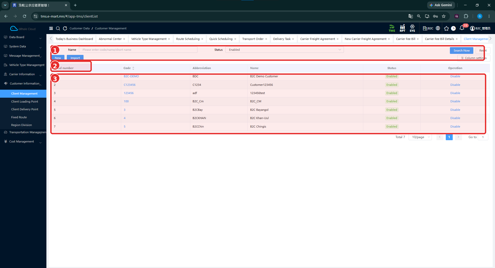
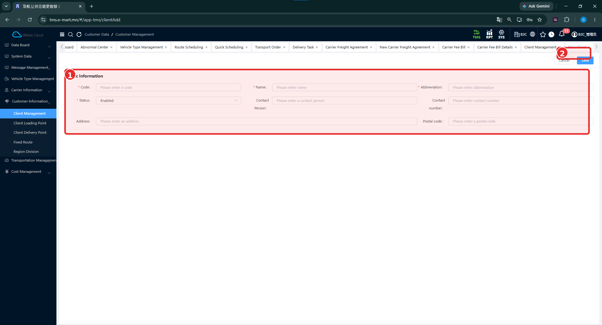
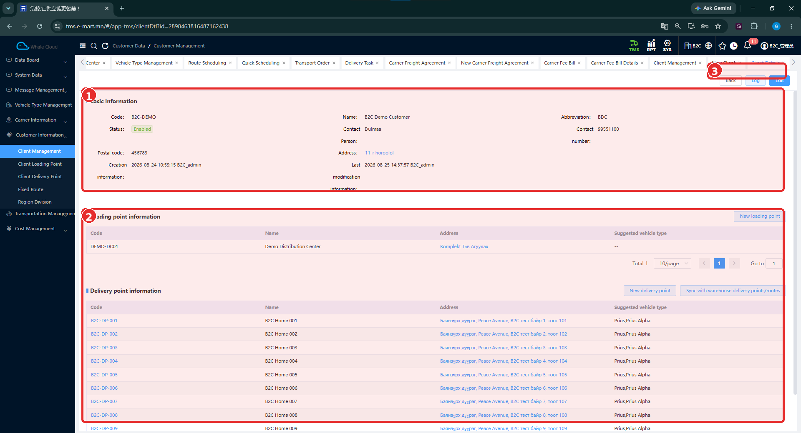

# Харилцагчийн удирдлага (Client Management)

[Харилцагчийн мэдээллийн тойм](../customer-information.md)

## Энэ хэсэг юу хийдэг вэ?

Харилцагчийн код, нэр, холбоо барих мэдээллийг бүртгэнэ. Түүнд ачилтын болон хүргэлтийн цэгүүд харьяалагдана. Харилцагчийн дэлгэрэнгүйд эдгээр цэгийг нэг дор харж болно.

## Хэзээ ашиглах вэ?

- Шинэ харилцагчийн бүртгэл бэлтгэх.
- Цэг нэмэхийн өмнө харилцагч бүртгэлтэй эсэхийг шалгах.
- Харилцагчийн холбоо барих мэдээлэл, харьяа цэгүүдийг харах.

## Эхлэхийн өмнө

Код, бүтэн нэр, товчилсон нэр болон холбоо барих мэдээллээ бэлтгэнэ. Өмнө бүртгэсэн эсэхийг хайлтаар шалгана.

**Цэсний зам:** TMS → Customer Information → Client Management.

## Дэлгэцийн бүтэц

1. **Name** талбарт код, нэр эсвэл товчилсон нэр оруулна.
2. **Status** нөхцөлийг сонгоод **Search Now** дарна.
3. Нөхцөлийг цэвэрлэх бол **Reset** ашиглана.
4. Хүснэгтийн **Code**, **Abbreviation**, **Name**, **Status**-ыг тулгана.

**Enabled** нь идэвхтэй төлөв. Мөрийн **Disable** нь идэвхгүй болгох үйлдэл юм. **Column settings** товч нь баганын тохиргооны эхлэл; тохируулах цонх энэ багцад байхгүй.

| № | Хэсэг | Тайлбар |
|---|---|---|
| 1 | Хайлт ба үндсэн үйлдлүүд | Name, Status, Search Now, Reset; доод захад New, Import, Column settings байна. |
| 2 | Хүснэгтийн эхний багана | Мөрийн дугаарын гарчгийн хэсэг. |
| 3 | Жагсаалт | Код, товчилсон нэр, бүтэн нэр, төлөв, Disable үйлдэл. |

## Шинээр бүртгэх

1. **New** дарна.
2. **Code**, **Name**, **Abbreviation**-ыг бөглөнө.
3. **Status** сонгоно.
4. Холбоо барих хүн, дугаар, хаяг, шуудангийн кодоо оруулна.
5. Мэдээллээ нягтлаад **Save** дарна. Хадгалахгүй буцах бол **Cancel** ашиглана.
6. Хадгалсны дараа жагсаалтад бүртгэл нэмэгдсэн эсэхийг кодоор хайж шалгана.

| № | Хэсэг | Тайлбар |
|---|---|---|
| 1 | Basic Information | Харилцагчийн үндсэн талбарууд. |
| 2 | Дээд талын үйлдлүүд | Cancel, Save товчнууд тэмдэглэгээний доод захад байрлана. |

## Талбаруудын тайлбар

**Тийм** гэдэг нь зурагт улаан одтой талбарыг заана. Одгүй талбарын нарийн шалгалтын дүрэм зурагт батлагдаагүй.

| Талбар | Тайлбар | Заавал эсэх |
|---|---|---|
| Code | Харилцагчийн код. Тестийн жишээ: B2C-DEMO. | Тийм |
| Name | Харилцагчийн бүтэн нэр. Жишээ: B2C Demo Customer. | Тийм |
| Abbreviation | Товчилсон нэр. Жишээ: BDC. | Тийм |
| Status | Бүртгэлийн төлөв. | Тийм |
| Contact Person | Холбоо барих хүний нэр. | Зурагт * тэмдэггүй |
| Contact number | Холбоо барих утас. | Зурагт * тэмдэггүй |
| Address | Харилцагчийн хаяг. | Зурагт * тэмдэггүй |
| Postal code | Шуудангийн код. | Зурагт * тэмдэггүй |

## Дэлгэрэнгүй ба засварлах

Жагсаалтын **Code** холбоосоор харилцагчийн дэлгэрэнгүйг нээнэ. Үндсэн мэдээлэл, үүсгэсэн болон сүүлд өөрчилсөн мэдээлэл, ачилтын ба хүргэлтийн цэгүүдийг шалгана. Засварлах үйлдлийг дээд талын **Edit** товчоор эхлүүлнэ.

| № | Хэсэг | Тайлбар |
|---|---|---|
| 1 | Basic Information | Код, нэр, холбоо барих мэдээлэл, төлөв болон өөрчлөлтийн мэдээлэл. |
| 2 | Харьяа цэгүүд | Loading point information, Delivery point information гэсэн хоёр хүснэгт. |
| 3 | Дээд талын үйлдлүүд | Back, Log, Edit байрлана. |

**New loading point**, **New delivery point** товчнууд мөн харагдана. Цэг бүртгэх үндсэн зааврыг доорх тусдаа хуудсуудаас дагана. **Sync with warehouse delivery points/routes** үйлдлийн дараагийн цонх, синхрончлох дүрэм одоогийн тестээр баталгаажаагүй.

## Бүртгэсний дараа шалгах зүйл

- Код, бүтэн нэр, товчилсон нэр зөв эсэх.
- Status зорьсон төлөвтэй эсэх.
- Холбоо барих мэдээлэл алдаагүй эсэх.
- Ачилтын болон хүргэлтийн цэгээ зөв харилцагчид нэмсэн эсэх.

## Анхаарах зүйл

Шинэ маягт болон бүртгэлтэй харилцагчийн дэлгэрэнгүй нь нэг хадгалалтын өмнөх ба дараах баталгаа биш. Код давхцах үеийн шалгалт, **Import** загвар, **Disable** үйлдлийн захиалгад үзүүлэх нөлөө одоогийн тестээр баталгаажаагүй.

## Дараагийн алхам

[Ачилтын цэг бүртгэх](client-loading-point.md) → [Хүргэлтийн цэг бүртгэх](client-delivery-point.md).
