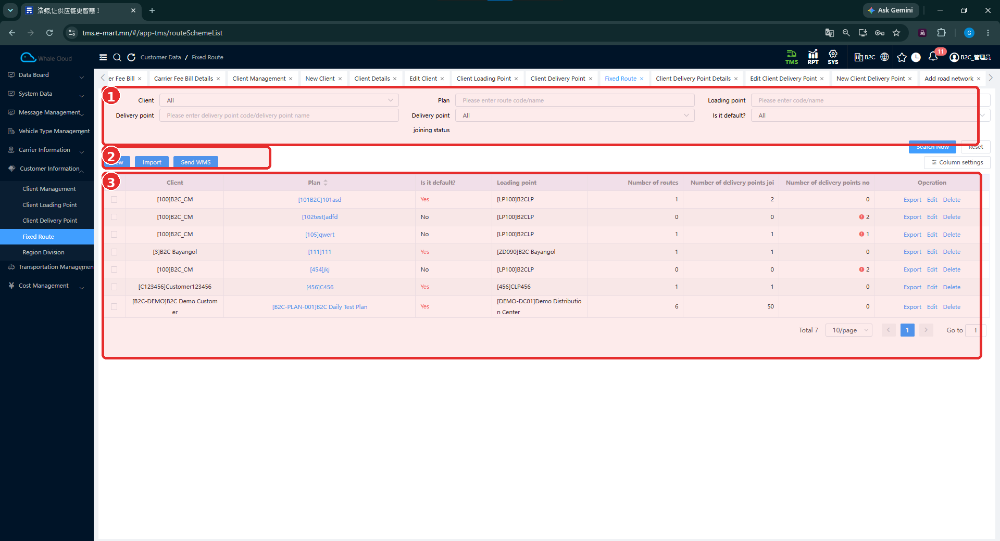
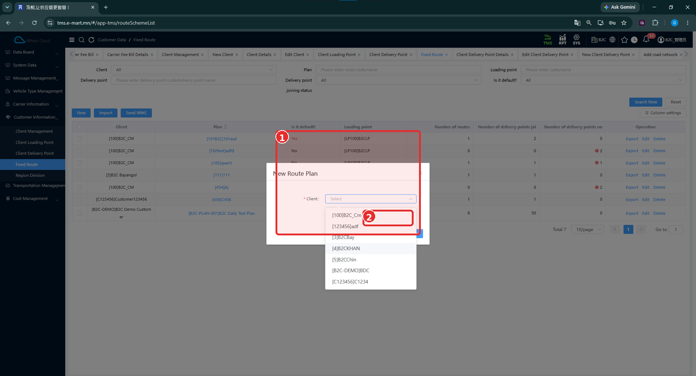
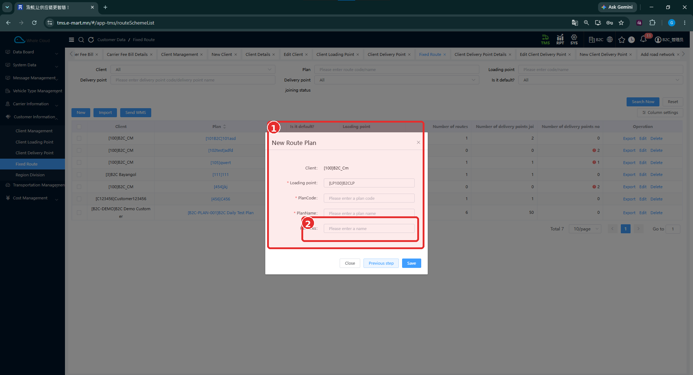
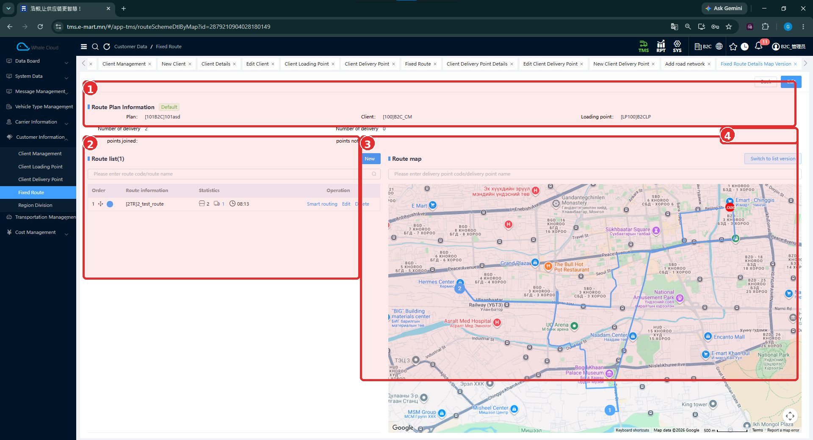
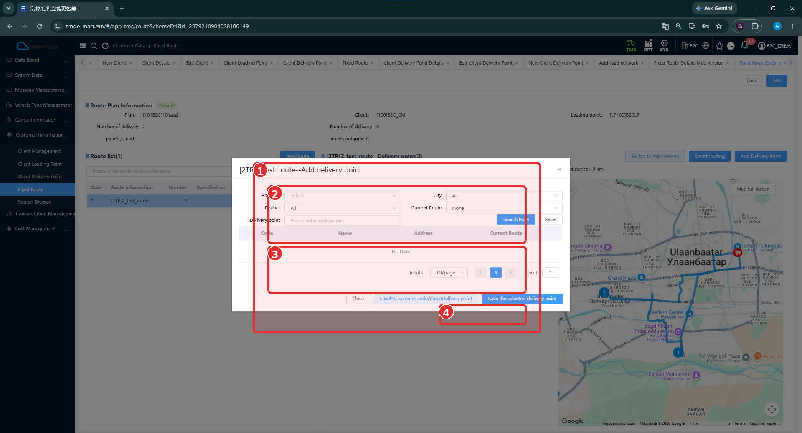

# Тогтмол маршрут (Fixed Route)

[Харилцагчийн мэдээллийн тойм](../customer-information.md)

## Энэ хэсэг юу хийдэг вэ?

Харилцагчийн хүргэлтийн цэгүүдийг тогтмол ашиглах маршрутаар урьдчилан бүлэглэнэ. Энд **Plan** буюу маршрутын төлөвлөгөө, түүний доторх **Route** буюу маршрут гэсэн хоёр түвшин байна. Төлөвлөгөө нь харилцагч, ачилтын цэгтэй; маршрут бүр хүргэлтийн цэгүүдтэй.

Энэ бүртгэл нь бодит хүргэлтийн даалгавар өөрөө биш. Тогтмол маршрутыг захиалгын төлөвлөлтөд автоматаар сонгох дүрэм одоогийн тестээр баталгаажаагүй.

## Хэзээ ашиглах вэ?

- Давтан ашиглах цэгүүдийг маршрутаар бүлэглэх.
- Төлөвлөгөөнд орсон болон ороогүй цэгийн тоог шалгах.
- Бүртгэлтэй маршрутын цэгүүдийг газрын зураг, жагсаалтаар харах.

## Эхлэхийн өмнө

[Харилцагч](client-management.md), [ачилтын цэг](client-loading-point.md), [хүргэлтийн цэгүүд](client-delivery-point.md) бэлэн байна. Шинэ төлөвлөгөөний код, нэр болон ямар цэгүүдийг нэг маршрутад оруулахаа бэлтгэнэ.

**Цэсний зам:** TMS → Customer Information → Fixed Route.

## Дэлгэцийн бүтэц

**Client**, **Plan**, **Loading point**, **Delivery point**, **Delivery point joining status**, **Is it default?** нөхцөлөөр хайна. **Search Now** нь хайх, **Reset** нь нөхцөлийг цэвэрлэх товч.

Жагсаалтад харилцагч, төлөвлөгөө, анхдагч эсэх, ачилтын цэг, маршрутын тоо, орсон/ороогүй хүргэлтийн цэгийн тоог харуулна.

| № | Хэсэг | Тайлбар |
|---|---|---|
| 1 | Хайлт | Харилцагч, төлөвлөгөө, ачилтын ба хүргэлтийн цэг, хамрагдсан байдал. |
| 2 | Үйлдлүүд | New, Import, Send WMS. |
| 3 | Төлөвлөгөөний жагсаалт | Plan холбоос, тоон мэдээлэл, Export, Edit, Delete. |

## Шинэ маршрутын төлөвлөгөө үүсгэх

1. **New** дарна.
2. **New Route Plan** цонхны **Client**-ээс харилцагчаа сонгоно.
3. Дараагийн маягтад харилцагч болон **Loading point**-ыг нягтална.
4. **PlanCode**, **PlanName**-ыг оруулна.
5. Хэрэгтэй бол **Remarks** бичнэ.
6. **Save** дарна. Харилцагч сонгох алхам руу буцах бол **Previous step**, хаах бол **Close** ашиглана.
7. Жагсаалтад төлөвлөгөө нэмэгдсэн эсэхийг шалгана.

| № | Хэсэг | Тайлбар |
|---|---|---|
| 1 | New Route Plan | Харилцагч сонгох цонх орчмыг хамарсан хүрээ. |
| 2 | Client сонголт | Нээгдсэн харилцагчийн жагсаалтын хэсэг. |

Харилцагч сонгох цонхны доод товч сонголтын жагсаалтаар халхлагдсан. Дараагийн маягт байгаа нь дараах зургаар батлагдах боловч шилжүүлэх товчны нэрийг энэ зургаас тодорхой унших боломжгүй.

| № | Хэсэг | Тайлбар |
|---|---|---|
| 1 | Төлөвлөгөөний мэдээлэл | Client, Loading point, PlanCode, PlanName. |
| 2 | Remarks | Нэмэлт тайлбар; хадгалах товчнууд хүрээнээс доор байна. |

## Талбаруудын тайлбар

| Талбар | Тайлбар | Заавал эсэх |
|---|---|---|
| Client | Төлөвлөгөө харьяалах харилцагч. | Тийм — эхний алхамд * тэмдэгтэй |
| Loading point | Төлөвлөгөөний ачилтын цэг. | Тийм — * тэмдэгтэй |
| PlanCode | Маршрутын төлөвлөгөөний код. | Тийм — * тэмдэгтэй |
| PlanName | Маршрутын төлөвлөгөөний нэр. | Тийм — * тэмдэгтэй |
| Remarks | Төлөвлөгөөний нэмэлт тайлбар. | Зурагт * тэмдэггүй |

## Дэлгэрэнгүй: төлөвлөгөө ба маршрут

Жагсаалтын **Plan** холбоосоор дэлгэрэнгүйг нээнэ. Дээд талд төлөвлөгөөний харилцагч, ачилтын цэг, хамрагдсан цэгийн тоо байна. **Route list** нь тухайн төлөвлөгөөний маршрутуудыг харуулна.

| № | Хэсэг | Тайлбар |
|---|---|---|
| 1 | Route Plan Information | Plan, Client, Loading point болон Default тэмдэглэгээ. |
| 2 | Route list | Маршрут, тоон мэдээлэл, Smart routing, Edit, Delete. |
| 3 | Route map | Цэгүүд болон маршрутын шугамтай газрын зураг; New товч мөн энэ хэсгийн захад байна. |
| 4 | Харагдац солих хэсэг | Switch to list version нь тэмдэглэгээний доор байрлана. |

**Switch to list version**-оор жагсаалтын хувилбарт орж, **Switch to map version**-оор газрын зураг руу буцна. Зурагт нэг маршрут, хоёр хүргэлтийн цэг байна.

!!! note "Төлөвлөгөө дотор шинэ маршрут нэмэх"
    Дэлгэрэнгүйд New / NewRoute товч харагдана. Харин маршрут өөрөө үүсгэх маягт энэ багцад байхгүй. Төлөвлөгөө хадгалахад маршрут автоматаар үүснэ гэж үзэхгүй. Доорх нэмэх заавар нь Route list-д маршрут байгаа нөхцөлд хамаарна.

## Маршрутад хүргэлтийн цэг нэмэх

1. Зөв төлөвлөгөөний дэлгэрэнгүйг нээнэ.
2. **Switch to list version**-оор жагсаалтын хувилбарт шилжиж, **Route list**-ээс хэрэгтэй маршрутаа сонгоно.
3. **Add Delivery Point** дарна.
4. **Province**, **City**, **District**, **Current Route**, **Delivery point** нөхцөлөө тохируулж **Search Now** дарна.
5. Үр дүнд цэгүүд гарвал код, нэр, хаяг, **Current Route** мэдээллийг шалгаад хэрэгтэй мөрийн сонгох нүдийг тэмдэглэнэ.
6. **Save the selected delivery point** товчоор сонгосон цэгүүдийг хадгална. Хаах бол **Close** дарна.
7. Маршрутын цэгийн жагсаалт, тоо болон газрын зурагт өөрчлөлт орсон эсэхийг шалгана.

| № | Хэсэг | Тайлбар |
|---|---|---|
| 1 | Add delivery point | Гарчигт сонгосон маршрутын код, нэр байна. |
| 2 | Хайлт ба баганууд | Байршлын нөхцөлүүд, Current Route, цэгийн код/нэр. |
| 3 | Хайлтын үр дүн | Энэ зурагт No Data, Total 0. |
| 4 | Доод талын тэмдэглэгээ | Хадгалах товчнууд тэмдэглэгээний дээд талд байрлана. |

### Нэмэх боломжтой цэг ба маршрутад орсон цэг

- **Маршрутад орсон цэгүүд** нь дэлгэрэнгүйн Delivery point хэсэгт харагдана.
- **Нэмэхээр хайж буй цэгүүд** нь Add delivery point цонхны үр дүн юм.
- **Current Route** нь одоо ямар маршрутад байгааг шалгах нөхцөл; зурагт **None** байна.

Энэ зурагт хайлтын үр дүн хоосон тул сонгон хадгалсан амжилтын үр дүнг батлахгүй. Өөр маршрутад байгаа цэгийг шилжүүлэх дүрэм одоогийн тестээр баталгаажаагүй. Сонгосон цэг хадгалах товчны хажуугийн өөр товчны бичвэр нийлж харагдсан тул зориулалтыг нь таамаглаагүй.

## Бүртгэсний дараа шалгах зүйл

- Төлөвлөгөө зөв харилцагч, ачилтын цэгтэй эсэх.
- PlanCode болон PlanName зөв эсэх.
- Зөв төлөвлөгөөний зөв маршрутад цэг нэмсэн эсэх.
- Орсон/ороогүй цэгийн тоо, жагсаалтын код, нэрийг тулгах.

## Анхаарах зүйл

**Smart routing**, **Send WMS**, анхдагч төлөвлөгөө сонгох, Import / Export болон Delete-ийн нарийн үйлчлэл одоогийн тестээр баталгаажаагүй. Газрын зурагт шугам харагдсан нь хамгийн оновчтой маршрут эсвэл бодит явсан зам гэдгийг дангаар батлахгүй.

## Дараагийн алхам

[Бүсийн хуваарилалт](region-division.md) эсвэл [тээврийн төлөвлөлтийн заавар](../../planning/overview.md). Өмнөх B2C төлөвлөлтөд энэ тогтмол маршрутыг ашигласныг эх сурвалж нотлоогүй.
