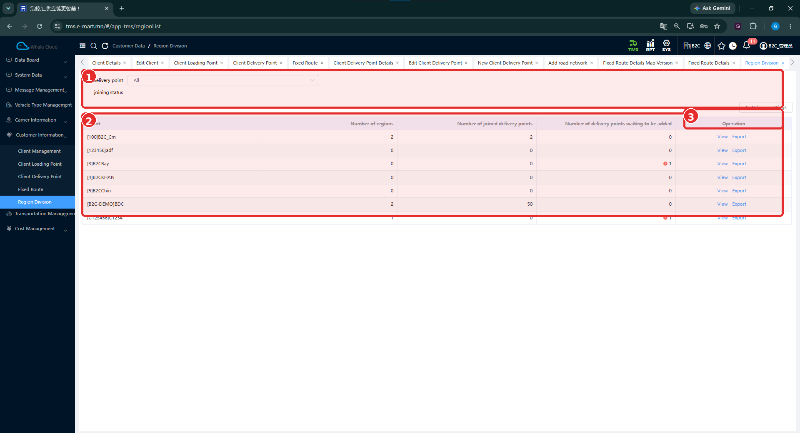
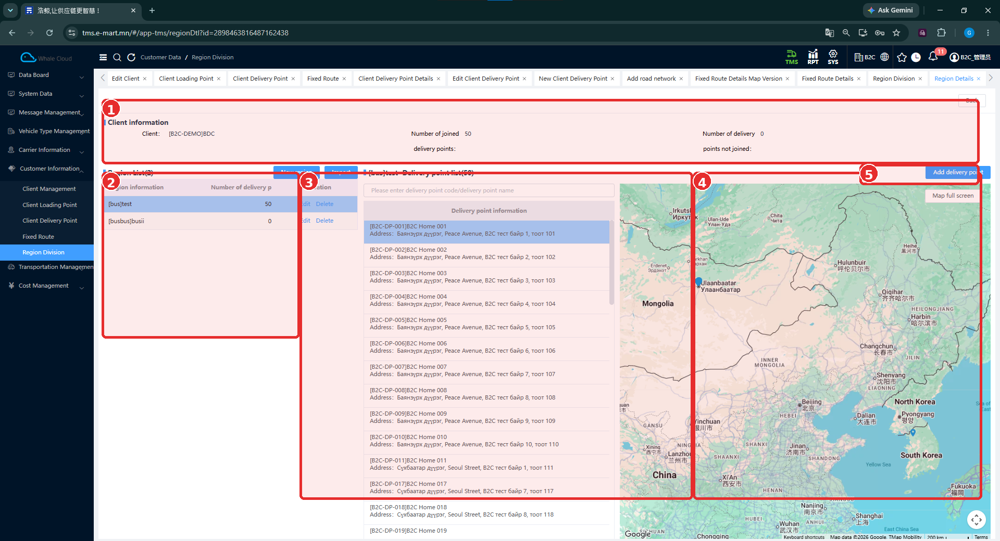
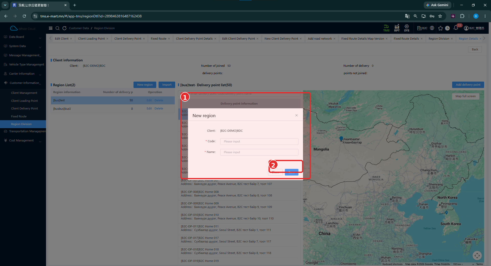
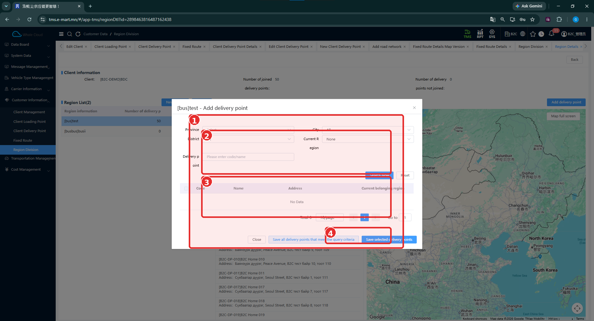

# Бүсийн хуваарилалт (Region Division)

[Харилцагчийн мэдээллийн тойм](../customer-information.md)

## Энэ хэсэг юу хийдэг вэ?

Харилцагчийн хүргэлтийн цэгүүдийг бүсээр бүлэглэж удирдана. Бүс бүр код, нэртэй бөгөөд түүнд харьяалах хүргэлтийн цэгүүдийг жагсаалт, газрын зурагтай хамт харж болно. Бүс үүсгэх нь газрын зураг дээр хил автоматаар зурах эсвэл хүргэлтийн дараалал тогтоохтой адил үйлдэл гэж батлагдаагүй.

## Хэзээ ашиглах вэ?

- Харилцагчийн хүргэлтийн цэгүүдэд бүсийн харьяалал өгөх.
- Бүсэд орсон, ороогүй цэгийн тоог шалгах.
- Бүртгэлтэй бүсэд хүргэлтийн цэг нэмэх.

## Эхлэхийн өмнө

[Харилцагч](client-management.md) болон [хүргэлтийн цэгүүд](client-delivery-point.md) бүртгэлтэй байна. Бүсийн код, нэр болон ямар цэгүүдийг хамруулахыг бэлтгэнэ.

**Цэсний зам:** TMS → Customer Information → Region Division.

## Дэлгэцийн бүтэц

Жагсаалт нь **харилцагч тус бүрээр** бүсийн тоо, бүсэд орсон цэг, нэмэхийг хүлээж буй цэгийн тоог харуулна. **Delivery point joining status** нь цэгийн хамрагдсан байдлын шүүлтүүр. Тухайн харилцагчийн **View** үйлдлээр дэлгэрэнгүйд орно.

| № | Хэсэг | Тайлбар |
|---|---|---|
| 1 | Шүүлтүүр | Delivery point joining status; зурагт All. |
| 2 | Харилцагчдын жагсаалт | Number of regions, хамрагдсан болон нэмэхийг хүлээж буй цэгүүдийн тоо. |
| 3 | Operation | View, Export үйлдлүүд байрлах багана. |

## Дэлгэрэнгүй харах

1. Зөв харилцагчийн **View** дарна.
2. **Client information** дахь харилцагчийг шалгана.
3. **Region List**-ээс бүсээ сонгоно.
4. Дунд хэсгийн **Delivery point list** болон газрын зургийг харна.

| № | Хэсэг | Тайлбар |
|---|---|---|
| 1 | Client information | Харилцагч, бүсэд орсон ба ороогүй цэгийн тоо. |
| 2 | Region List | Бүсүүд, цэгийн тоо, Edit / Delete; New region, Import нь хүснэгтийн дээр байна. |
| 3 | Цэгийн жагсаалт | Сонгосон бүсийн цэгийн код, нэр, хаяг болон хайлт. |
| 4 | Газрын зураг | Сонгосон мэдээллийн байршлыг харах хэсэг. |
| 5 | Add delivery point | Сонгосон бүсэд цэг нэмэх товч. |

Зурагт **B2C-DEMO / BDC** харилцагчийн хоёр бүс, нийт 50 хамрагдсан цэг харагдана. Энэ нь тухайн зураг дахь жишээ болохоос системд тогтмол байх тоо биш.

## Шинээр бүс үүсгэх

1. Харилцагчийн бүсийн дэлгэрэнгүйг нээнэ.
2. **New region** дарна.
3. Цонхонд харагдах **Client** зөв эсэхийг шалгана.
4. **Code**, **Name**-ыг оруулна.
5. **Save** дарна. Хаах бол **Close** ашиглана.
6. **Region List**-д шинэ бүс нэмэгдсэн эсэхийг шалгана.

| № | Хэсэг | Тайлбар |
|---|---|---|
| 1 | New region | Харилцагч, бүсийн код, нэрийн цонх. |
| 2 | Close / Save | Хаах, хадгалах товчны хэсэг. |

## Талбаруудын тайлбар

| Талбар | Тайлбар | Заавал эсэх |
|---|---|---|
| Client | Бүс харьяалах харилцагч; цонхонд текстээр харагдана. | Харах мэдээлэл |
| Code | Бүсийг ялгах код. | Тийм — * тэмдэгтэй |
| Name | Бүсийн нэр. | Тийм — * тэмдэгтэй |

Шинэ бүсийн цонхонд Status, газрын зураг дээр талбай зурах талбар харагдахгүй. Иймээс тэдгээрийг бүртгэх алхамд нэмээгүй.

## Бүсэд хүргэлтийн цэг нэмэх

1. **Region List**-ээс зөв бүсээ сонгоно.
2. **Add delivery point** дарна.
3. Цонхны гарчигт зөв бүсийн код, нэр байгаа эсэхийг шалгана.
4. **Province**, **City**, **District**, **Current Region**, **Delivery point** нөхцөлөө тохируулна.
5. **Search Now** дарна. Шаардлагатай бол **Reset**-ээр нөхцөлийг цэвэрлэнэ.
6. Үр дүнд цэг гарвал код, нэр, хаяг, одоогийн бүсийг нь шалгаад хэрэгтэй мөрийн сонгох нүдийг тэмдэглэнэ.
7. **Save selected delivery points** дарж сонгосон цэгүүдийг хадгална.
8. Бүсийн цэгийн жагсаалт болон тоо өөрчлөгдсөн эсэхийг шалгана.

| № | Хэсэг | Тайлбар |
|---|---|---|
| 1 | Цэг нэмэх цонхны үндсэн хэсэг | Байршлын нөхцөл, хайлт, үр дүн болон доод үйлдлүүд. |
| 2 | Хайлтын нөхцөл | Province, City, District, Current Region, цэгийн код/нэр. |
| 3 | Үр дүн | Code, Name, Address, Current belonging region; зурагт No Data. |
| 4 | Хадгалах үйлдлүүд | Сонгосон цэгүүд эсвэл хайлтын нөхцөлд тохирох бүх цэгийг хадгалах товчнууд. |

**Current Region**-д **None** харагдаж байна. Энэ нөхцөл болон цэгийн код/нэрээ шалгаж байж үр дүнг дүгнэнэ. Зурагт үр дүн хоосон тул цэг сонгон амжилттай нэмсэн үр дүн одоогийн тестээр баталгаажаагүй.

**Save all delivery points that meet the query criteria** нь хайлтын нөхцөлд тохирох бүх цэгийг хамруулах нэртэй товч. Зөвхөн тодорхой цэг нэмэх бол **Save selected delivery points**-ыг сонгож, бүх цэг хамруулах үйлдэлтэй андуурахгүй. Өөр бүсэд харьяалагдах цэгийг шилжүүлэх нарийн дүрэм баталгаажаагүй.

## Бүртгэсний дараа шалгах зүйл

- Зөв харилцагчийн дор бүс үүссэн эсэх.
- Бүсийн код, нэр зөв эсэх.
- Сонгосон бүсийн жагсаалтад зөв цэгүүд орсон эсэх.
- Харилцагчийн хамрагдсан/хамрагдаагүй цэгийн тоог жагсаалттай тулгах.

## Анхаарах зүйл

Бүсийн мөрөнд **Edit**, **Delete**, мөн Import / Export үйлдлүүд харагдана. Засвар, устгалын цонх, импортын формат, төлөвлөлтөд үзүүлэх нөлөө одоогийн тестээр баталгаажаагүй.

!!! note "Initialize Region"
    Бүсийг анх удаа автоматаар үүсгэх Initialize Region үйлдлийн дэлгэц одоогийн зураг болон repository-ийн эх сурвалжаар баталгаажаагүй. Иймээс энэ хувилбарт зөвхөн гараар бүс үүсгэх болон хүргэлтийн цэг холбох боломжийг тайлбарласан.

Газрын зураг харагдаж байгаа нь бүсийн хил, цэг автоматаар ангилах алгоритм эсвэл GPS дүрмийг батлахгүй.

## Дараагийн алхам

[Тээврийн захиалгын мэдээлэл](../../transportation-order/overview.md) → [Төлөвлөлт](../../planning/overview.md). Бүсийн тохиргоо өмнөх B2C төлөвлөлтийн үр дүнд хэрхэн нөлөөлснийг одоогийн тестээр баталгаажуулаагүй.
