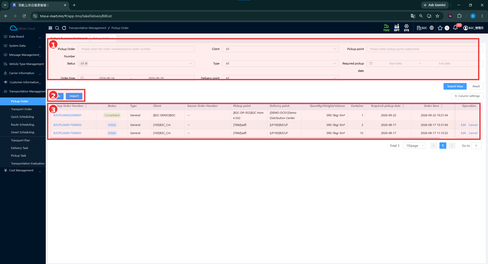
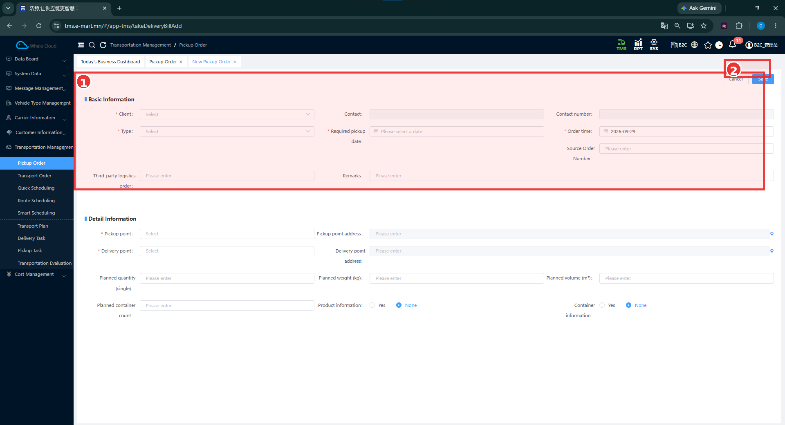
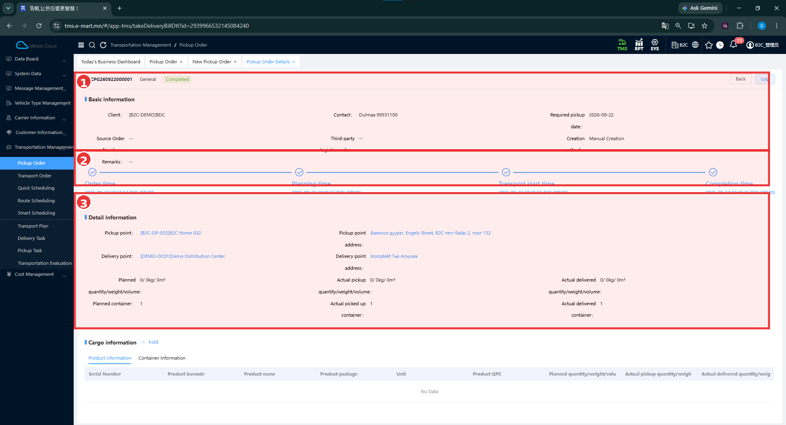

# Pickup Order — Татан авах захиалга

[Transportation Management-ийн тойм](../transportation-management.md)

## Энэ хэсэг юу хийдэг вэ?

Pickup Order нь тодорхой **Pickup point**-оос бараа, сав татан авч **Delivery point** руу хүргэх захиалгын мэдээлэл. Захиалгад харилцагч, авах огноо, цэгүүд болон төлөвлөсөн хэмжээг бүртгэнэ. [Transport Order](../../transportation-order/overview.md) нь ачилтын цэгээс бараа хүргэх үндсэн захиалга бөгөөд тусдаа бүртгэл юм.

## Хэзээ ашиглах вэ?

Татан авах захиалгаа хайх, шинэ захиалга бэлтгэх, төлөвлөсөн ба бодит хэмжээг харьцуулахад ашиглана. Өмнөх B2C тестэд дэлгүүрээс агуулах руу нэг сав буцаан татсан.

## Эхлэхийн өмнө

[Харилцагч болон цэгүүд](../customer-information.md), авах огноо, бараа эсвэл савны мэдээллээ бэлтгэнэ. Зураг дахь жишээ утгуудыг өөрийн захиалгад шууд хуулж ашиглахгүй.

**Цэсний зам:** TMS → Transportation Management → Pickup Order.

## Жагсаалтын дэлгэц

| № | Хэсэг | Тайлбар |
|---|---|---|
| ① | Хайлтын нөхцөл | Pickup Order Number, Client, Pickup point, Status, Type, Required pickup date; доод захад Order time, Delivery point байна. Search Now / Reset нь хүрээний доор. |
| ② | Үйлдэл | New — шинэ маягт; Import — импортын боломж. |
| ③ | Захиалгын жагсаалт | Дугаар, төлөв, төрөл, харилцагч, эх захиалгын дугаар, хоёр цэг, хэмжээ, сав, авах огноо, үүссэн цаг, Operation. |

1. Дугаар, харилцагч эсвэл татан авах цэгээр хайлтын нөхцөл оруулна.
2. Хэрэгтэй бол **Status**, **Required pickup date**, **Order time**-ыг тохируулна.
3. **Search Now** дарна. Нөхцөлөө цэвэрлэхдээ **Reset** ашиглана.
4. Захиалгын цэнхэр дугаараар дэлгэрэнгүйг нээнэ.

Жишээнд нэг **Completed**, хоёр **Initial** захиалга байна. **Initial** мөрүүдийн Operation баганад **Edit**, **Cancel** харагдана.

## Шинээр Pickup Order үүсгэх

| № | Хэсэг | Тайлбар |
|---|---|---|
| ① | Basic Information | Харилцагч, төрөл, огноо, холбоо барих мэдээлэл. Detail Information нь хүрээний доор үргэлжилнэ. |
| ② | Дээд үйлдлийн хэсэг | Cancel / Save товчны орчим. |

1. Жагсаалтын **New** дарна.
2. **Client**, **Type**, **Required pickup date**, **Order time**-ыг бөглөнө.
3. **Detail Information** хэсгээс **Pickup point**, **Delivery point**-ыг сонгож, хаягуудыг нягтална.
4. Төлөвлөсөн тоо, жин, эзлэхүүн, савны тоогоо оруулна. Бараа, савны мэдээлэл ашиглах эсэх сонголтыг шалгана.
5. Шаардлагатай бусад мэдээллээ бөглөж, **Save** дарна. Хадгалахгүй буцах бол **Cancel** ашиглана.
6. Жагсаалтаас шинээр оруулсан захиалгаа хайж, харилцагч, цэгүүд, огноо, хэмжээг шалгана.

### Талбаруудын тайлбар

**Тийм** гэдэг нь зөвхөн зурагт улаан **\*** тэмдэгтэй талбар. Тэмдэггүй талбарыг бүх нөхцөлд албагүй гэж дүгнэхгүй.

| Талбар | Тайлбар | Заавал эсэх |
|---|---|---|
| Client | Захиалгын харилцагч. | Тийм |
| Type | Татан авах захиалгын төрөл. | Тийм |
| Required pickup date | Татан авах шаардлагатай огноо. | Тийм |
| Order time | Захиалгын огноо. | Тийм |
| Pickup point | Бараа, савыг авах цэг. | Тийм |
| Delivery point | Татан авсан бараа, савыг хүргэх цэг. | Тийм |
| Contact / Contact number | Холбоо барих хүн, утас. | Зурагт * тэмдэггүй |
| Source Order Number | Эх захиалгын дугаар. | Зурагт * тэмдэггүй |
| Third-party logistics order | Гаднын тээврийн захиалгын дугаар. | Зурагт * тэмдэггүй |
| Remarks | Нэмэлт тайлбар. | Зурагт * тэмдэггүй |
| Pickup point address / Delivery point address | Хоёр цэгийн хаяг. | Зурагт * тэмдэггүй |
| Planned quantity (single) | Төлөвлөсөн барааны тоо. | Зурагт * тэмдэггүй |
| Planned weight (kg) / Planned volume (m³) | Төлөвлөсөн жин, эзлэхүүн. | Зурагт * тэмдэггүй |
| Planned container count | Төлөвлөсөн савны тоо. | Зурагт * тэмдэггүй |
| Product information / Container information | Бараа, савны дэлгэрэнгүй ашиглах Yes / None сонголт. | Зурагт * тэмдэггүй |

## Pickup Order Detail

| № | Хэсэг | Тайлбар |
|---|---|---|
| ① | Үндсэн мэдээлэл | Захиалгын дугаар, General төрөл, Completed төлөв, харилцагч, авах огноо, Creation method. |
| ② | Хугацааны мөр | Order time, Planning time, Transport start time, Completion time. |
| ③ | Detail Information | Татан авах ба хүргэх цэг, хаяг, төлөвлөсөн болон бодит тоо/жин/эзлэхүүн, савны тоо. |

Жишээ **B2CPG260922000001** нь **B2C-DP-032 → DEMO-DC01** чиглэлтэй. **Planned container / Actual picked up container / Actual delivered container = 1 / 1 / 1** байна. Барааны тоо, жин, эзлэхүүн 0 байна. Доорх **Cargo information → Product information** хүснэгт **No Data** гэж харагдана.

## Үйлдэл хийсний дараа

Хайсан захиалгын дугаар, цэгүүдийг тулгаж, төлөв ба бодит хэмжээг уншина. Дээрх Completed дэлгэрэнгүй нь өмнө байсан захиалга; шинэ маягтыг Save хийсний шууд үр дүн биш.

## Нэмэлт ажиллагаа, анхаарах зүйл

**Import**, **Edit**, **Cancel** харагддаг боловч импортын загвар, засварлах болон цуцлах нөхцөл, дараах төлөв одоогийн тестээр баталгаажаагүй.

!!! note "Үүсэх аргын зөрүү"
    Өмнөх B2C тестийн тэмдэглэлд Driver App-ийн Pickup Registration-аас захиалга автоматаар үүссэн гэж дурдсан. Харин энэ дэлгэрэнгүйд Creation method = Manual Creation байна. Энэ зөрүүг [тестийн бүртгэлд](../../testing/tc-b2c-e2e-001.md) хадгалсан; үүсэх механизмыг нэг талбараар дүгнэхгүй.

## Дараагийн алхам

[Pickup Task](pickup-task.md)-ийн холбоог шалгах эсвэл [Driver App-ийн сав буцаан татах заавар](../../execution/index.md)-ыг дагах.
