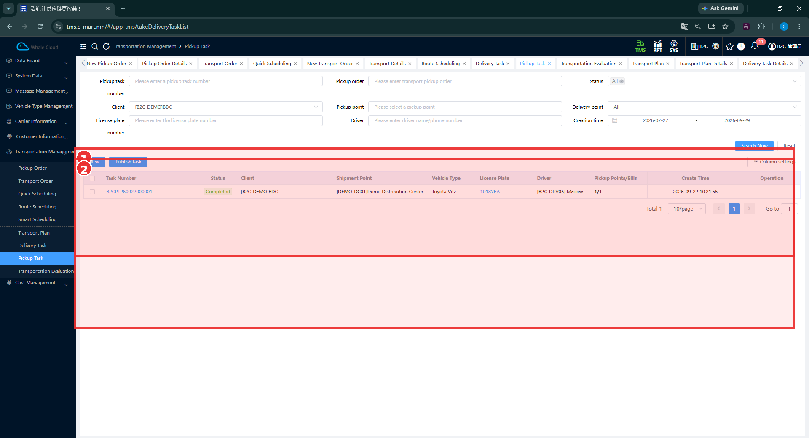
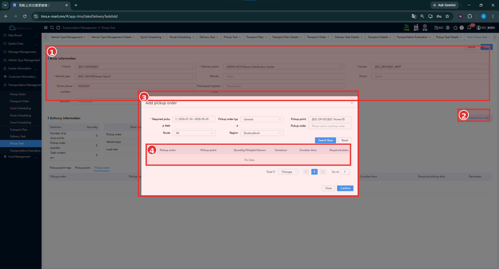

# Pickup Task — Татан авах даалгавар

[Transportation Management-ийн тойм](../transportation-management.md)

## Энэ хэсэг юу хийдэг вэ?

Pickup Task нь Pickup Order-уудыг татан авах бодит ажиллагаанд холбосон даалгавар. Харилцагч, хүргэх цэг, тээвэрлэгч, машин, жолооч болон холбогдох Pickup Order-уудыг нэг даалгаварт харна.

## Хэзээ ашиглах вэ?

Байгаа татан авах даалгаврыг шалгах эсвэл Web дээр шинэ даалгаврын мэдээлэл бэлтгэх үед ашиглана. Өмнөх B2C тестийн сав буцаан татах гүйцэтгэл [Driver App](../../execution/index.md)-д тусдаа бий.

## Эхлэхийн өмнө

[Pickup Order](pickup-order.md), [Client ба цэгүүд](../customer-information.md), [Carrier, Vehicle, Driver](../carrier-information.md)-ийн мэдээллээ шалгана.

**Цэсний зам:** TMS → Transportation Management → Pickup Task.

## Existing Completed Task — Дууссан даалгавар

| № | Хэсэг | Тайлбар |
|---|---|---|
| ① | Дээд үйлдлийн мөр | New / Publish task байрлах хэсэг. Хайх нөхцөлүүд дээр нь байна. |
| ② | Жагсаалт | Task Number, Status, Client, Shipment Point, Vehicle Type, License Plate, Driver, Pickup Points/Bills, Create Time. |

1. Даалгаврын дугаар, Client, Status эсвэл Creation time-аар нөхцөл оруулна.
2. **Search Now** дарна. Хайлтаа цэвэрлэх бол **Reset** ашиглана.
3. Дугаар, төлөв, цэг, машин, жолооч болон Pickup Points/Bills-ийг шалгана.

Жишээнд **B2CPT260922000001**, **Completed**, **Toyota Vitz / 1018УБА**, **B2C-DRV05**, **Pickup Points/Bills = 1/1** байна. Энэ нь өмнө үүссэн даалгавар байгааг нотолно. Доорх New маягтыг хадгалсны дараах үр дүн биш.

## New Pickup Task ба Add Pickup Order

| № | Хэсэг | Тайлбар |
|---|---|---|
| ① | Basic Information | Арын маягтын харилцагч, очих цэг, тээврийн нөөц. |
| ② | Add pickup order | Захиалга нэмэх цонх нээх товч. |
| ③ | Add pickup order цонх | Хайлтын нөхцөл, Search Now / Reset, Close / Confirm. |
| ④ | Үр дүн | No Data; Total 0 байна. |

### Алхам алхмаар

1. Жагсаалтын **New** дарна.
2. **Client**, **Delivery point**, **Carrier**, **Vehicle type**-ыг сонгоно.
3. **Vehicle**, **Driver**, утас болон бусад мэдээллийг нягтална.
4. **Add pickup order** дарна.
5. **Required pickup date** болон хэрэгтэй бусад шүүлтүүрээ тохируулна.
6. **Search Now** дарж сонгох захиалга байгаа эсэхийг шалгана.
7. Энэ тестийн адил **No Data** байвал огноо, харилцагч, цэг, маршрут, бүсийн нөхцөлийг дахин нягтална. Цонхноос гарахдаа **Close** ашиглана.

### Шинэ даалгаврын талбарууд

**Тийм** нь зөвхөн зурагт харагдах улаан **\*** тэмдэгтэй талбар.

| Талбар | Тайлбар | Заавал эсэх |
|---|---|---|
| Client | Даалгаврын харилцагч. | Тийм |
| Delivery point | Татан авсан ачааг хүргэх цэг; жишээнд DEMO-DC01. | Тийм |
| Carrier | Тээвэрлэгч. | Тийм |
| Vehicle type | Машины төрөл. | Тийм |
| Vehicle | Бодит машин. | Зурагт * тэмдэггүй |
| Driver | Гүйцэтгэх жолооч. | Зурагт * тэмдэггүй |
| Driver phone number | Жолоочийн утас. | Зурагт * тэмдэггүй |
| Third-party logistics order | Гаднын тээврийн захиалгын дугаар. | Зурагт * тэмдэггүй |
| Remarks | Нэмэлт тайлбар. | Зурагт * тэмдэггүй |

### Захиалга нэмэх цонхны талбарууд

| Талбар | Тайлбар | Заавал эсэх |
|---|---|---|
| Required pickup date | Татан авах шаардлагатай огнооны хязгаар. | Тийм |
| Pickup order type | Захиалгын төрөл; зурагт General. | Зурагт * тэмдэггүй |
| Pickup point | Татан авах цэг. | Зурагт * тэмдэггүй |
| Route / Region | Маршрут, бүсээр шүүх. | Зурагт * тэмдэггүй |
| Pickup order | Захиалгаар шүүх. | Зурагт * тэмдэггүй |

**Search Now** нь хайх, **Reset** нь нөхцөл цэвэрлэх, **Confirm** нь сонголт баталгаажуулах товч. Гэхдээ энэ зурагт сонгох мөр байхгүй.

## Үйлдэл хийсний дараа

Одоогийн тестэд захиалга хайх цонх нээгдэж, **No Data** гарсан. Арын Delivery information хэсгийн татан авах цэг, захиалга, савны тоо 0 байна.

!!! note "Save болон Publish баталгаажаагүй"
    Одоогийн тестийн өгөгдлөөр сонгох боломжтой Pickup Order илрээгүй тул New Pickup Task-ийн Save болон Publish дараагийн урсгал энэ тестээр баталгаажаагүй. Захиалга амжилттай сонгосон, хадгалсан, нийтэлсэн эсвэл тодорхой төлөвт шилжсэн гэж үзэхгүй.

## Анхаарах зүйл

Өмнөх B2C тестэд хүргэлт дууссаны дараа тусдаа Pickup Task гарч, **Delivery Confirmation** хийснээр Completed болсон. Энэ гүйцэтгэл нь Web дээр гараар New → Add pickup order → Save → Publish хийх урсгалын баталгаа биш.

**No Data** нь одоогийн хайлтаар үр дүнгүй байгааг илэрхийлнэ. Систем Pickup Task үүсгэхийг дэмждэггүй гэсэн үг биш.

## Дараагийн алхам

[Pickup Order-ийн мэдээллээ шалгах](pickup-order.md) эсвэл [Driver App-ийн татан авах гүйцэтгэл](../../execution/index.md)-ийг унших.
