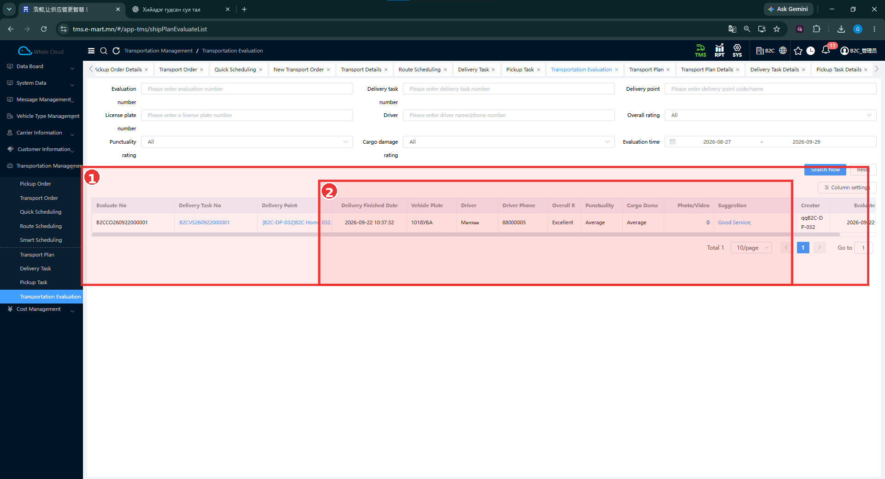

# Transportation Evaluation — Тээврийн үнэлгээ

[Transportation Management-ийн тойм](../transportation-management.md)

## Энэ хэсэг юу хийдэг вэ?

Хүлээн авагчийн илгээсэн тээврийн үнэлгээг Web TMS дээр харуулна. Үнэлгээ нь хүргэлтийн даалгавар, хүргэлтийн цэг, машин, жолоочтой холбогдсон байна. Цаг баримталсан байдал, ачааны гэмтэл, ерөнхий үнэлгээ болон тайлбарыг шалгана.

## Хэзээ ашиглах вэ?

Хүргэлт дууссаны дараа Store App-аас илгээсэн үнэлгээ орж ирсэн эсэхийг шалгах үед ашиглана.

## Эхлэхийн өмнө

Хүргэлтийн даалгаврын дугаар, хүргэлтийн цэгээ мэдэж байна. Өмнөх тестэд жолоочийн хүргэлт дуусаж, [Store App](../../execution/store-app.md)-ийн **Received** хэсэгт мэдээлэл харагдсаны дараа Transport Evaluation → Submit хийсэн.

**Цэсний зам:** TMS → Transportation Management → Transportation Evaluation.

## Дэлгэцийн бүтэц

| № | Хэсэг | Тайлбар |
|---|---|---|
| ① | Үнэлгээний хүснэгт | Үнэлгээний дугаар, даалгавар, цэг, үр дүн болон хуудаслалт. Хайлтын нөхцөлүүд хүрээний дээр байна. |
| ② | Гүйцэтгэл ба үнэлгээ | Дууссан цаг, машин, жолооч, утас, ерөнхий үнэлгээ, цаг баримтлалт, гэмтэл, зураг/видео, тайлбар. |

## Алхам алхмаар

1. **Delivery task number** эсвэл **Evaluation number** оруулна.
2. Хэрэгтэй бол **Delivery point**, **License plate number**, **Driver**, **Evaluation time**-аар нарийсгана.
3. **Overall rating**, **Punctuality rating**, **Cargo damage rating**-аар үнэлгээг шүүж болно.
4. **Search Now** дарна. Нөхцөл цэвэрлэхдээ **Reset** ашиглана.
5. Олдсон мөрийн даалгавар, хүргэлтийн цэг, машин, жолооч, дууссан цагийг тулгана.
6. Үнэлгээ ба **Suggestion** тайлбарыг уншина. Store App-аас илгээсэн мэдээлэлтэй харьцуулна.

## Талбаруудын тайлбар

Эдгээр нь жагсаалтын харах талбарууд; бөглөх маягтын шаардлага биш.

| Талбар | Тайлбар | Зураг дахь жишээ |
|---|---|---|
| Evaluate No. / Evaluation number | Үнэлгээний дугаар. | B2CCO260922000001 |
| Delivery Task No. | Холбоотой хүргэлтийн даалгавар. | B2CVS260922000001 |
| Delivery Point | Үнэлгээ өгсөн хүргэлтийн цэг. | B2C-DP-032 |
| Delivery Finished Date | Хүргэлт дууссан огноо, цаг. Evaluation time-аас тусдаа. | 2026-09-22 10:37:32 |
| Vehicle Plate | Машины улсын дугаар. | 1018УБА |
| Driver / Driver Phone | Жолооч, утас. | Мөнхөө / 88000005 |
| Overall rating | Ерөнхий үнэлгээ. | Excellent |
| Punctuality | Цаг баримталсан байдлын үнэлгээ. | Average |
| Cargo Damage | Ачааны гэмтлийн үнэлгээ. | Average |
| Photo/Video | Хавсаргасан зураг, видеоны тоо. | 0 |
| Suggestion | Хэрэглэгчийн тайлбар. | Good Service; |
| Creator | Үнэлгээ үүсгэсэн хэрэглэгч. | qqB2C-DP-032 |

## Үйлдэл хийсний дараа

Өмнөх **TC-B2C-E2E-001** тестэд Store App-аас үнэлгээ илгээсний дараа Web жагсаалтад бүртгэл харагдсан. Шинэ зурагт мөн тэр даалгавар, цэгийн жишээ байна. Store App дээрх 3/5, 3/5, 5/5 үнэлгээ ба Web-ийн Average, Average, Excellent утгуудыг энэ тестийн хүрээнд холбоно.

## Анхаарах зүйл

Бүх онооны хувиргалтын хүснэгт, үнэлгээ засах/устгах дүрэм, илгээснээс хойш харагдах хугацааны баталгаа энэ багцад байхгүй. Хоосон үр дүн гарвал огнооны хүрээ, даалгаврын дугаар, хүргэлтийн цэгийн шүүлтүүрээ шалгана.

## Дараагийн алхам

[Store App-аас үнэлгээ илгээх](../../execution/store-app.md) зааврыг ашиглах эсвэл [B2C урсгалын тойм](../transportation-management.md) руу буцах.
