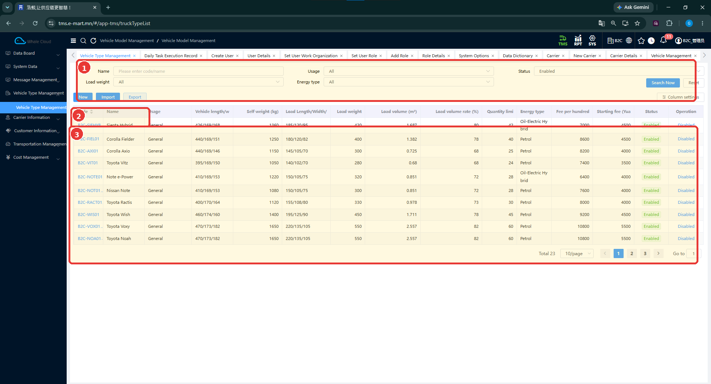
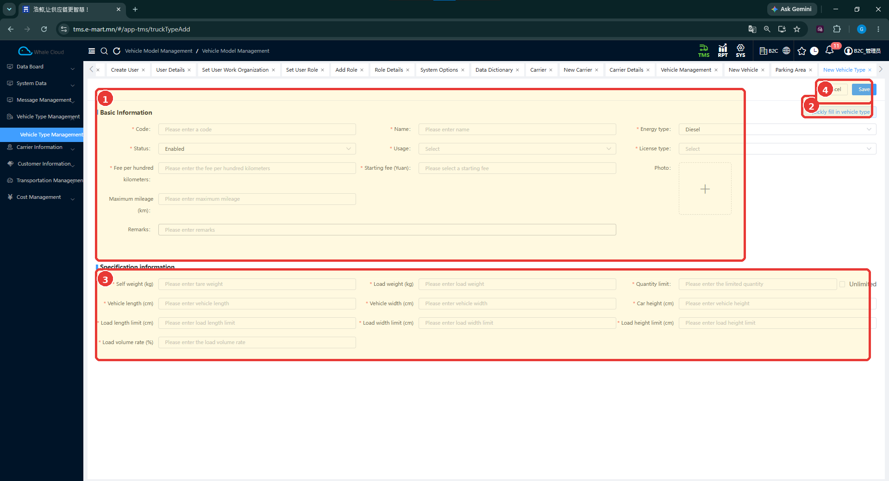
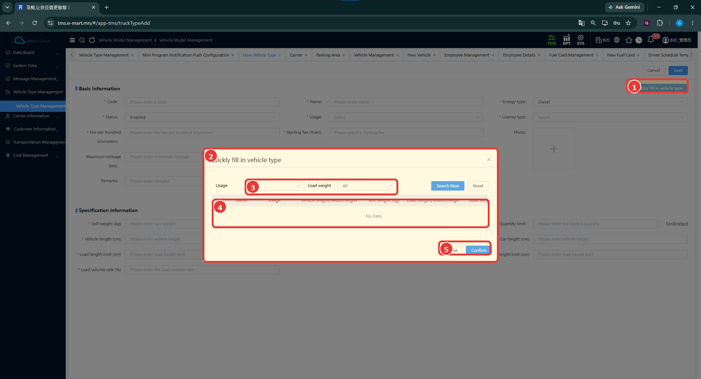

# Тээврийн хэрэгслийн төрөл (Vehicle Type Management)

[TMS-ийн тойм](index.md)

## Энэ хэсэг юу хийдэг вэ?

Тээврийн хэрэгслийн төрөл нь машины загвар, даац, хэмжээ зэрэг ерөнхий шинжийг бүртгэнэ. Харин **Vehicle Management** хэсэгт улсын дугаартай бодит машиныг бүртгэж, энэ төрлөөс сонгоно. Жишээлбэл, **Toyota Vitz** бол төрөл, **1018УБА** бол [B2C тестэд ашигласан бодит машин](../getting-started/overview.md) юм.

Даац, багтаамжийн мэдээлэл нь тээврийн нөөцөө бэлтгэхэд хэрэгтэй. Төлөвлөлтийн алгоритм талбар бүрийг хэрхэн тооцдог нь одоогийн тестээр баталгаажаагүй.

## Хэзээ ашиглах вэ?

- Ашиглах машины төрөл бүртгэлтэй эсэхийг шалгах.
- Шинэ загварын машины ерөнхий үзүүлэлтийг бүртгэх.
- Бодит машин нэмэхийн өмнө тохирох төрлийг бэлтгэх.

## Эхлэхийн өмнө

Төрлийн код, нэр, бодит техникийн үзүүлэлтээ бэлтгэнэ. Тоон утгыг зураг дээрх жишээнээс таамаглан хуулж болохгүй. Доорх хүснэгтэд **Тийм** гэдэг нь зураг дээр улаан **\*** тэмдэгтэй талбарыг заана; тэмдэггүй талбарыг систем бүх нөхцөлд албагүй гэж үзэхгүй.

**Цэсний зам:** TMS → Vehicle Type Management.

## Жагсаалт ба хайлт

1. **Name** талбарт код эсвэл нэр оруулна.
2. Хэрэгтэй бол **Load weight**, **Usage**, **Energy type**, **Status** нөхцөлийг сонгоно.
3. **Search Now** дарж үр дүнг шалгана. **Reset** нь хайлтын нөхцөлийг цэвэрлэх товч.
4. Хүснэгтийн код, нэр, хэмжээ, даац, багтаамж, төлөвийг харьцуулна.

**Enabled** нь идэвхтэй, **Disabled** нь идэвхгүй төлөвийг илэрхийлнэ. Үйлдлийн баганад төлөв өөрчлөх удирдлага харагдана; өмнөх төлөвлөлтөд үзүүлэх нөлөө одоогийн тестээр баталгаажаагүй.

| № | Хэсэг | Тайлбар |
|---|---|---|
| 1 | Хайлт ба үйлдлүүд | Шүүлтүүр, Search Now, Reset болон New / Import / Export байрлана. |
| 2 | Код, нэрийн эхний хэсэг | Жижиг хүрээ нь хүснэгтийн эхний багануудын хэсгийг заасан. |
| 3 | Бүртгэлийн хүснэгт | Төрлүүдийн үзүүлэлт болон хуудаслалтыг харуулна. |

## Шинээр бүртгэх

1. Жагсаалтын **New** дарна.
2. **Basic Information** хэсэгт код, нэр болон үндсэн сонголтуудыг бөглөнө.
3. **Specification information** хэсэгт техникийн үзүүлэлтүүдийг оруулна.
4. Нэгж, сонгосон төлөв болон улаан **\*** тэмдэгтэй талбаруудыг нягтална.
5. **Save** дарна. Оруулахгүйгээр хаах бол **Cancel** ашиглана.
6. Жагсаалтаас код эсвэл нэрээр хайж, хадгалсан утгуудыг шалгана.

| № | Хэсэг | Тайлбар |
|---|---|---|
| 1 | Basic Information | Код, нэр, төлөв болон үндсэн мэдээлэл. |
| 2 | Quickly fill in vehicle type | Бэлэн төрөл хайх туслах цонхыг нээнэ. |
| 3 | Specification information | Даац, хэмжээ, ачааны хязгаарууд. |
| 4 | Save / Cancel | Хадгалах эсвэл хаах. |

## Талбаруудын тайлбар

| Талбар | Тайлбар | Заавал эсэх |
|---|---|---|
| Code | Төрлийн код. Жишээ: B2C-VIT01. | Тийм |
| Name | Төрлийн нэр. Жишээ: Toyota Vitz. | Тийм |
| Status | Бүртгэлийн төлөв. | Тийм |
| Usage | Тээврийн хэрэгслийн зориулалтын сонголт. | Тийм |
| Energy type | Ашиглах эрчим хүч, түлшний төрлийн сонголт. | Тийм |
| License type | Жолоодох эрхийн ангиллын сонголт. | Тийм |
| Fee per hundred kilometers | 100 км тутмын төлбөрийн утга. Тооцоололд хэрэглэх дүрэм баталгаажаагүй. | Тийм |
| Starting fee (Yuan) | Эхлэх төлбөр. Дэлгэц дээр Yuan гэж тэмдэглэсэн. | Тийм |
| Maximum mileage (km) | Явах зайны дээд утга, км. | Зурагт * тэмдэггүй |
| Self weight (kg) | Тээврийн хэрэгслийн өөрийн жин, кг. | Тийм |
| Load weight (kg) | Ачааны жингийн хязгаар, кг. | Тийм |
| Quantity limit | Ачааны тоо хэмжээний хязгаар. Хажууд Unlimited сонголт бий. | Тийм |
| Vehicle length (cm) | Тээврийн хэрэгслийн урт, см. | Тийм |
| Vehicle width (cm) | Тээврийн хэрэгслийн өргөн, см. | Тийм |
| Car height (cm) | Тээврийн хэрэгслийн өндөр, см. | Тийм |
| Load length limit (cm) | Ачааны уртын хязгаар, см. | Тийм |
| Load width limit (cm) | Ачааны өргөний хязгаар, см. | Тийм |
| Load height limit (cm) | Ачааны өндрийн хязгаар, см. | Тийм |
| Load volume rate (%) | Ачааны эзлэхүүний хувь. Нарийн тооцооллын дүрэм баталгаажаагүй. | Тийм |
| Remarks | Нэмэлт тайлбар. | Зурагт * тэмдэггүй |
| Photo | Төрөлтэй холбоотой зураг. | Зурагт * тэмдэггүй |

## Нэмэлт туслах боломж: Quickly fill in vehicle type

1. Бүртгэлийн цонхны **Quickly fill in vehicle type** дарна.
2. **Usage**, **Load weight** нөхцөлийг тохируулж **Search Now** дарна.
3. Хайлтын нөхцөлд тохирох бэлэн төрөл байгаа үед сонгох боломжтой.
4. Сонгосон төрлөө **Confirm** товчоор баталгаажуулах боломж харагдана. Буцах бол **Close** дарна.
5. Үндсэн маягтад буцаж ирээд утгуудыг нягталж байж **Save** дарна.

| № | Хэсэг | Тайлбар |
|---|---|---|
| 1 | Нээх товч | Үндсэн маягтын туслах үйлдэл. |
| 2 | Сонгох цонх | Бэлэн төрлийн хайлт. |
| 3 | Хайлтын нөхцөл | Usage, Load weight болон хайх товчнууд. |
| 4 | Үр дүн | Энэ зурагт No Data буюу үр дүнгүй байна. |
| 5 | Close / Confirm | Хаах эсвэл сонголтыг баталгаажуулах. |

!!! note "Нотолгооны хүрээ"
    Зурагт хайлтын үр дүн хоосон тул автоматаар яг ямар талбарууд бөглөгдөх нь одоогийн тестээр баталгаажаагүй. Бэлэн төрөл олдохгүй бол үндсэн маягтаар мэдээллээ оруулна.

## Бүртгэсний дараа юу шалгах вэ?

- Код, нэрээр хайхад зөв төрөл гарч байгаа эсэх.
- Даац болон хэмжээсийг кг, см, км гэсэн зөв нэгжээр оруулсан эсэх.
- Төлөв болон зориулалтын сонголт зөв эсэх.
- Бодит машин үүсгэхэд шаардлагатай төрөл сонголтод байгаа эсэх.

## Анхаарах зүйл

Import / Export товч харагдаж байгаа ч файлын загвар, импортын шалгалтыг одоогийн тестээр баталгаажуулаагүй. Unlimited сонголт, тариф, эзлэхүүний хувь төлөвлөлтөд хэрхэн нөлөөлөхийг таамаглахгүй.

## Дараагийн алхам

[Тээвэрлэгч үүсгэх](carrier-information/carrier.md) → [Бодит тээврийн хэрэгсэл бүртгэх](carrier-information/vehicle-management.md).

Төлбөрийн нөхцөлд машины төрөл ашиглах бол [гэрээний тарифын заавар](cost-management/carrier-freight-agreement.md#pricing)-ыг үзнэ.
