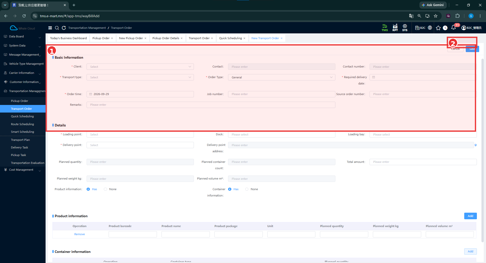

# New Transport Order — Тээврийн захиалга үүсгэх

[Transport Order-ийн тойм](overview.md)

## Энэ хэсэг юу хийдэг вэ?

Тээвэрлэх бараа, ачилтын цэг, хүргэлтийн цэг, шаардлагатай хугацааг шинэ захиалгад оруулна. Захиалга бэлэн бол Scheduling-д ашиглах мэдээллийг шалгана.

## Хэзээ ашиглах вэ?

Шинэ хүргэлтийн захиалга гараар бүртгэх үед ашиглана.

## Эхлэхийн өмнө

[Client](../tms/customer-information/client-management.md), [Loading Point](../tms/customer-information/client-loading-point.md), [Delivery Point](../tms/customer-information/client-delivery-point.md)-ын бүртгэл, хүргэх огноо болон ачааны мэдээллээ бэлтгэнэ.

**Цэсний зам:** TMS → Transportation Management → Transport Order → New.

## Дэлгэцийн бүтэц

| № | Хэсэг | Тайлбар |
|---|---|---|
| ① | Basic Information | Харилцагч, тээврийн ба захиалгын төрөл, огноо, дугаар, тайлбар. Details гарчиг хүрээний доод захад байна. |
| ② | Дээд үйлдлийн хэсэг | Cancel / Save товчны орчим. |

Цэгүүд, төлөвлөсөн хэмжээ, Product information болон Container information нь ① хүрээний доор үргэлжилнэ.

## Алхам алхмаар

1. Transport Order жагсаалтын **New** дарна.
2. **Client** сонгож, холбоо барих мэдээллийг шалгана.
3. **Transport type**, **Order Type**, **Required delivery date**, **Order time**-ыг бөглөнө.
4. **Details** хэсэгт **Loading point**, **Delivery point** сонгоно. Хүргэлтийн цэгийн хаягийг тулгана.
5. Хэрэгтэй бол **Job number**, **Source order number**, **Remarks**, **Dock**, **Loading bay**, **Total amount**-ыг бөглөнө.
6. **Product information** ашиглах бол **Has** сонголтыг шалгаж, **Add**-аар барааны мөр нэмж, баркод, нэр, савлагаа, нэгж, тоо, жин, эзлэхүүнийг оруулна. **Remove** нь мөр хасах үйлдэл.
7. **Container information** сонголт болон савны мэдээллийг шалгана. Зурагт савны хүснэгтийн зөвхөн эхлэл харагдсан; бүх талбар нь багтаагүй.
8. Төлөвлөсөн тоо, сав, жин, эзлэхүүн болон улаан **\*** тэмдэгтэй талбаруудыг нягталж **Save** дарна. Хадгалахгүй буцах бол **Cancel** ашиглана.
9. Жагсаалтаас захиалгаа хайж, [дэлгэрэнгүй мэдээлэл](overview.md#transport-order-detail)-ийг тулгана.

## Талбаруудын тайлбар

**Тийм** нь зурагт харагдсан улаан **\*** тэмдэг. Тэмдэггүй талбарыг бүх нөхцөлд албагүй гэж ойлгохгүй.

| Талбар | Тайлбар | Заавал эсэх |
|---|---|---|
| Client | Захиалгын харилцагч. | Тийм |
| Transport type | Тээврийн төрөл. | Тийм |
| Order Type | Захиалгын төрөл; зурагт General сонгосон. | Тийм |
| Required delivery date | Хүргэх шаардлагатай огноо. | Тийм |
| Order time | Захиалгын огноо. | Тийм |
| Loading point | Бараа ачих цэг. | Тийм |
| Delivery point | Бараа хүргэх цэг. | Тийм |
| Contact / Contact number | Холбоо барих хүн, утас. | Зурагт * тэмдэггүй |
| Job number / Source order number | Ажлын болон эх захиалгын тусдаа дугаарууд. | Зурагт * тэмдэггүй |
| Remarks | Нэмэлт тайлбар. | Зурагт * тэмдэггүй |
| Dock / Loading bay | Ачилтын хэсэг, байрлалын сонголт. | Зурагт * тэмдэггүй |
| Delivery point address | Сонгосон хүргэлтийн цэгийн хаяг. | Зурагт * тэмдэггүй |
| Planned quantity / Planned container count | Төлөвлөсөн бараа, савны тоо. | Зурагт * тэмдэггүй |
| Planned weight kg / Planned volume m³ | Төлөвлөсөн жин, эзлэхүүн. | Зурагт * тэмдэггүй |
| Total amount | Захиалгын нийт дүн. | Зурагт * тэмдэггүй |
| Product information / Container information | Бараа, савны мэдээллийн Has / None сонголт. | Зурагт * тэмдэггүй |
| Product barcode / Product name / Product package / Unit | Барааны мөрийн баркод, нэр, савлагаа, нэгж. | Зурагт * тэмдэггүй |
| Planned quantity / Planned weight kg / Planned volume m³ — барааны мөр | Тухайн барааны төлөвлөсөн хэмжээ. | Зурагт * тэмдэггүй |

Нийт төлөвлөсөн хэмжээний талбарууд зурагт саарал байна. Барааны мөрөөс хэрхэн бодогдох, ямар сонголтоор засагдах дүрэм энэ зургаар баталгаажаагүй.

## Үйлдэл хийсний дараа

Хадгалсан захиалга жагсаалтад байгаа эсэх, харилцагч ба цэгүүд зөв эсэх, хүргэх огноо болон ачааны хэмжээ тохирч байгаа эсэхийг шалгана.

!!! note "Нотолгооны хүрээ"
    Шинэ маягт болон Save товч харагдсан. Харин Save-ийн амжилтын мэдэгдэл, шинээр үүссэн дугаар, эхний төлөв энэ багцад байхгүй. Жагсаалт ба дэлгэрэнгүй зургууд нь өмнө байсан захиалгуудын жишээ.

## B2C тестийн захиалгын өгөгдөл шалгах

Өмнөх [TC-B2C-E2E-001](../testing/tc-b2c-e2e-001.md)-д **B2C-DEMO / BDC**, **DEMO-DC01**, **B2C-DP-031**, **B2C-DP-032** гэсэн мэдээлэлтэй **2 захиалга / 2 хүргэлтийн цэг** ашигласан. Тэр хоёр захиалгын ID эх сурвалжид өгөөгүй. Шинэ дэлгэрэнгүй зураг дахь DP-041 захиалгыг тэр хоёрын нэг гэж холбохгүй.

## Дараагийн алхам

[Захиалгын дэлгэрэнгүйг шалгах](overview.md#transport-order-detail) → [Quick / Route / Smart Scheduling-ийн ялгаа](../tms/transportation-management.md#scheduling).
