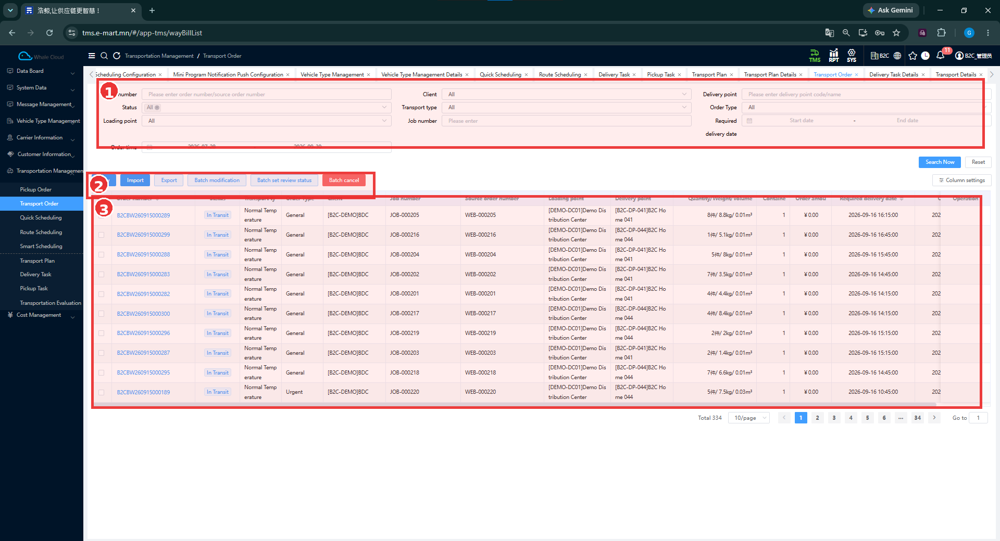
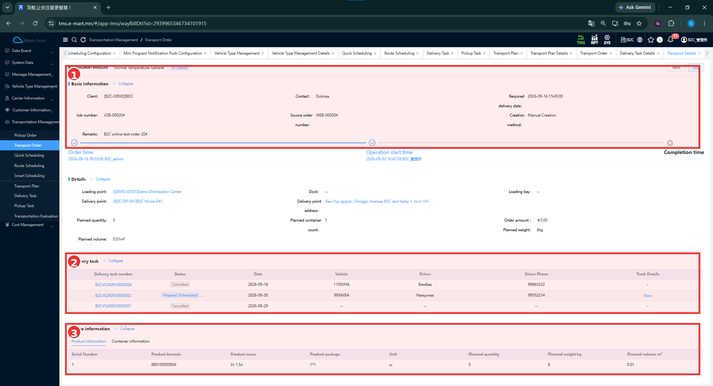

# Transport Order — Тээврийн захиалга

[Transportation Management-ийн тойм](../tms/transportation-management.md)

## Transport Order гэж юу вэ?

Transport Order нь **Client**-ийн барааг **Loading point**-оос **Delivery point** руу тээвэрлэх үндсэн захиалга. Хаанаас, хаашаа, хэзээ, ямар хэмжээтэй ачаа хүргэхийг тодорхойлно. Захиалгыг Scheduling-д ашиглаж, төлөвлөгөө болон хүргэлтийн даалгавартай холбоно.

## Хэзээ ашиглах вэ?

Хүргэлтийн захиалга бэлтгэх, төлөвлөхийн өмнө мэдээллийг нягтлах, тухайн захиалгатай холбоотой даалгавар болон барааны мэдээллийг шалгахад ашиглана.

## Эхлэхийн өмнө

[Client, Loading Point, Delivery Point](../tms/customer-information.md)-оо бэлтгэнэ. Хүргэх хугацаа, ачааны хэмжээ, барааны мэдээлэл тодорхой байна.

**Цэсний зам:** TMS → Transportation Management → Transport Order.

## Жагсаалтын дэлгэц

| № | Хэсэг | Тайлбар |
|---|---|---|
| ① | Хайлт | Order number, Status, Loading point, Client, Transport type, Job number, Delivery point, Order Type, Required delivery date; доод захад Order time. |
| ② | Үйлдлүүд | New, Import, Export, Batch modification, Batch set review status, Batch cancel. |
| ③ | Захиалгын хүснэгт | Захиалгын дугаар, төлөв, харилцагч, цэгүүд, ачааны хэмжээ болон хугацаа. |

### Алхам алхмаар

1. **Client**, дугаар эсвэл хүргэлтийн цэгээр нөхцөл оруулна.
2. Шаардлагатай бол **Status**, **Required delivery date**, **Order time**-аар нарийсгана.
3. **Search Now** дарж үр дүнг шалгана. Нөхцөл цэвэрлэхдээ **Reset** ашиглана.
4. Дугаар, харилцагч, цэг, хүргэх хугацааг зөв эсэхийг нягтална.
5. Шинэ захиалга оруулах бол [New Transport Order](create-order.md) зааврыг дагана. Байгаа захиалгын цэнхэр дугаарыг дарж дэлгэрэнгүйг нээнэ.

### Жагсаалтын талбарууд

Эдгээр нь харах баганууд; бөглөх маягтын заавал талбарын тэмдэглэгээ биш.

| Талбар | Тайлбар |
|---|---|
| Order number | Тээврийн захиалгын дугаар; дэлгэрэнгүй рүү орох холбоос. |
| Status | Захиалгын төлөв. Жишээнд In Transit байна. |
| Transport type | Тээврийн төрөл; жишээнд Normal Temperature. |
| Order Type | Захиалгын төрөл; жишээнд General, Urgent. |
| Client | Харилцагч. |
| Job number | Ажлын дугаар; эх захиалгын дугаараас тусдаа. |
| Source order number | Эх захиалгын дугаар. |
| Loading point / Delivery point | Ачилтын болон хүргэлтийн цэг. |
| Quantity / Weight / Volume | Барааны тоо, кг-аар жин, м³-ээр эзлэхүүн. |
| Container | Савны тоо. |
| Order amount | Захиалгын дүн; зурагт ¥ тэмдэгтэй. |
| Required delivery date | Хүргэх шаардлагатай огноо, цаг. |

### Боломжит үйлдлүүд

| Товч | Зориулалт, нотолгооны хүрээ |
|---|---|
| New | [Шинэ захиалгын маягт](create-order.md) нээнэ. |
| Import | [Импортлох](import-orders.md) боломж; загвар ба үр дүн баталгаажаагүй. |
| Export | Мэдээлэл гаргах боломж; файлын бүтэц, хамрах мөрүүд баталгаажаагүй. |
| Batch modification | Сонгосон мөрүүдийг бөөнөөр засварлах боломж. |
| Batch set review status | Сонгосон мөрүүдийн хяналтын төлөв тохируулах боломж. |
| Batch cancel | Сонгосон мөрүүдийг бөөнөөр цуцлах боломж. |

Batch үйлдлийн дэлгэц, шаардлага, амжилттай үр дүн энэ багцад байхгүй. **Urgent** гэсэн нэрээс автомат эрэмбийн дүрэм дүгнэхгүй.

## Transport Order Detail

| № | Хэсэг | Тайлбар |
|---|---|---|
| ① | Basic Information | Харилцагч, холбоо барих хүн, хүргэх хугацаа, Job number, Source order number, Creation method, тайлбар; доод захад хугацааны мөр. |
| ② | Delivery task | Энэ захиалгатай холбоотой даалгаврын дугаар, төлөв, огноо, машин, жолооч, утас. |
| ③ | Cargo information | Product information болон Container information tab; зурагт барааны мөр харагдана. |

**Хугацааны мөр** нь Order time, Operation start time, Completion time-ыг харуулна. Жишээ захиалга **In Transit** бөгөөд дууссан цаг бөглөгдөөгүй байна.

**Details** нь ① ба ② хүрээний хооронд байрлана. Жишээний ачилтын цэг **DEMO-DC01**, хүргэлтийн цэг **B2C-DP-041**. **Planned quantity = 5**, **Planned container count = 1**, **Planned weight = 8 kg**, **Planned volume = 0.01 m³** байна. Эдгээр нь төлөвлөсөн хэмжээ болохоос бодит хүлээн авалтын баталгаа биш.

### Delivery Task холбоо

Нэг захиалгын дэлгэрэнгүйд гурван Delivery Task харагдаж байна. Тэдгээрийн хоёр нь **Cancelled**, нэг нь **Shipped (Scheduled)**. Даалгаврын дугаар, төлөв, огноог хамтад нь шалгана. Нэг захиалга яагаад олон даалгавартай болсныг энэ зураг тайлбарлаагүй.

**Track Details → View** холбоос харагдана. Нээсэн дэлгэц болон GPS ажиллагааны үр дүн энэ багцад байхгүй.

### Product Information

| Багана | Тайлбар | Зураг дахь жишээ |
|---|---|---|
| Product barcode | Барааны баркод. | 880100000004 |
| Product name | Барааны нэр. | Ус 1.5л |
| Product package | Савлагааны мэдээлэл. | 1*1 |
| Unit | Тоолох нэгж. | ш |
| Planned quantity | Төлөвлөсөн тоо. | 5 |
| Planned weight kg | Төлөвлөсөн жин. | 8 |
| Planned volume m³ | Төлөвлөсөн эзлэхүүн. | 0.01 |

## Үйлдэл хийсний дараа

Хайлтаас захиалгаа олж, цэг, хэмжээ, хугацаа болон холбоотой Delivery Task-ийн төлөвийг шалгасан байна. Шинэ захиалга хадгалсны дараах үр дүн тусдаа зураггүй тул энэ жагсаалтыг тухайн Save-ийн баталгаа гэж үзэхгүй.

## Анхаарах зүйл

Захиалгын **In Transit** төлөв ба даалгаврын **Shipped (Scheduled)** төлөв нь өөр бүртгэлд хамаарна. [Захиалга засварлах](edit-order.md), [цуцлах](cancel-order.md), [төлөвийн хүрээ](order-status.md)-г тус тусын заавраас харна.

## Дараагийн алхам

[New Transport Order](create-order.md) → [Scheduling-ийн аргаа сонгох](../tms/transportation-management.md#scheduling).
